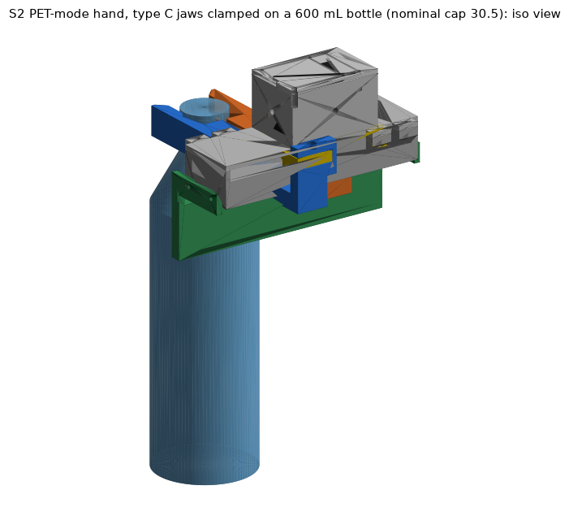
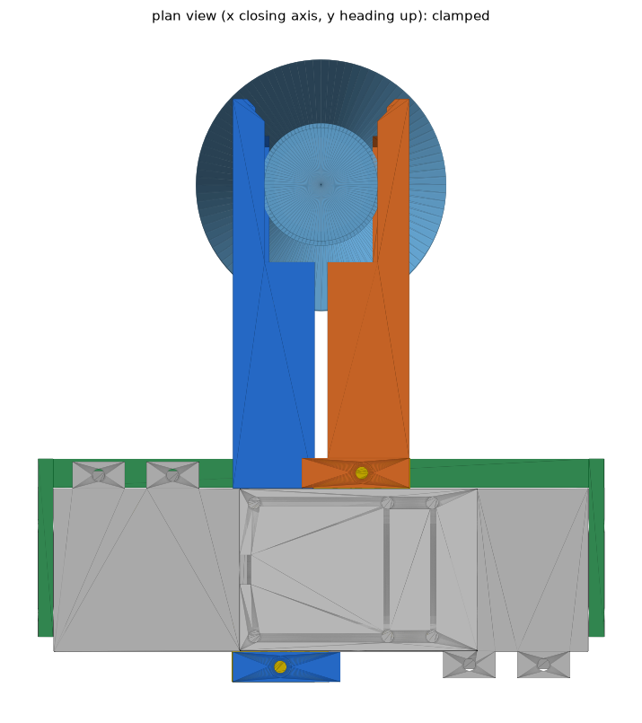
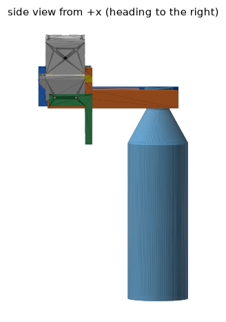
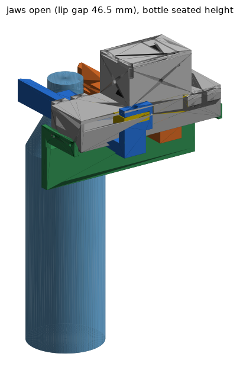
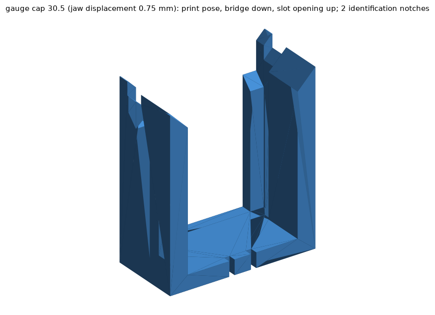

# S2 PET-mode hand: collar jaws on the S1 gripper body (HAND track, S2-RC2)

Frame used everywhere: x = closing axis (jaw A on +x, jaw B on -x), y = heading (+y toward the bottle), z = zeta (up, origin on the J3 / pinion axis); seat plane (ring underside of a seated bottle = lip top) at zeta0 = -12.3 mm, z' = zeta - zeta0. All lengths mm. Every number below was produced by code in this session (scripts and CSV sources are linked in section 13); items marked ASSUMED are not measured.

**Where the LEAD requests are answered**: A assembled-frame meshes + manifest -> sections 4 and 13 (hard-stop pose, groups, masses, pinion rotation); B tilt envelope + fix -> section 8; C friction budget / hold table -> section 7; D assembly, torque register, print list, Gate-0 order -> sections 1-3; E lip ramp, lip friction, BACK_CLR -> section 9; Gate-0 slot gauges -> section 1b and 5.7; short-neck jaws and the free-neck rule -> sections 5 and 9.4; strength, droop and maximum mass -> section 6; P2 -> section 10.

## 0. Deviations, corrections and items NOT assessed (read first)

| # | Item | Status | What it means |
|---|---|---|---|
| 1 | Bore style | DEVIATION from the master spec (accepted by LEAD) | The spec asks for stepped CIRCULAR half-bores. They cannot clamp the cap-OD box: the jaws stop at 2.2 / 4.3 / 6.4 mm per jaw for caps 29.5 / 30.5 / 32.0 (flat faces: 0.25 / 0.75 / 1.50), contact is only at the arc end edges and the lip circles move out with the jaws (ring seat collapses). The delivered main jaw uses stepped PLANAR faces (BORE_STYLE "flat"); "circ" is only a build option. Evidence: s2hand_bore_style_study.csv. |
| 2 | Seat plane | CHOSEN | zeta0 = -12.3 (spec relation assumed -4.3); rule z_c = z_ring_underside + 162.3 mm (accepted by LEAD). |
| 3 | GROOVE_H, BACK_CLR | CHOSEN | GROOVE_H = 5.5 (spec range 3.5-5.5, nominal 4.5: 5.5 gives 121/129 corners for a release lowering of D = 2 mm and 113/129 for closing at the 2.2 mm window, instead of 77/129 and 73/129 with 4.5; per-corner scan in s2hand_groove_height_scan.csv, earlier build state, the final-geometry scan [s2hand_bottle_scan_flat_CF.csv](s2hand_bottle_scan_flat_CF.csv) reproduces 121 / 113 for 5.5), BACK_CLR = 4.0 (back wall y = 83, Sim request; spec 1.0). |
| 4 | Jaw width | DEVIATION | Jaw bars are 22-23 mm wide, not 5-6 mm plates (a 5 x 22 mm plate 78-130 mm long would deflect 10-40 mm sideways at 25 N). |
| 5 | Guide | DEVIATION / proposal adopted | Guide = front rail (part s2hand_guide_rail, 4 mm L-brackets on 4 M3 inserts in the base END FACES x = +-72, y = +-12, z = 1) + base bottom as rear stop, instead of a beam under the base. The S1 base needs 4 holes D4.2 x 5.5: drill template (2 x ~0.4 h) or reprint s2hand_base_v2 (2.4 h model). |
| 6 | G3 droop (1.2 kg x 1.5 g, <= 1.0 mm; L/R <= 0.5 mm) | MET ONLY WITH THE PTFE/SHIM ASSEMBLY STEP | Elastic droop (FE jaw + rail flexure through the guide lever) = 0.40 mm (A) / 0.37 mm (B), L/R difference 0.028 mm. But the printed 0.2 / 0.2 mm guide gaps close under the nose-heavy jaw: nose shift 0.79 / 0.77 mm (not elastic) -> total 1.19 / 1.14 mm FAILS 1.0 mm. With gaps reduced to <= 0.12 mm (0.08 mm PTFE tape on rail top and bar tops, feeler-check) the total is 0.88 / 0.83 mm. L/R difference is deterministic 0.05 mm but +-0.4 mm if the two printed gaps differ by 0.1 mm each: MUST be feeler-checked at first assembly (not assessed on hardware). 2 L x 1.5 g: 1.19 mm (stretch SKU, fails). |
| 7 | Jaw clamp-path FE | CORRECTED | The earlier clamp / stall FE runs (across-layer SF 1.63, deflection 1.06 mm) had NO tab-wall support because of a node-mask bug; superseded. Corrected 1.5 mm voxel FE: clamp 25 N across-layer peak 2.67 MPa B / 2.46 MPa A (SF 3.75 / 4.07), lateral stiffness k = 34.2 (B) / 42.2 (A) N/mm. Stall (100 N, single event, S1 single-event allowables 35 / 17.5 MPa): SF 1.64 (B) / 1.78 (A) across layers, 1.9 / 2.2 in-plane excluding load/support elements. Repeated stall is not allowed; keep Max_Torque_Limit <= 400. 1.0 mm voxel check of the corrected code (row 17, [s2hand_fe_clamp_convergence.csv](s2hand_fe_clamp_convergence.csv)): clamp 25 N across-layer peak excluding contact elements 3.39 MPa B / 2.93 MPa A (SF 2.95 / 3.42), in-plane SF 3.24 / 4.34, k = 32.4 (B) / 49.7 (A) N/mm; stall (linear scaling x 4 of the 25 N case): SF 1.29 (B) / 1.50 (A) across layers, 1.42 / 1.90 in-plane. The 1.0 mm values are the lowest of the three meshes and are the ones to use. |
| 8 | Clamp force vs cap OD | NEW FINDING | Because of the jaw lateral compliance the clamp force on small caps is limited by the hard stop: F = 18.9 N/mm x (OD - 29.0) for OD < 30.3 mm at TQ 0.70 (9.4 N at 29.5, 18.9 N at 30.0); full 24.8 N only for OD >= 30.3 mm. Servo ticks read the hard stop for OD <= 30.3, so cap OD cannot be inferred from ticks below that (section 3). |
| 9 | Friction-only carry | LIMITED | With PETG faces (ASSUMED mu 0.3-0.5) friction alone holds only 500 / 600 mL at SF >= 2 (static, 25 N per jaw); 1 L needs mu >= 0.5; 1.5 L and 2 L need the lip. The 1.2 kg design mass is lip-supported. |
| 10 | Swing about the closing axis (LEAD item B) | NOT MET passively | Flat faces give no restoring torque: free swing is -14...-34 deg / +7...+40 deg (40 corner combinations), a shallow V adds only 55-93 N mm and costs seat width. Verdict and the cheapest fix (TPU pad pocket + transport torque + acceleration limits) are in section 8; +-8 deg at 0.3 g lateral is met only for 500 / 600 mL without changes. |
| 11 | Type F | PARTIAL | F-type = same jaws without the cap wall (groove face to the top). Approach / drop-over 129/129 corners, release D=1/2/3: 129/97/81. The scan flags seated_ok / close_ok of the C-type scan are not meaningful for F (the fork has no cap wall to stop on), so an F-specific closing check was run afterwards ([s2hand_F_close_check.csv](s2hand_F_close_check.csv), script s2hand_verify_F_close.py): for each of the 129 corners the jaws are swept from the open pose (delta 10 mm) to the hard stop in 0.5 mm steps with the lip top 0.2 / 1.2 / 2.2 mm below the ring underside (overlap criterion 1 mm3). 129 / 97 / 81 corners reach the hard stop without touching the bottle. Every failure is a free-neck 3.0 mm corner (the lip meets the shoulder cone; overlap 2.94-4.33 mm3 at the 1.2 mm window, 1.15-20.17 mm3 at the 2.2 mm window); all 65 corners with free neck >= 6 mm pass at all three windows, i.e. the same free-neck rule as for C. Positive controls (s2hand_F_close_check_controls.csv): neck OD 27.5 at the stop 14.37 mm3, jaws 0.5 mm past the stop on a 26.5 mm neck 14.12 mm3, ring OD 35 at the stop 10.73 mm3 (all detected). F seat geometry (hard stop, ring on the lip): ring bearing width 2.75-3.75 mm (nominal 3.25), neck-to-lip clearance 0.0-1.0 mm (nominal 0.5), no lateral clamp. FE of the F jaws was NOT run (C jaws only). Mass 396.9 g. |
| 12 | lip2 jaws | FE COMPLETE at 1.0 mm (stall by scaling) | Boolean fit scan done (216 corners). FE at 1.0 mm voxel, corrected code, both jaws: lip hold 8.8 N: deflection 0.2123 (A) / 0.2141 (B) mm, SF 9.8 / 9.7 in-plane, 11.1 / 11.0 across-layer (s2hand_fe_lip2_d1p0.csv, s2hand_fe_lip2_B_d1p0.csv); clamp 25 N: cap-face deflection 0.516 (A) / 0.786 (B) mm, across-layer SF excluding contact elements 3.42 / 2.95, in-plane 4.35 / 3.24 (A, B); the lip relief does not change the clamp path (baseline 1.0 mm values: 0.503 / 0.772 mm, 3.42 / 2.95). The clamp row first saved in s2hand_fe_lip2_d1p0.csv (jaw A, 25 N: 0.7456 mm, across-layer SF 1.88) is INVALID - it came from a job started before the tab-wall support fix - and is flagged valid = False in the current version. The thinner-lip ledge beam estimate remains the governing number for the lip (SF 1.7 for 2 L x 1.5 g, 3.0 at 1.2 kg x 1.5 g). |
| 13 | Gauge labels | CHANGED | Engraved text made the exported STL non-watertight; gauges are identified by 1 / 2 / 3 / 4 notches in the bridge top edge. |
| 14 | Servo register addresses | VERIFY | Torque_Limit (RAM, addr 48 / 0x30, 0-1000 = 0-100 % of 2.942 N m stall), Max_Torque_Limit (EEPROM, addr 16 / 0x10) are from the Feetech STS3215 table as I remember it; confirm in test B2 before relying on them. |
| 15 | Mass / COM CSV | FIXED | The earlier message claimed s2hand_* files were saved before [s2hand_mass_com.csv](s2hand_mass_com.csv) existed (auditor finding). It is saved now: type C 398.4 g, type F 396.9 g (final geometry; the first-CAD report was 399.4 g). The Wrist track used the first-CAD values 399.4 g / COM y 11.1 mm; final 398.4 g / 10.78 mm: difference 1.0 g (0.25 %) and 0.32 mm, i.e. 1.36 N mm of gravity moment about the J3 axis for the y offset; LEAD treats it as immaterial and the HAND track does not object. |
| 16 | Not assessed | - | Real friction coefficients (no test data), printed-gap tolerance, creep / fatigue of PETG under the continuous hang load, thermal drift, camera plate (optional, +11.7 g, not designed in), Al-strip reinforcement (not needed by the FE stresses), servo thermal limit at 0.70-1.0 N m holding, FE of the F jaws, rail unilateral-contact effect on the droop (+20 % deflection estimate not simulated). |
| 17 | Clamp-case FE | CORRECTED, MESH CHECK DONE (1.5 / 1.25 / 1.0 mm) | An earlier set of clamp / stall runs had no x-support at the tab wall (voxel node-plane mask bug); every clamp / stall value in section 6 is from the corrected code (30 wall nodes at 1.5 mm, 42 at 1.25 mm, 63 at 1.0 mm). Mesh check, clamp 25 N ([s2hand_fe_clamp_convergence.csv](s2hand_fe_clamp_convergence.csv); raw: 1.5 mm, A 1.25 mm, A 1.0 mm, B 1.0 mm; script s2hand_fe_clamp_buf.py): jaw A at 1.5 / 1.25 / 1.0 mm: cap-face deflection 0.592 / 0.516 / 0.503 mm (k = 42.2 / 48.4 / 49.7 N/mm); peak excluding contact elements in-plane 3.92 / 4.17 / 4.61 MPa, across-layer 2.456 / 2.796 / 2.926 MPa; peak at >= 3 mm from every load / support node in-plane 3.10 / 3.13 / 3.59 MPa, across-layer 1.94 / 1.80 / 2.21 MPa. Jaw B at 1.5 / 1.0 mm: deflection 0.732 / 0.772 mm (k = 34.2 / 32.4 N/mm), in-plane 4.61 / 6.18 MPa, across-layer 2.668 / 3.394 MPa. The 'excluding' peaks grow 18-34 % from 1.5 to 1.0 mm (slow approach to the support singularities), the deflection changes -15 % (A) / +6 % (B), the series stiffness goes 18.9 -> 19.6 N/mm (+4 %, clamp-force table unchanged). Lowest clamp-path safety factors at the 1.0 mm mesh (across layers, 10 MPa allowable): 2.95 (B) at 25 N, 2.08 (B) at the 1.0 N m transport torque (35.4 N), 1.77 (B) at 1.177 N m (41.7 N); stall 100 N (single event, linear scaling): 1.29 (B) / 1.50 (A). Not resolved: the sharp inner corner of the tab window (no fillet; the 0.4 mm window clearance limits any fillet to R <= 0.6-0.8 mm). |
| 18 | Timeline | NOTE | README v1 was saved on 2026-10-03 about 07:55 UTC, before the 08:45 UTC deadline. The session was then suspended and resumed on 2026-10-04 08:03 UTC (new LEAD deadline 10:30 UTC). This version contains the late additions: F-type closing check (row 11), FE mesh check and lip2 FE completion (rows 12 / 17), groove-height scan CSV (row 3), servo-table notes updated to the 1.0 mm FE (section 3). |

## 1. Print order for the Gate-0 hand test

Print settings (PETG, STL/STEP are already in print pose, no supports, do not re-orient or scale): 0.2 mm layers, 0.4 nozzle, >= 4 perimeters, 25-30 % gyroid (gauges: 3 perimeters, 15 %), dry filament. Hours = project model 0.25 h + mass / 33 g/h (the slicer will differ).

| step | part | qty | mass_g | hours_model | purpose |
|---|---|---|---|---|---|
| 1 | s2hand_gauge_cap30p5 | 1 | 12.9 | 0.64 | nominal cap 30.5 mm slot gauge; try every real bottle on it first |
| 2 | s2hand_gauge_cap29p5 | 1 | 12.8 | 0.64 | cap 29.5 mm position |
| 2 | s2hand_gauge_cap32p0 | 1 | 13.0 | 0.64 | cap 32.0 mm position |
| 3 | s2hand_gauge_cap30p5_lip2 | 1 | 12.1 | 0.62 | only if a bottle has free neck 3.0-4.0 mm (2.0 mm lip) |
| 4 | s2hand_stick_A_C | 1 | 17.2 | 0.77 | hand-held clip stick (jaw A head): jaw half with the real lip / groove / cap faces, lead-ins and ramp |
| 4 | s2hand_stick_B_C | 1 | 17.2 | 0.77 | clip stick, jaw B head |
| 5 | s2hand_drill_template | 2 | 5.2 | 0.41 | only if the S1 base is already printed: drill the 4 end-face holes (D4.3 guides), then heat-set 4 M3 inserts |
| 6 | s2hand_guide_rail | 1 | 44.4 | 1.60 | rail + brackets |
| 7 | s2hand_jaw_A_C | 1 | 37.1 | 1.37 | jaw A (type C) |
| 7 | s2hand_jaw_B_C | 1 | 40.4 | 1.47 | jaw B (type C) |
| 8 opt | s2hand_jaw_A_C_pad | 1 | 37.1 | 1.38 | jaw A with 1 mm pad pocket (use with s2hand_pad_tpu, TPU 95A) |
| 8 opt | s2hand_jaw_B_C_pad | 1 | 40.4 | 1.47 | jaw B with pad pocket |
| 8 opt | s2hand_pad_tpu | 2 | 0.2 | 0.26 | TPU strips 14 x 10.5 x 1.0 (print 4) |
| 8 opt | s2hand_jaw_A_C_lip2 | 1 | 36.5 | 1.36 | short-neck set (2.0 mm lip), replaces jaw A |
| 8 opt | s2hand_jaw_B_C_lip2 | 1 | 39.8 | 1.46 | short-neck set, replaces jaw B |
| 9 opt | s2hand_stick_A_F | 1 | 16.4 | 0.75 | type F clip stick (only if the fork type is evaluated) |
| 9 opt | s2hand_stick_B_F | 1 | 16.4 | 0.75 | type F clip stick |
| 9 opt | s2hand_jaw_A_F | 1 | 36.3 | 1.35 | type F jaw A |
| 9 opt | s2hand_jaw_B_F | 1 | 39.6 | 1.45 | type F jaw B |
| 9 opt | s2hand_base_v2 | 1 | 72.3 | 2.44 | S1 base with the 4 holes (instead of the drill template) |

Gate-0 sequence: (1) the three slot gauges (about 25 min of extrusion each) answer "ring enters the groove / lip passes under the ring / cap sits on the faces" for the real bottles before any jaw is printed; (2) the two clip sticks (~0.8 h each) are the same head geometry as the jaws and let you push-test ring, lip, ramp and lead-ins by hand; (3) only then the drill template, rail and the two jaws (total 4.4 h). The 8 tolerance-ladder head pairs (s2hand_ladder_*.stl, ~0.8 h each) are only needed if a gauge fails: LIP_T 2/3/4/5, GROOVE_H 3.5/4.5/5.5, D_CAP_HS 28/29/30 (one factor at a time, L+R side by side).

Post-processing: remove elephant foot / stringing from the slot faces with a scraper (do not sand the cap-wall or lip faces: they set the 0.25 mm steps); ream the two M3 holes of each strap to 3.2; check the strap window on the rack tab (0.2 mm closing-side clearance, 0.4 mm vertical) and relieve with a needle file if tight; optional: 600-grit on the lip TOP plane only (lower friction, section 9); PTFE tape (0.08-0.1 mm adhesive film) on the rail top (2 patches 24 x 8) and on the bar tops (2 x 20 x 20) to bring the guide gaps to <= 0.12 mm.

## 1b. Gate-0 slot gauges: use note

**Use note (one paragraph)**: each gauge is the two jaw slot profiles (lip, groove and cap-wall steps, back wall at y = 83, 45 deg lead-ins, lip ramp) cut from a 20 mm slab and joined by a 4 mm back bridge at the face spacing of one cap-OD position (jaw displacement 0.25 / 0.75 / 1.50 mm = cap 29.5 / 30.5 / 32.0 mm; the lip / cap-wall / groove face gaps are 27.0 / 29.5 / 34.5, 28.0 / 30.5 / 35.5 and 29.5 / 32.0 / 37.0 mm; the lip2 gauge is the 30.5 position with a 2.0 mm lip). The notches in the top edge of the bridge count 1 / 2 / 3 / 4 (cap 29.5 / 30.5 / 32.0 / 30.5-lip2); in use the notched edge is the TOP, the part is printed lying on its back. Hold the gauge level, slot opening toward the bottle, push it onto the neck from the front about 1-2 mm below the final height until the cap approaches the back wall, then lift until the ring underside rests on the lip. **Good**: the cap sits between the cap-wall faces touching (or with a hair of play) for the gauge whose OD matches it, and with about 0.25 mm per side of visible gap for a cap 0.5 mm smaller; the ring lies in the groove with air above and beside it (groove 5.5 mm high, 34.5-37 mm wide); the lip tip is under the ring and the ring rests on it; the bottle hangs from the lip; the cap top stands about 1 mm ABOVE the jaw top for the nominal 18 mm cap (master spec: the jaw top z' = 17 is 1 mm below the cap top; a cap shorter than 17 mm ends below the jaw top and is also fine). **Failures and their meaning**: the cap does not enter the faces -> cap OD is larger than this gauge, use the next gauge (boolean: +0.6 mm = 26-27 mm3 overlap); the ring does not enter the groove or stops on the lead-in -> ring OD above the groove gap minus 0.5 mm or ring thicker than 5.5 mm (14 mm3 / 9-59 mm3); the gauge cannot be lifted to the ring because the lip does not pass under it -> free neck too short for the 3.0 mm lip, use the lip2 gauge (needs free neck >= 3.0 mm at a release lowering of 2 mm, >= 1.6 mm just to close at 0.2 mm above the seat); the neck wedges against the lip faces -> neck OD larger than the lip face gap (27.0 / 28.0 / 29.5 mm). All 49 boolean cases (nominal pass, tolerance extremes pass, controls fail) are in the gauge checks CSV.

## 2. Assembly sequence, hardware, delta against the v1 gripper

1. Base end faces: drill / print the 4 holes (D4.2 x 5.5 at x = +-72, y = +-12, z = +1; wall >= 2.7 mm, boolean-checked) and heat-set 4 inserts M3 x 5 (Ruthex-type). Skip if base_v2 is used (inserts are still needed).
2. Remove the v1 fingers, yokes and TPU pads from racks A and B (frees 12 M3 screws + 12 inserts).
3. Slide jaw A onto the tab of rack A from the OUTER +x side (strap on the +y flank, window open to the outside), jaw B onto rack B from -x (strap on the -y flank). Fit the vertical retention screw M3 x 8 into the tab insert with a 0.5 mm washer / shim under the head so that the strap floats +-0.4 mm vertically.
4. Offer the guide rail from below: bar tops pass between the base bottom and the rail (0.2 / 0.2 mm design gaps); bolt the two L-brackets to the 4 end-face inserts with 4 x M3 x 10. Check both gaps with a feeler gauge; tape with PTFE until both are <= 0.12 mm and the jaws still slide by hand over the full travel.
5. Set the grip servo (section 3): EEPROM Max_Torque_Limit 400, RAM Torque_Limit 238; drive to the closed hard stop with Torque_Limit 119 (0.35 N m) and set the zero offset so that it reads -122.2 ticks from the mechanical zero (1925.8 with a 2048 mid-range zero); then check the recommended open position (+421.0 / 2469.0) and the open hard stop (+2363.1 / 4411.1 - never command beyond).
6. Fit-check with the gauge-matched bottle: the cap must sit on the cap faces with the ring in the groove and the lip under the ring at closing; repeat the bottle on the clip sticks if the jaws disagree with the gauge.

Hardware per hand: 4 heat-set inserts M3, 4 x M3 x 10, 2 x M3 x 8 + 2 washers 0.5 mm (retention; reuse the v1 yoke screws), PTFE tape, optional TPU pads (4). Removed from v1: 2 yokes, 2 fingers, 2 TPU pads, 12 M3 + 12 inserts, camera plate (optional, +11.7 g). Added: 2 jaws + rail (4.4 h) and the 4 base holes. The J3 interface (46 x 46 flange, 4 x M3 on 36 x 36, arm-side plane zeta 62.5) is unchanged, so the Wrist track can swap in the metal J3 kit without touching the hand.

## 3. Grip servo: registers, positions (ticks), closing-distance policy

Pinion r_p = 12 mm, 4096 ticks/rev -> 54.3249 ticks per mm of rack travel s; clamp per jaw = 0.85 T / (2 r_p); register = round(1000 T / 2.942) (VERIFY address / scale in test B2). "ticks" = relative to the mechanical zero s = 0; add 2048 for a servo zeroed at mid-range.

| TQ_limit_Nm | register_0_1000 | clamp_per_jaw_N | pct_of_stall | pct_of_rated_0p981 | note |
|---|---|---|---|---|---|
| 0.350 | 119 | 12.4 | 11.9 | 35.7 | positioning / pre-contact |
| 0.500 | 170 | 17.7 | 17.0 | 51.0 | light |
| 0.700 | 238 | 24.8 | 23.8 | 71.4 | RECOMMENDED TQ_CLAMP (spec 0.70 = about 25 N per jaw) |
| 0.850 | 289 | 30.1 | 28.9 | 86.6 |  |
| 1.000 | 340 | 35.4 | 34.0 | 101.9 | transport torque for >= 1 L (jaw across-layer SF 2.08 at the 1.0 mm voxel FE [2.65 at 1.5 mm], rack tab SF 2.08) |
| 1.177 | 400 | 41.7 | 40.0 | 120.0 | S1 firmware cap (1.2 x rated, 41.7 N): highest value ever commanded; also EEPROM Max_Torque_Limit = 400; jaw across-layer SF 1.77 at the 1.0 mm voxel FE (< 2: not for sustained holds) |
| 2.942 | 1000 | 104.2 | 100.0 | 299.9 | stall: never (single event only: jaw SF 1.3-1.9 vs single-event allowables, 1.0 / 1.5 mm voxel FE; S1 pinion tip-loading FAIL 0.89) |

Recommended: TQ_CLAMP = 0.70 N m (register 238, 24.8 N per jaw); TRANSPORT for >= 1 L = 1.0 N m (340; jaw across-layer SF 2.08 at the 1.0 mm FE mesh, rack tab SF 2.08); never above 1.177 N m (400): set EEPROM Max_Torque_Limit = 400 so a software error cannot command stall.

| position | jaw_displacement_from_hard_stop_mm | rack_travel_s_mm | pinion_angle_deg | ticks_from_mech_zero | ticks_zero_at_2048 | lip_gap_mm | cap_wall_gap_mm | groove_gap_mm | note |
|---|---|---|---|---|---|---|---|---|---|
| real mechanical closed hard stop | 0.00 | -2.25 | -10.74 | -122.2 | 1925.8 | 26.50 | 29.00 | 34.00 | s = -2.25 (0.25 mm beyond the S1 CSV -2.0; boolean-verified). Never command beyond. |
| closed command target without bottle | 0.10 | -2.15 | -10.27 | -116.8 | 1931.2 | 26.70 | 29.20 | 34.20 | 0.1 mm short of the hard stop, torque limit TQ_CLAMP |
| OPEN = approach = drop-over (recommended) | 10.00 | 7.75 | 37.00 | 421.0 | 2469.0 | 46.50 | 49.00 | 54.00 | lip gap 46.5 / cap-wall gap 49.0 / groove gap 54.0 mm (>= 46 at both cap and lip level); outer width 66 mm |
| wide open (diagnostic) | 20.00 | 17.75 | 84.75 | 964.3 | 3012.3 | 66.50 | 69.00 | 74.00 | inside the 43.5 mm travel; outer width 86 mm |
| real mechanical open hard stop | 45.75 | 43.50 | 207.70 | 2363.1 | 4411.1 | 118.00 | 120.50 | 125.50 | s = +43.5 (0.25 mm beyond the S1 CSV 43.25; boolean-verified) |

Stall positions on a cap (jaw lateral compliance included; k = 42.2 N/mm for A and 34.2 N/mm for B, series 18.9 N/mm; flex = F x 0.0529 mm/N for the pair):

| tq_Nm | tq_register | cap_od_mm | rack_delta_each_mm | ticks_from_mech_zero | ticks_zero_at_2048 | clamp_force_at_cap_N | regime |
|---|---|---|---|---|---|---|---|
| 0.35 | 119 | 29.5 | 0.000 | -122.2 | 1925.8 | 9.4 | hard stop (spring-limited) |
| 0.35 | 119 | 30.0 | 0.172 | -112.9 | 1935.1 | 12.4 | servo-limited |
| 0.35 | 119 | 30.5 | 0.422 | -99.3 | 1948.7 | 12.4 | servo-limited |
| 0.35 | 119 | 31.0 | 0.672 | -85.7 | 1962.3 | 12.4 | servo-limited |
| 0.35 | 119 | 32.0 | 1.172 | -58.6 | 1989.4 | 12.4 | servo-limited |
| 0.35 | 119 | 32.5 | 1.422 | -45.0 | 2003.0 | 12.4 | servo-limited |
| 0.70 | 238 | 29.5 | 0.000 | -122.2 | 1925.8 | 9.4 | hard stop (spring-limited) |
| 0.70 | 238 | 30.0 | 0.000 | -122.2 | 1925.8 | 18.9 | hard stop (spring-limited) |
| 0.70 | 238 | 30.5 | 0.094 | -117.1 | 1930.9 | 24.8 | servo-limited |
| 0.70 | 238 | 31.0 | 0.344 | -103.6 | 1944.4 | 24.8 | servo-limited |
| 0.70 | 238 | 32.0 | 0.844 | -76.4 | 1971.6 | 24.8 | servo-limited |
| 0.70 | 238 | 32.5 | 1.094 | -62.8 | 1985.2 | 24.8 | servo-limited |
| 1.00 | 340 | 29.5 | 0.000 | -122.2 | 1925.8 | 9.4 | hard stop (spring-limited) |
| 1.00 | 340 | 30.0 | 0.000 | -122.2 | 1925.8 | 18.9 | hard stop (spring-limited) |
| 1.00 | 340 | 30.5 | 0.000 | -122.2 | 1925.8 | 28.3 | hard stop (spring-limited) |
| 1.00 | 340 | 31.0 | 0.063 | -118.8 | 1929.2 | 35.4 | servo-limited |
| 1.00 | 340 | 32.0 | 0.563 | -91.7 | 1956.3 | 35.4 | servo-limited |
| 1.00 | 340 | 32.5 | 0.813 | -78.1 | 1969.9 | 35.4 | servo-limited |

Closing-distance policy for the planner (answer to the "rejected_closing_distance" question): the physical window is the cap-OD box 29.5-32.0 plus measurement error, i.e. at TQ 0.70 accept any stall between the hard stop (-122.2; 1925.8 with the 2048 offset) and the 32.5 mm position (-62.8; 1985.2), plus a few ticks of read-out tolerance. Below OD 30.3 mm the rack is ON the hard stop and the reading cannot distinguish "small cap" from "empty jaws" (clamp force 9-19 N from the jaw spring): treat "stalled at the hard stop with a bottle present" as VALID closure, not as a rejection. OD_est = 29.0 + 2 x delta_rack + 0.0529 x F_servo (valid when delta_rack > 0.05 mm).

## 4. Geometry and interfaces fixed by this design

Parameters (s2hand_build.py): D_CAP_HS 29.0 (cap-wall gap at the hard stop), lip face |x| = 13.25 (gap 26.5), groove |x| = 17.0 (gap 34.0), GROOVE_H 5.5, LIP_T 3.0, jaw top z' = 17.0 (the cap top at z' = 18 stands 1 mm ABOVE the jaw top: jaw top is 1 mm below the cap top, as in the master spec), BACK_CLR 4.0 (back wall y = 83.0, cap rear clearance 5.75 mm at cap 30.5), bore axis L3 = 104.0 ahead of the J3 axis, 45 deg x 6 mm lead-ins on all three zones, lip ramp 45 deg starting 10 mm ahead of the bore axis (ends 3 mm later; it leaves the ring-seat chord +-6.2 mm at the worst corner and +-8.7 mm at the nominal ring untouched; only the extreme ring 34 / cap 29.5 chord of +-10.3 mm is trimmed by 0.3 mm), jaw bottom zeta -15.3, jaw top zeta +4.7, strap top +27.45, rail down to zeta -51.5 and x = +-76.3, outer width of the open jaws 66 mm (46 mm closed).

Open gaps (recommended open / approach / drop-over position, delta 10 mm per jaw): lip level 46.5 mm, cap-wall level 49.0 mm, groove level 54.0 mm (>= 46 mm at both cap and lip level; nothing of the hand above z' = 17 over the bore; the strap / carrier are 74 mm behind the bore axis). Closed hard stop: 26.5 / 29.0 / 34.0 mm.

Mass / COM in the hand frame (closed pose; open pose x shifts by -0.09 mm):

| jaw_type | pose | camera_plate | delta_mm | mass_g | com_x_mm | com_y_mm | com_zeta_mm | com_zprime_mm | moving_mass_g |
|---|---|---|---|---|---|---|---|---|---|
| C | hard stop | False | 0.0 | 398.4 | 2.72 | 10.78 | 12.86 | 25.16 | 99.1 |
| C | hard stop | True | 0.0 | 410.1 | 4.09 | 10.47 | 13.65 | 25.95 | 99.1 |
| C | open (lip gap 46.5) | False | 10.0 | 398.4 | 2.63 | 10.78 | 12.86 | 25.16 | 99.1 |
| C | open (lip gap 46.5) | True | 10.0 | 410.1 | 4.01 | 10.47 | 13.65 | 25.95 | 99.1 |
| F | hard stop | False | 0.0 | 396.9 | 2.73 | 10.34 | 12.91 | 25.21 | 97.6 |
| F | hard stop | True | 0.0 | 408.6 | 4.10 | 10.05 | 13.70 | 26.00 | 97.6 |
| F | open (lip gap 46.5) | False | 10.0 | 396.9 | 2.64 | 10.34 | 12.91 | 25.21 | 97.6 |
| F | open (lip gap 46.5) | True | 10.0 | 408.6 | 4.02 | 10.05 | 13.70 | 26.00 | 97.6 |

Part masses (S1-calibrated shell + infill print-mass model, rms 7 % on the S1 parts; servo 55 g from design_params.json; screws / inserts 28 g and horn 9 g ASSUMED): jaw A 37.1 g, jaw B 40.4 g (type C), 36.3 / 39.6 g (type F), rail 44.4 g. Per-part masses, COM and the rack / pinion travel conventions are in the frame manifest (s2hand_frame_manifest.json).

## 5. Verification (boolean = manifold3d on the exported meshes; every check has a positive control)

1. Hard stops: first rack-vs-base/carrier overlap at s = -2.25 mm (S1 CSV -2.0, 0.25 mm further) and s = +43.5 (CSV 43.25); controls: 7.77 mm3 at s = -2.60 and 22.9 mm3 at 43.75 (s2hand_stops.csv).
2. Rack roll about x (rack pitch play dy +-0.3, dz +-0.6): feasible (< 1 mm3) up to 0.045 rad (0.0015 mm3 at 0.035, 0.36 at 0.045), infeasible at 0.05 (1.13 mm3); control 5.25 mm3 at 0.06 -> a jaw rigidly on the rack would have a free tip pitch of +-2.7 mm (jaw A) to +-4.6 mm (B): this is why the guide rail takes the vertical load (s2hand_rack_roll_scan.csv).
3. v1 attachment found: finger (44.3 wide plate under the base) bolted by 4 M3 along y into the yoke strap leg; the strap (y 22.15-30.15) has a through window for the rack tab (+-0.2 mm) and a vertical M3 retention screw into the tab insert. The new jaws replace finger + yoke + pad with one printed part per side that uses the same window and screw (so the rack tab geometry is not touched).
4. Base end-face inserts: wall >= 2.7 mm all around (floor side 2.7 analytic / 2.76 numeric); controls: hole 2 mm lower breaks out (0 mm wall), at y = 20 breaks out, at z = -0.2 leaves 1.57 mm.
5. Bottle fit, type C, 129 cases (nominal + 128 parameter-box corners; cap OD 29.5-32, ring OD 32-34, ring t 1.5-3, neck OD 24.5-26.5, free neck 3-10, shoulder 35-45, body D 71 = steepest 600 mL; [s2hand_bottle_scan_flat_CF.csv](s2hand_bottle_scan_flat_CF.csv)): seated 129/129 (clamp delta 0.209-1.457 mm, ring seat width 1.293-3.541 mm, seat area 21.9-100.2 mm2, lip-neck clearance 0.209-2.457 mm, first contact always the cap); heading approach at w = 0.2 / 1.2 / 2.2 mm: 129/129/129; vertical drop-over: 129/129/129; closing at the window w = 0.2 / 1.2 / 2.2: 129/121/113; release lowering D = 1 / 2 / 3 mm: 129/121/73. The only failures are the corner cap 29.5 + neck 26.5 + free neck 3.0 + short shoulder (jaw lip bottom meets the shoulder cone) and, for D = 3, ring t 3.0 (ring + D > GROOVE_H) - quantified by the free-neck rule below. Nominal bottle (600 mL, cap 30.5, ring 33 x 2): clamp delta 0.708 mm, seat width 2.54 mm, seat area 60.6 mm2, lip-neck clearance 1.21 mm.
6. Assembled frame: 15 meshes x 2 jaw types x 4 poses (closed, delta 10, 20, open hard stop) -> max pairwise overlap 0.0 mm3 over 440 pair-poses; 6 positive controls detected (17.8 - 1693 mm3, including the pinion rotated the wrong way: 77.7 mm3) ([s2hand_frame_interference.csv](s2hand_frame_interference.csv)). LEAD's independent audit of 576 placement poses also found zero.
7. Slot gauges: 49 boolean cases, all as expected (nominal bottles pass the slide-in at w = 1.2 / 2.2 and lowering with 0.0 mm3; ring 34 x 3 and ring 32 x 1.5 pass; controls detected: cap +0.6 mm 26-27 mm3, ring too large 14 mm3, ring 6.0 thick 9-59 mm3, neck too large 28-44 mm3, short free neck with a D110 shoulder 8-47 mm3) ([s2hand_gauge_checks.csv](s2hand_gauge_checks.csv)).

Free-neck rule ([s2hand_lip_free_neck_rule.csv](s2hand_lip_free_neck_rule.csv), 216 corners, worst corner = 2 L shoulder D110 / 35 mm, neck 26.5, cap 29.5): release lowering D (jaws loosened +0.5 mm or open) needs free neck >= LIP_T + D - 1.0 mm; closing at height w above the seat needs free neck >= LIP_T + w - 0.575 mm.

| lip mm | release lowering D mm | min free neck, worst corner | min free neck, 600 mL D71/35 | min free neck, D71/45 | Sim rule LIP_T + D + 0.5 |
|---|---|---|---|---|---|
| 2.00 | 1.00 | 2.00 | 1.25 | 0.75 | 3.50 |
| 2.00 | 2.00 | 3.00 | 2.25 | 1.88 | 4.50 |
| 2.00 | 3.00 | 4.00 | 3.25 | 2.75 | 5.50 |
| 3.00 | 1.00 | 3.00 | 2.25 | 1.88 | 4.50 |
| 3.00 | 2.00 | 4.00 | 3.25 | 2.75 | 5.50 |
| 3.00 | 3.00 | 5.00 | 4.25 | 3.88 | 6.50 |
| 4.00 | 1.00 | 4.00 | 3.25 | 2.75 | 5.50 |
| 4.00 | 2.00 | 5.00 | 4.25 | 3.88 | 6.50 |
| 4.00 | 3.00 | 6.00 | 5.25 | 4.75 | 7.50 |
| 5.00 | 1.00 | 5.00 | 4.25 | 3.88 | 6.50 |
| 5.00 | 2.00 | 6.00 | 5.25 | 4.75 | 7.50 |
| 5.00 | 3.00 | 7.00 | 6.25 | 5.88 | 8.50 |

Baseline 3.0 mm jaws give an effective 2.0 mm lip drop for free neck >= 4.0 mm (worst corner) / 3.25 mm (600 mL); the 2.0 mm lip (_lip2 set) for >= 3.0 mm / 2.25 mm. Add 0.5 mm margin if needed. The Sim rule is 1.5 mm more conservative than the real shoulder-cone geometry.

## 6. Strength, droop and maximum bottle mass (G3)

Method: voxel hex8 FE (1.5 mm, PETG E = 1200 MPa, nu 0.38, direct solve) of each jaw and of the rail; jaw supports = rail front strip (y, z), rear base-bottom strip (z), tab-wall contact (x, 30 nodes) and the screw link (x); allowables = S1 rule (in-plane 20 MPa, across layers 10 MPa repeated; 35 / 17.5 single event). Print orientation: outer face down, so layers are normal to x and x-tension (clamp reaction through the strap bridge bars) is across layers. 1.5 mm voxels do not resolve the 3.0 / 2.0 mm lip: the lip ledge is therefore checked by a cantilever hand calculation (3.75 mm ledge, seat patch 1.25 mm wide, chord 12.4 mm: worst corner cap 32.0 / ring 32).

| element | case | load | result | value | unit | allowable | SF |
|---|---|---|---|---|---|---|---|
| jaw B | hold lip (1.2 kg x 1.5 g / 2) | 8.8 N per jaw | in-plane vM peak | 1.496 | MPa | 20 | 13.37 |
| jaw B | hold lip | 8.8 N per jaw | vertical deflection of the load patch | 0.2058 | mm | 1 | 4.86 |
| jaw B | clamp (cap-face reaction pushes the jaw outward) | 25 N per jaw | in-plane vM peak (all elements) | 7.324 | MPa | 20 | 2.73 |
| jaw B | clamp | 25 N per jaw | in-plane peak excluding load/support elements | 4.613 | MPa | 20 | 4.34 |
| jaw B | clamp | 25 N per jaw | across-layer peak excluding load/support elements | 2.668 | MPa | 10 | 3.75 |
| jaw B | clamp | 25 N per jaw | lateral deflection of the cap face relative to the tab wall (servo reading includes it) | 0.7317 | mm |  |  |
| jaw B | stall (cap-face reaction pushes the jaw outward) (single-event allowables 35 / 17.5 MPa) | 100 N per jaw | in-plane vM peak (all elements) | 29.295 | MPa | 35 | 1.19 |
| jaw B | stall (single-event allowables 35 / 17.5 MPa) | 100 N per jaw | in-plane peak excluding load/support elements | 18.453 | MPa | 35 | 1.90 |
| jaw B | stall (single-event allowables 35 / 17.5 MPa) | 100 N per jaw | across-layer peak excluding load/support elements | 10.67 | MPa | 17.5 | 1.64 |
| jaw B | stall | 100 N per jaw | lateral deflection of the cap face relative to the tab wall (servo reading includes it) | 2.927 | mm |  |  |
| jaw A | hold lip (1.2 kg x 1.5 g / 2) | 8.8 N per jaw | in-plane vM peak | 1.582 | MPa | 20 | 12.64 |
| jaw A | hold lip | 8.8 N per jaw | vertical deflection of the load patch | 0.2179 | mm | 1 | 4.59 |
| jaw A | clamp (cap-face reaction pushes the jaw outward) | 25 N per jaw | in-plane vM peak (all elements) | 5.815 | MPa | 20 | 3.44 |
| jaw A | clamp | 25 N per jaw | in-plane peak excluding load/support elements | 3.92 | MPa | 20 | 5.10 |
| jaw A | clamp | 25 N per jaw | across-layer peak excluding load/support elements | 2.456 | MPa | 10 | 4.07 |
| jaw A | clamp | 25 N per jaw | lateral deflection of the cap face relative to the tab wall (servo reading includes it) | 0.5919 | mm |  |  |
| jaw A | stall (cap-face reaction pushes the jaw outward) (single-event allowables 35 / 17.5 MPa) | 100 N per jaw | in-plane vM peak (all elements) | 23.261 | MPa | 35 | 1.50 |
| jaw A | stall (single-event allowables 35 / 17.5 MPa) | 100 N per jaw | in-plane peak excluding load/support elements | 15.682 | MPa | 35 | 2.23 |
| jaw A | stall (single-event allowables 35 / 17.5 MPa) | 100 N per jaw | across-layer peak excluding load/support elements | 9.824 | MPa | 17.5 | 1.78 |
| jaw A | stall | 100 N per jaw | lateral deflection of the cap face relative to the tab wall (servo reading includes it) | 2.3677 | mm |  |  |
| guide rail | both jaws 26 N each (hold 2 L x 1.5 g would be 31 N) | 26 N per jaw | von Mises peak | 3.446 | MPa | 20 | 5.80 |
| guide rail | both jaws 26 N each | 26 N per jaw | max deflection | 0.1866 | mm |  |  |
| guide rail | both jaws 26 N each | 26 N per jaw | bracket-screw reaction (sum / max per patch) | 52.0 / 30.7 | N |  |  |
| lip ledge (beam, worst seat corner) | lip-supported hold 1 L x 1.5 g | 7.9 N per jaw | sigma_xx root, lip 3.0 mm | 1.32 | MPa | 10 | 7.55 |
| lip ledge (beam, worst seat corner) | lip-supported hold 1.5 L x 1.5 g | 11.8 N per jaw | sigma_xx root, lip 3.0 mm | 1.98 | MPa | 10 | 5.04 |
| lip ledge (beam, worst seat corner) | lip-supported hold 2 L x 1.5 g | 15.7 N per jaw | sigma_xx root, lip 3.0 mm | 2.63 | MPa | 10 | 3.80 |
| lip ledge (beam, worst seat corner) | lip-supported hold 1 L x 1.5 g | 7.9 N per jaw | sigma_xx root, lip 2.0 mm | 2.98 | MPa | 10 | 3.36 |
| lip ledge (beam, worst seat corner) | lip-supported hold 1.5 L x 1.5 g | 11.8 N per jaw | sigma_xx root, lip 2.0 mm | 4.46 | MPa | 10 | 2.24 |
| lip ledge (beam, worst seat corner) | lip-supported hold 2 L x 1.5 g | 15.7 N per jaw | sigma_xx root, lip 2.0 mm | 5.92 | MPa | 10 | 1.69 |
| rack tab root (S1 load path, unchanged) | grip clamp at TQ 0.700 N m | 24.8 N per rack | tab root bending (S1 w_eff 20 mm estimate, scaled) | 6.72 | MPa | 20 | 2.97 |
| rack tab root (S1 load path, unchanged) | grip clamp at TQ 1.000 N m | 35.4 N per rack | tab root bending (S1 w_eff 20 mm estimate, scaled) | 9.61 | MPa | 20 | 2.08 |
| rack tab root (S1 load path, unchanged) | grip clamp at TQ 1.177 N m | 41.7 N per rack | tab root bending (S1 w_eff 20 mm estimate, scaled) | 11.31 | MPa | 20 | 1.77 |

FE mesh note (row 17): the voxel FE is a screening tool. Stresses at point loads and supports are mesh-dependent (singular). The 1.5 mm values in the table above are the coarsest of three meshes (1.5 / 1.25 / 1.0 mm); at 1.0 mm the clamp-case 'excluding' peaks are 18-34 % higher (jaw A across-layer 2.926 MPa, SF 3.42; jaw B 3.394 MPa, SF 2.95; in-plane SF 4.34 / 3.24) and the stall margin drops to SF 1.29 (B) / 1.50 (A) across layers (single event, linear scaling). The lowest clamp-path safety factor at the recommended TQ_CLAMP 0.70 N m is therefore 2.95 (>= 2 met), at the 1.0 N m transport torque 2.08, at 1.177 N m 1.77. The sharp inner corner of the tab window (no fillet; 0.4 mm window clearance limits any fillet to R <= 0.6-0.8 mm) is not resolved.

Bracket screws (hand calc, rigid-line guide model with the load at y = 30 on the rail edge and the screw pair at y = +-12): vertical shear per M3 screw 37.9 N at 1.2 kg x 1.5 g (67 N at 2 L x 1.5 g) against 300 N per insert (S1 J3-insert allowable) -> SF 7.9 / 4.5; bearing in the 4 mm bracket 3.0 / 5.2 MPa.

Rack-tab path: the tab only carries the grip force (<= servo force, 24.8 N at TQ 0.70) - the bottle weight goes through the lip -> jaw -> rail / base bottom, bypassing the tab (window clearance +-0.4 mm). S1 tab-root bending (case C 41.7 N: 11.31 MPa, SF 1.77) scales to SF 2.97 at TQ 0.70 and 2.08 at TQ 1.0. Fallback if the rail were missing: 35 N vertical couple on the tab faces, S1 tab-root SF 1.8-2.1.

Droop at the bore, 1.2 kg x 1.5 g (8.83 N per jaw):

| jaw | jaw_elastic_FE_mm | rail_flex_via_lever_mm | elastic_total_mm | limit_mm | lever_U_over_P | rail_stiffness_N_per_mm | play_closure_nose_mm_gap_0p2 | droop_incl_play_0p2_mm | play_closure_nose_mm_gap_0p12_PTFE | droop_incl_play_0p12_mm |
|---|---|---|---|---|---|---|---|---|---|---|
| A | 0.219 | 0.181 | 0.400 | 1.0 | 2.480 | 299 | 0.792 | 1.192 | 0.475 | 0.875 |
| B | 0.206 | 0.165 | 0.372 | 1.0 | 2.424 | 314 | 0.770 | 1.142 | 0.462 | 0.834 |
| A-B difference | 0.013 | 0.016 | 0.028 | 0.5 |  |  | 0.022 |  |  |  |

Guide model: the jaw pitches nose-down about the rail front edge (y = 30.0) and rests with its bar top on the base bottom at its rear end (A: y = -20.0; B: y = -21.95); lever ratios U/P = 2.48 (A) / 2.42 (B), D/P = 1.48 / 1.42. The jaw is nose-heavy (COM y = 46 ahead of the rail edge), so the loaded pose is also the rest pose; the 0.2 / 0.2 mm gaps then put the seat plane 0.79 / 0.77 mm below the drawn plane (0.47 / 0.46 mm with 0.12 mm gaps). Calibrate zeta0_eff once per hand by lowering onto a real ring. The FE modelled the rail contact as a 7.7 mm wide bilateral support; a unilateral line contact may give up to +20 % jaw deflection (not included in the table).

Maximum bottle mass at SF 2 ([s2hand_max_mass.csv](s2hand_max_mass.csv) and s2hand_friction_budget.csv):

| face | mu (ASSUMED) | static, SF 2 (kg) | dynamic 1.3 g + 0.3 g heading, SF 2 (kg) | TQ |
|---|---|---|---|---|
| PETG face (smooth/wet) mu 0.3 | 0.3 | 0.65 | 0.49 | 0.70 N m (24.8 N), guide mu 0.3 |
| PETG face mu 0.5 | 0.5 | 0.98 | 0.74 | 0.70 N m (24.8 N), guide mu 0.3 |
| 1 mm TPU 95A pad, mu 0.6 (ASSUMED) | 0.6 | 1.13 | 0.85 | 0.70 N m (24.8 N), guide mu 0.3 |
| 1 mm TPU 95A pad, mu 0.8 (ASSUMED, dry) | 0.8 | 1.38 |  | 0.70 N m (24.8 N), guide mu 0.3 |

Friction-only at TQ 1.0 N m (35.4 N): 0.70 / 1.06 / 1.21 kg dynamic for mu 0.3 / 0.5 / 0.6; at 1.177 N m 0.82 / 1.24 / 1.43 kg. Lip-supported (1.5 g, SF 2): 4.05 kg with the 3.0 mm lip and 1.80 kg with the 2.0 mm lip (ledge beam, worst seat corner); the nominal-seat FE gives 7.6-8.0 kg; the droop limit (1.0 mm at the bore) allows 3.0 kg on elastic deflection alone but only 1.37 kg with 0.12 mm guide gaps and 1.01 kg with 0.2 mm gaps -> **droop, not strength, limits the lip-supported hold: 1.37 kg with the PTFE/shim step (1.2 kg design mass OK, 1 L OK, 1.5 L 1.6 kg and 2 L 2.13 kg exceed 1.0 mm)**.

## 7. Friction / hold table (flat faces = line contact per jaw; with and without a 1 mm TPU pad)

Model: friction capacity of the pair = 2 mu F_cap on both z (carry) and y (pull-out; isotropic in the face plane); F_cap = servo force 0.85 T / (2 r_p) minus guide friction mu_g (U + D) (U + D = 3.85 P, P = m g / 2, worst jaw B) or the spring-limited force of the previous section for caps below 30.3 mm; lip friction for the pull-out of a lip-supported bottle mu_lip 0.3 (PETG on PET, dry, ASSUMED; wet 0.15-0.25). mu values are ASSUMED: PETG face 0.3 (wet / smooth) and 0.5 (dry), TPU 95A pad 0.6 and 0.8 (dry).

**25 N per jaw at the cap (spec value, no guide loss)** - hold force along z (carry) and y (pull-out) in N:

| sku | mass_kg | face | mu | hold_z_carry_N | SF_z_static | hold_y_pullout_while_carrying_N | hold_y_pullout_lip_supported_N | carried_by |
|---|---|---|---|---|---|---|---|---|
| 500 mL | 0.519 | PETG line contact | 0.3 | 15.0 | 2.95 | 14.1 | 16.5 | friction only (SF>=2) |
| 500 mL | 0.519 | PETG line contact | 0.5 | 25.0 | 4.91 | 24.5 | 26.5 | friction only (SF>=2) |
| 500 mL | 0.519 | 1 mm TPU pad (ASSUMED mu) | 0.6 | 30.0 | 5.89 | 29.6 | 31.5 | friction only (SF>=2) |
| 600 mL | 0.650 | PETG line contact | 0.3 | 15.0 | 2.35 | 13.6 | 16.9 | friction only (SF>=2) |
| 600 mL | 0.650 | PETG line contact | 0.5 | 25.0 | 3.92 | 24.2 | 26.9 | friction only (SF>=2) |
| 600 mL | 0.650 | 1 mm TPU pad (ASSUMED mu) | 0.6 | 30.0 | 4.71 | 29.3 | 31.9 | friction only (SF>=2) |
| 1 L | 1.072 | PETG line contact | 0.3 | 15.0 | 1.43 | 10.7 | 18.2 | friction marginal (1<SF<2): use the lip |
| 1 L | 1.072 | PETG line contact | 0.5 | 25.0 | 2.38 | 22.7 | 28.2 | friction only (SF>=2) |
| 1 L | 1.072 | 1 mm TPU pad (ASSUMED mu) | 0.6 | 30.0 | 2.85 | 28.1 | 33.2 | friction only (SF>=2) |
| 1.5 L | 1.605 | PETG line contact | 0.3 | 15.0 | 0.95 | 0.0 | 19.7 | LIP REQUIRED (friction SF<1) |
| 1.5 L | 1.605 | PETG line contact | 0.5 | 25.0 | 1.59 | 19.4 | 29.7 | friction marginal (1<SF<2): use the lip |
| 1.5 L | 1.605 | 1 mm TPU pad (ASSUMED mu) | 0.6 | 30.0 | 1.91 | 25.5 | 34.7 | friction marginal (1<SF<2): use the lip |
| 2 L | 2.130 | PETG line contact | 0.3 | 15.0 | 0.72 | 0.0 | 21.3 | LIP REQUIRED (friction SF<1) |
| 2 L | 2.130 | PETG line contact | 0.5 | 25.0 | 1.20 | 13.7 | 31.3 | friction marginal (1<SF<2): use the lip |
| 2 L | 2.130 | 1 mm TPU pad (ASSUMED mu) | 0.6 | 30.0 | 1.44 | 21.5 | 36.3 | friction marginal (1<SF<2): use the lip |

**Servo-limited clamp, TQ 0.70 N m (24.8 N) minus guide friction (mu_g 0.3, load-dependent)**:

| sku | face | mu | F_cap_N | hold_z_carry_N | SF_z_static | hold_y_pullout_while_carrying_N | carried_by |
|---|---|---|---|---|---|---|---|
| 500 mL | PETG line contact | 0.3 | 21.9 | 13.1 | 2.58 | 12.1 | friction only (SF>=2) |
| 500 mL | PETG line contact | 0.5 | 21.9 | 21.9 | 4.30 | 21.3 | friction only (SF>=2) |
| 500 mL | 1 mm TPU pad (ASSUMED mu) | 0.6 | 21.9 | 26.2 | 5.15 | 25.7 | friction only (SF>=2) |
| 600 mL | PETG line contact | 0.3 | 21.1 | 12.7 | 1.99 | 11.0 | friction marginal (1<SF<2): use the lip |
| 600 mL | PETG line contact | 0.5 | 21.1 | 21.1 | 3.31 | 20.1 | friction only (SF>=2) |
| 600 mL | 1 mm TPU pad (ASSUMED mu) | 0.6 | 21.1 | 25.3 | 3.98 | 24.5 | friction only (SF>=2) |
| 1 L | PETG line contact | 0.3 | 18.7 | 11.2 | 1.07 | 4.0 | friction marginal (1<SF<2): use the lip |
| 1 L | PETG line contact | 0.5 | 18.7 | 18.7 | 1.78 | 15.5 | friction marginal (1<SF<2): use the lip |
| 1 L | 1 mm TPU pad (ASSUMED mu) | 0.6 | 18.7 | 22.5 | 2.14 | 19.9 | friction only (SF>=2) |
| 1.5 L | PETG line contact | 0.3 | 15.7 | 9.4 | 0.60 | 0.0 | LIP REQUIRED (friction SF<1) |
| 1.5 L | PETG line contact | 0.5 | 15.7 | 15.7 | 1.00 | 0.0 | LIP REQUIRED (friction SF<1) |
| 1.5 L | 1 mm TPU pad (ASSUMED mu) | 0.6 | 15.7 | 18.9 | 1.20 | 10.4 | friction marginal (1<SF<2): use the lip |
| 2 L | PETG line contact | 0.3 | 12.7 | 7.6 | 0.37 | 0.0 | LIP REQUIRED (friction SF<1) |
| 2 L | PETG line contact | 0.5 | 12.7 | 12.7 | 0.61 | 0.0 | LIP REQUIRED (friction SF<1) |
| 2 L | 1 mm TPU pad (ASSUMED mu) | 0.6 | 12.7 | 15.3 | 0.73 | 0.0 | LIP REQUIRED (friction SF<1) |

Effect of the guide friction (PTFE tape, mu_g 0.1) and dynamic loading (1.3 g vertical + 0.3 g heading), TQ 0.70:

| sku | face | dynamic / PETG on PETG 0.3 | dynamic / PTFE tape on rail and base 0.1 | static / PETG on PETG 0.3 | static / PTFE tape on rail and base 0.1 |
|---|---|---|---|---|---|
| 1 L | 1 mm TPU 95A pad, mu 0.6 (ASSUMED) | 1.45 | 1.9 | 2.14 | 2.6 |
| 1 L | PETG face mu 0.5 | 1.21 | 1.58 | 1.78 | 2.17 |
| 1.5 L | 1 mm TPU 95A pad, mu 0.6 (ASSUMED) | 0.74 | 1.19 | 1.2 | 1.66 |
| 1.5 L | PETG face mu 0.5 | 0.62 | 0.99 | 1 | 1.38 |
| 2 L | 1 mm TPU 95A pad, mu 0.6 (ASSUMED) | 0.39 | 0.84 | 0.73 | 1.19 |
| 2 L | PETG face mu 0.5 | 0.33 | 0.7 | 0.61 | 0.99 |
| 500 mL | 1 mm TPU 95A pad, mu 0.6 (ASSUMED) | 3.71 | 4.16 | 5.15 | 5.61 |
| 500 mL | PETG face mu 0.5 | 3.09 | 3.46 | 4.29 | 4.68 |
| 600 mL | 1 mm TPU 95A pad, mu 0.6 (ASSUMED) | 2.82 | 3.27 | 3.97 | 4.44 |
| 600 mL | PETG face mu 0.5 | 2.35 | 2.73 | 3.31 | 3.7 |
| design ref 1.2 kg | 1 mm TPU 95A pad, mu 0.6 (ASSUMED) | 1.22 | 1.67 | 1.84 | 2.3 |
| design ref 1.2 kg | PETG face mu 0.5 | 1.02 | 1.39 | 1.53 | 1.91 |

Reading: friction alone is enough (SF >= 2 static) at TQ 0.70, cap >= 30.3 mm, for 500 mL with any face and for 600 mL with PETG mu >= 0.5 or the pad (SF 1.99 at mu 0.3); 1 L needs the pad (SF 2.14; PETG mu 0.5 gives 1.78); 1.5 L and 2 L are lip-carried at every torque up to the S1 cap. Pull-out along +y is friction only (the back wall stops motion toward the hand): 14-30 N for 500 / 600 mL, 11-28 N for 1 L while carrying; with the lip carrying the weight the pull-out capacity is the clamp friction plus 0.3 x weight = 17-36 N. For a cap of 29.5 mm the spring-limited force (9.4 N) reduces these numbers by 62 % - the lip, not the clamp, is the design carrying path.

## 8. Tilt / swing envelope of the seated bottle in the FLAT jaw (LEAD item B) and the fix

Free swing about the closing axis x (pivot at the ring centre on the seat plane; bottle free to translate in y, z; overlap criterion 1 mm3; 40 combinations of cap 29.0 / 29.5 / 30.5 / 32.0 x ring (OD, t) x neck 24.5 / 26.5; s2hand_tilt_envelope_flat.csv): first collision at 14 to 34 deg in the negative and 7 to 40 deg in the positive direction (thin ring + large cap = largest; ring 34 x 3.0: -14 / +7 deg). Roll about the heading axis y is 0 deg (face contact; control overlap 451-634 mm3 detected). Ring-shelf contact patch (both jaws): 20.6-108.4 mm2 at 0 deg, 0.36-0.70 mm2 at 3 deg and 0.09-0.18 mm2 at 6 deg (a line / sliver). Pull-out distance along +y before the cap leaves the slot: 31.5-33.0 mm. All values exceed +-8 deg.

Why: planar faces parallel to x give no restoring torque about x (required jaw opening delta(theta) is constant to +-15 deg for the flat faces). Options evaluated:

1. Shallow V on the cap-wall faces (flank 15 / 20 / 30 deg, CAP_V_DEG option in the build script): average restoring torque up to 8 deg of 55-79 N mm (24.8 N per jaw) -> compare 377 N mm of inertial torque for 1 L at 0.3 g. Cost: the closing position moves outward by 0.014-0.111 mm (V20 at cap 32.0: +0.111 mm -> worst-corner ring seat 1.29 -> 1.18 mm, below the 1.25 mm target). Not recommended (s2hand_swing_restoring_summary.csv).
2. Back-wall step at the cap level only (cap rear clearance 5.75 -> 2.5 mm): limits ONE swing direction (cap top toward the hand) to asin(2.5 / 17) = 8.5 deg; no effect on the cap-OD box; costs 3.25 mm of aim tolerance at the cap level; the other direction stays free (open front). Analytic estimate only, NOT boolean-verified, not implemented.
3. Friction (recommended, cheapest): friction torque about x = 2 mu F_cap z_bar with z_bar = 11.25 mm; a hanging bottle swings to tilt = atan(a - a_hold) under a constant lateral acceleration a, with a_hold = torque / (m g l_cg) (l_cg = COM depth below the ring, ASSUMED water-filled geometry: 96 / 107 / 119 / 146 / 132 mm for 500 mL ... 2 L). Maximum lateral (heading) acceleration for tilt <= 8 deg = a_hold + tan 8 deg:

| sku | COM depth mm | 0.70 N m / PETG mu 0.5 | 0.70 N m / 1 mm TPU pad mu 0.6 | 1.00 N m / 1 mm TPU pad mu 0.6 | 1.177 N m / 1 mm TPU pad mu 0.8 |
|---|---|---|---|---|---|
| 500 mL | 96 | 0.64 | 0.74 | 1.04 | 1.57 |
| 600 mL | 107 | 0.49 | 0.56 | 0.77 | 1.14 |
| 1 L | 119 | 0.31 | 0.34 | 0.46 | 0.65 |
| 1.5 L | 146 | 0.22 | 0.23 | 0.29 | 0.40 |
| 2 L | 132 | 0.19 | 0.20 | 0.26 | 0.33 |

**Verdict**: with the baseline PETG faces (mu 0.5, TQ 0.70) the +-8 deg limit under a constant 0.3 g lateral acceleration is met only for 500 mL (capability 0.64 g) and nearly for 600 mL (0.49 g); a 1 L bottle tolerates 0.31 g, 1.5 L 0.22 g and 2 L 0.19 g of lateral (heading) acceleration. Cheapest fix with no change to the cap-OD box or the approach / release windows: print the pad-pocket jaws (s2hand_jaw_*_C_pad + s2hand_pad_tpu) and raise the clamp to 1.0 N m after the grasp for >= 1 L (TPU mu 0.6: 1 L 0.46 g, 1.5 L 0.30 g, 2 L 0.26 g; TPU mu 0.8 at the S1 cap 1.177 N m: 0.65 / 0.40 / 0.33 g), and/or cap the heading acceleration at the table values. A mechanical fix (V flank, back-wall step) is not recommended for the first prints. The numbers assume a statically settled tilt (no dynamic overshoot; a step acceleration can overshoot up to twice the settled angle) and ASSUMED friction.

## 9. Release geometry and the Sim requests (E)

1. **Lip top ramp** (implemented in all jaws): the lip top slopes down at 45 deg from y = L3 + 10 (3 mm run); the nominal ring seat chord (+-8.7 mm) is untouched (margin 1.27 mm), the worst-corner chord +-6.2 mm (margin 3.8 mm); only the extreme ring 34 / cap 29.5 combination (chord +-10.3 mm) is trimmed by 0.3 mm. A tilted (+-6 deg about x) ring sliding ahead along the heading never has to climb (required climb 0.0 mm for all 72 profiles of lip 2.0 / 3.0 mm x ramp 30 / 45 / 60 deg x start 8 / 10 / 12; s2hand_ramp_study_v2.csv); it is 1 mm below the seat plane after 13-21 mm of forward travel (gentler ramp +0.5-0.75 mm later). Starting the ramp at +8 mm cuts the nominal seat (margin -0.73 mm) and is rejected. No separate inner-edge chamfer: the seat width at the worst corner (1.29 mm) cannot shrink; the lip front edge is already the ramp.
2. **Lip-top friction**: PETG on PET dry mu about 0.3-0.4, wet 0.15-0.25 (ASSUMED, no test). A 6 deg tilt only makes the ring slide by gravity if mu < tan 6 deg = 0.105, which neither a sanded lip (about 0.2-0.3) nor PTFE tape (about 0.1) guarantees -> do not rely on sliding; release by lowering the hand D >= 2 mm first (ring lifts off the lip), then open. PTFE tape strip (0.08-0.1 mm) on the lip tops is only justified if the Sim still shows drag after the open-at-height sequence.
3. **BACK_CLR 1 -> 4 mm** (back wall y = 83, cap rear clearance 5.75 mm at cap 30.5, ring rear clearance 4.0-5.0 mm): adopted; approach / drop-over unchanged (129 / 129), windows unchanged; it enlarges the free swing toward the hand (back-wall limit about 18-20 deg at the cap level) and removes 3 mm of the hand's aim requirement.
4. **Short-neck jaws** (LEAD item 2): parameters in s2hand_build.py: LIP_RELIEF = 1.0 (head bottom raised 1.0 mm for y >= RELIEF_Y0 = 50 -> 2.0 mm lip; plate, rail contact and the rest unchanged, so the same rail / base are used), RAMP_DEG = 30, LIP_RAMP_Y0 = 10; parts s2hand_jaw_A_C_lip2 (36.5 g) and s2hand_jaw_B_C_lip2 (39.8 g), script s2hand_export_lip2.py. Minimum free neck for a release lowering D: LIP_T + D - 1.0 mm (2.0 mm lip: D = 1 / 2 / 3 -> 2.0 / 3.0 / 4.0 mm; 3.0 mm lip: 3.0 / 4.0 / 5.0; 4.0 mm lip: 4.0 / 5.0 / 6.0; 5.0 mm lip: 5.0 / 6.0 / 7.0), worst corner. Strength: lip-ledge beam 3.3 MPa across layers at 1.2 kg x 1.5 g (SF 3.0), 5.9 MPa at 2 L x 1.5 g (SF 1.7); jaw A FE (1.0 mm voxel, lip hold): deflection 0.212 mm, SF 9.8 / 11.1 (the clamp row of the same CSV is invalid, rows 12 and 17). The 30 deg ramp is a choice, not a result: the slide study cannot separate 30 / 45 / 60 deg (no catching in any), 30 deg gives the gentlest exit.

## 10. P2 items

1. Tolerance ladders: 8 head-pair STLs (L + R side by side, ~17-20 g, ~0.8 h each): LIP_T 2 / 3 / 4 / 5 (GROOVE_H 5.5, D_CAP_HS 29), GROOVE_H 3.5 / 4.5 / 5.5 and D_CAP_HS 28 / 29 / 30 (names s2hand_ladder_LIP*_GH*_D*). Use only if a gauge fails.
2. TPU pad strips (1 mm, 14 x 10.5, TPU 95A) with the pad-pocket jaws; cap-OD box unchanged because the pad is flush with the face. Contact half-width on a 1 mm pad under 25 N is about 1.2 mm (Hertz line contact, cap R 14.75, pad 10.5 mm long, E* 32 MPa from ASSUMED TPU E 26 MPa / PET 2500 MPa), so the line contact becomes a 2.4 mm strip. Aluminium-strip pocket: NOT needed (jaw stresses 2-8 MPa at 25 N, stall single-event SF 1.6-1.9); the clamp wear is a friction / creep question, not strength.
3. Neck NOT inside the bore when the racks close: the flat faces extend 44 mm (y 83-127) so a neck anywhere along them is clamped by the cap-wall / lip / groove steps, never pinched between edges; the 45 deg x 6 mm lead-ins guide a neck that is within +-6 mm of the nose; a neck or cap that is below the cap-wall zone (hand too low by >= 5.5 mm) is clamped by the lip faces (gap 26.5 mm at the hard stop vs neck OD <= 26.5) at the torque limit (24.8 N) and the jaws re-open normally; the worst case is a shoulder / body wedged against the lip bottom (free neck rule above). No lead-in change recommended. Analytic, not boolean-verified.

## 11. Open risks and assumptions

- Friction coefficients (PETG 0.3-0.5, TPU 0.6-0.8, lip 0.3, guide 0.3 / 0.1) and bottle COM depths are ASSUMED; the first Gate-0 test with real bottles should measure the pull-out force with a scale.
- Printed guide gaps decide the seat-plane height (0.8 mm) and the L/R height difference: feeler-gauge each hand; calibrate zeta0_eff.
- Clamp force on caps < 30.3 mm is spring-limited (9-19 N): the lip is the carrying path; if a TPU pad is used the pad compliance (about 640 N/mm in compression for the 2.4 x 10.5 x 1 mm contact strip, ASSUMED TPU modulus) is negligible against the jaw spring.
- Voxel FE at 1.5 mm: stresses at 3 mm features are indicative (lip by beam theory); singular nodal-load / support spots are excluded in the "excluding" rows, which still drift with mesh size (row 17: jaw A across-layer 2.456 / 2.796 / 2.926 MPa at 1.5 / 1.25 / 1.0 mm; jaw B 2.668 / 3.394 MPa at 1.5 / 1.0 mm). The tab-window inner corner is a sharp re-entrant corner in an across-layer tension field: inspect it after the first clamp cycles and keep TQ_CLAMP <= 0.70 N m; stall values are single-event only.
- The 6 deg floor / tilt release sequence of the Sim was not reproduced by me; I verified geometry only (free neck rule, ramp, windows).
- PETG creep under the continuous hang load of a 2 L bottle (lip bending stress 2.6-5.9 MPa) is not assessed.

## 12. Interface notes for the other tracks

- Datum: seat plane zeta0 = -12.3 (jaw flat bottom -15.3); z_c = z_ring_underside + 162.3 mm; loaded seat plane sits 0.5-0.8 mm lower (guide gaps).
- Mass / COM (type C, closed): 398.4 g, (x 2.72, y 10.78, zeta 12.86) = z' 25.16; type F 396.9 g; +11.7 g with the camera plate; moving mass 99.1 g.
- Hard stops s = -2.25 / +43.5 mm; recommended open delta 10 (s = +7.75, 421.0 ticks) with lip / cap / groove gaps 46.5 / 49.0 / 54.0 mm; torque register 238 (0.70 N m), 340 (1.0 N m), never above 400.
- Rail footprint x = +-76.3 mm, y -18 ... 30, down to zeta -51.5; 4 bracket screws in the base end faces; jaw outer width 66 mm open / 46 mm closed.
- Closing-distance check: accept the hard stop as valid closure (section 3). Jaw flex 0.50-0.77 mm per jaw at 25 N (1.0 mm FE mesh) is inside the servo reading.
- Open-pose coordinates: the jaw displacement delta is measured from each jaw's closed hard stop, the rack coordinate is s = -2.25 + delta; the recommended open pose is delta = 10.0 mm per jaw = s = +7.75 mm (the same pose, two coordinate systems), lip gap 26.5 + 2 x 10 = 46.5 mm.
- Mass / COM used by the Wrist track (first CAD): 399.4 g, COM y 11.1 mm; final (type C, closed, no camera plate): 398.4 g, COM (x 2.72, y 10.78, zeta 12.86) mm; difference 1.0 g (0.25 %), 0.32 mm, 1.36 N mm of gravity moment about the J3 axis for the y offset - immaterial (LEAD), no objection.
- Wrist: J3 interface unchanged (46 x 46, 4 x M3 on 36 x 36, arm-side plane zeta 62.5). Sim: frame meshes + manifest give the exact poses; lip rule above for the release sequence.

## 13. File index (all saved as artifacts; STEP files accompany every STL in the print groups)

**Gate-0 slot gauges (print first)**: s2hand_gauge_cap29p5.stl, s2hand_gauge_cap30p5.stl, s2hand_gauge_cap32p0.stl, s2hand_gauge_cap30p5_lip2.stl

**Gate-0 clip sticks**: s2hand_stick_A_C.stl, s2hand_stick_B_C.stl, s2hand_stick_A_F.stl, s2hand_stick_B_F.stl

**Production parts (STL; STEP with the same name)**: s2hand_jaw_A_C.stl, s2hand_jaw_B_C.stl, s2hand_jaw_A_F.stl, s2hand_jaw_B_F.stl, s2hand_guide_rail.stl, s2hand_base_v2.stl, s2hand_drill_template.stl

**Options (STL; STEP with the same name)**: s2hand_jaw_A_C_lip2.stl, s2hand_jaw_B_C_lip2.stl, s2hand_jaw_A_C_pad.stl, s2hand_jaw_B_C_pad.stl, s2hand_pad_tpu.stl

**Assembled-frame meshes (hand frame, jaws at the closed hard stop)**: s2hand_frame_base_v2.stl, s2hand_frame_bearing_624_standin.stl, s2hand_frame_camera_plate.stl, s2hand_frame_carrier.stl, s2hand_frame_guide_rail.stl, s2hand_frame_jaw_A_C.stl, s2hand_frame_jaw_A_F.stl, s2hand_frame_jaw_B_C.stl, s2hand_frame_jaw_B_F.stl, s2hand_frame_pinion.stl, s2hand_frame_rack_A.stl, s2hand_frame_rack_B.stl, s2hand_frame_servo_STS3215_standin.stl, s2hand_frame_top_plate.stl

**Tables and verification outputs**

| file | content |
|---|---|
| s2hand_frame_manifest.json | assembled-frame manifest: part, file, group (static / pinion / rackA_moving / rackB_moving / jawA_moving / jawB_moving), colour, mass, COM, rack ridden, travel axis per mm of s, pinion rotation per mm, hand totals |
| [s2hand_mass_com.csv](s2hand_mass_com.csv) | mass / COM of the complete PET hand (C and F; closed and open; with / without camera plate) |
| s2hand_mass_com_parts.csv | per-part mass and COM table behind the totals |
| [s2hand_frame_interference.csv](s2hand_frame_interference.csv) | pairwise boolean overlap of the assembled-frame meshes (4 poses x 2 jaw types) + 6 positive controls |
| [s2hand_print_parts.csv](s2hand_print_parts.csv) | print list: mass, hours, bounding box, orientation, supports for every new part |
| s2hand_gauge_parts.csv | slot gauges: face gaps, mass, bounding box |
| [s2hand_gauge_checks.csv](s2hand_gauge_checks.csv) | boolean checks of the slot gauges (49 cases incl. controls) |
| s2hand_lip2_parts.csv | short-neck jaws: mass, bounding box, build parameters |
| s2hand_min_free_neck.csv | minimum free neck per lip thickness / window / body (216 corners) |
| [s2hand_lip_free_neck_rule.csv](s2hand_lip_free_neck_rule.csv) | free-neck rule per lip thickness: LIP_T + D - 1.0 |
| [s2hand_bottle_scan_flat_CF.csv](s2hand_bottle_scan_flat_CF.csv) | bottle fit scan, 129 corners, type C and F |
| s2hand_tilt_envelope_flat.csv | free swing / roll / ring-shelf patch / pull-out distance, 40 combinations |
| s2hand_swing_restoring.csv | jaw opening needed vs swing angle for V flank 0 / 15 / 20 / 30 deg |
| s2hand_swing_restoring_summary.csv | restoring torque derived from the swing study |
| [s2hand_swing_hold.csv](s2hand_swing_hold.csv) | friction torque, hold acceleration and tilt at 0.3 g per SKU / torque / face |
| s2hand_friction_budget.csv | friction budget: SKU x torque x face mu x guide mu (static and dynamic SF, pull-out) |
| [s2hand_hold_table.csv](s2hand_hold_table.csv) | hold force along z and y per SKU, 25 N / servo-limited, +- TPU pad |
| [s2hand_clamp_vs_cap_od.csv](s2hand_clamp_vs_cap_od.csv) | servo ticks, clamp force and regime vs cap OD and torque (jaw compliance included) |
| [s2hand_servo_positions.csv](s2hand_servo_positions.csv) | servo positions: hard stops, open, ticks |
| [s2hand_servo_torque_table.csv](s2hand_servo_torque_table.csv) | torque limit register values and clamp force |
| [s2hand_strength_summary.csv](s2hand_strength_summary.csv) | strength results (FE, beam, S1 load path) |
| [s2hand_droop_budget.csv](s2hand_droop_budget.csv) | droop at the bore: elastic, rail flexure, guide play |
| [s2hand_max_mass.csv](s2hand_max_mass.csv) | maximum bottle mass at SF 2 |
| s2hand_fe_jaw_cases.csv | jaw FE cases (lip, friction, clamp, stall; B and A) |
| s2hand_fe_rail.csv | rail FE (stiffness, stresses) |
| s2hand_fe_lip2_d1p0.csv | lip2 jaw A FE (1.0 mm voxel): lip-hold row valid, clamp row INVALID (pre-fix boundary conditions, rows 12 / 17) |
| s2hand_fe_lip2_log.txt | log of the job that produced the CSV above |
| s2hand_fe_clamp_buf_d1p5.csv | clamp-case FE with buffered stress maxima, jaws A and B, 1.5 mm voxel (row 17) |
| [s2hand_fe_clamp_convergence.csv](s2hand_fe_clamp_convergence.csv) | clamp-case FE mesh convergence: jaws A / B at 1.5 / 1.25 / 1.0 mm, lip2 A / B at 1.0 mm; SF at 25 N, 35.4 N, stall (scaled) |
| s2hand_fe_clamp_buf_A_d1p25.csv | clamp FE, jaw A, 1.25 mm |
| s2hand_fe_clamp_buf_A_d1p0.csv, s2hand_fe_clamp_buf_B_d1p0.csv | clamp FE, baseline jaws A and B, 1.0 mm |
| s2hand_fe_clamp_buf_lip2_A_d1p0.csv, s2hand_fe_clamp_buf_lip2_B_d1p0.csv | clamp FE, lip2 jaws A and B, 1.0 mm (corrected code) |
| s2hand_fe_lip2_B_d1p0.csv | lip-hold FE, lip2 jaw B, 1.0 mm |
| [s2hand_F_close_check.csv](s2hand_F_close_check.csv) | F-type closing check (129 corners x 3 windows) |
| s2hand_F_close_check_controls.csv | positive controls of the F-type closing check |
| s2hand_groove_height_scan.csv | GROOVE_H 4.5 vs 5.5 scan (C jaws, 129 corners each; earlier build state) |
| s2hand_ramp_study_v2.csv | lip-ramp slide study (72 profiles) |
| s2hand_stops.csv | rack hard stops (boolean) |
| s2hand_rack_roll_scan.csv | rack roll feasibility scan |
| s2hand_bore_style_study.csv | circular vs flat bore: jaw stop positions |
| s2hand_parts_geometry.csv | first geometry table (superseded by s2hand_print_parts.csv) |

**Scripts (reproduce everything; run in the robodesign environment with gripper_build.py next to them)**: s2hand_bottle.py, s2hand_build.py, s2hand_export_all.py, s2hand_export_frame.py, s2hand_export_lip2.py, s2hand_fe.py, s2hand_fe_lip2.py, s2hand_fe_rail.py, s2hand_fe_run.py, s2hand_gauge.py, s2hand_mass.py, s2hand_previews.py, s2hand_strength.py, s2hand_verify_bottle.py, s2hand_verify_frame.py, s2hand_verify_freeneck.py, s2hand_verify_ramp.py, s2hand_verify_swing.py, s2hand_verify_tilt.py

**Previews**

