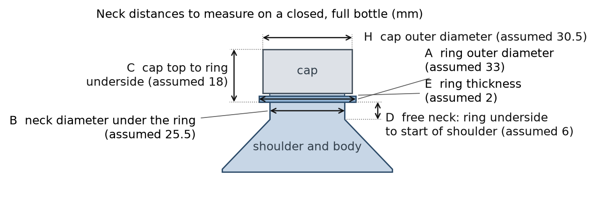

# S2 neck measurement and slot-gauge sheet (Gate 0), version 3

Version 3, 2026-10-03. Companion to the S2-RC2 master specification and to the Hand README. Version 2 added the cap outer diameter (H). Version 3 replaces the placeholder text about a second test by the real one: four printed slot gauges (about 25 to 40 minutes of printing each) that tell you, before any jaw is printed, whether the real bottles sit in the jaws as drawn. It also carries the exact decision rules from the Hand track, and corrects two numbers that were stale in version 2 (groove height is 5.5 mm, not 4.5 mm; the jaw top is 1 mm below the cap top).

## Why this is the most useful hour before printing the hand

The S2 hand does not squeeze the body of the bottle. Two jaws close around the cap and the neck (the same place where the Japanese restocking robot holds its bottles, as far as the public photos show), and a lip under the plastic ring below the cap catches the bottle if friction on the cap slips. The jaws are cut for a standard 28 mm (PCO 1881) neck. I have only assumed the dimensions below; the measurements and the gauges decide whether the jaws are printed as drawn, with a thinner lip, or not at all.

*Figure 1. Distances A to E and H on the neck. F (widest body diameter) and G (total height, floor to cap top) are measured on the whole bottle. The numbers in the figure are my assumptions for a 28 mm neck; your bottles will differ a little.*

## What you need

- Calipers (0.1 mm reading) and a ruler.
- Closed, full bottles from a store (cold is fine). Best: 3 brands of 600 mL soda or water, plus one 500 mL, one 1 L, one 1.5 L and one 2 L if you can. The same brand from two different batches is worth including.
- Your phone: one photo of each neck from the side, with the ruler next to it.
- The printer: PETG, 0.2 mm layers, 3 perimeters, 15 % infill, no supports, the files exactly as exported (they are already in print pose).

## Part 1. Measure (5 minutes per bottle, no printing)

1. **A, ring outer diameter.** Calipers across the ring, twice, turned 90 degrees between readings. Write "notches" in the ring column if the ring has gaps, notches or flats.
2. **B, neck diameter under the ring.** Calipers on the cylinder just below the ring, twice, 90 degrees apart. If the neck is slightly conical, measure 1 mm under the ring.
3. **C, cap top to ring underside.** Lay the ruler flat on top of the cap and measure down to the underside of the ring (or use the caliper depth rod).
4. **D, free neck.** Height from the underside of the ring to the point where the neck starts to widen into the shoulder. If it widens gradually, use the point where the diameter is 1 mm bigger than B. **This is the number I care about most**: it decides the lip.
5. **E, ring thickness** at its rim.
6. **H, cap outer diameter,** twice, 90 degrees apart, at the widest point of the cap (ribs included). Note if the cap is smooth, ribbed or has a sport nozzle.
7. **F** widest body diameter and **G** total height.
8. Fill one row of `S2_neck_measurement_template.csv` per bottle.

## Part 2. Print the four slot gauges and try every bottle (printing about 2 h in total, testing 15 minutes)

Each gauge is the slot profile of the two jaws (lip, groove and cap-wall steps, back wall, 45 degree lead-ins) cut from a 20 mm slab and joined by a bridge, at the spacing of one cap diameter. The notches in the top edge of the bridge identify it. The gauge is printed lying on its back; in use the notched edge is the top. The Hand track's one-paragraph use note for the gauges (what a good fit and each failure look like) is [s2hand_gauge_use_note.md](s2hand_gauge_use_note.md.html).

| gauge | file | cap position | lip / cap-wall / groove face gap (mm) | notches |
|---|---|---|---|---|
| 1 (print first) | s2hand_gauge_cap30p5.stl | cap 30.5 (nominal) | 28.0 / 30.5 / 35.5 | 2 |
| 2 | s2hand_gauge_cap29p5.stl | cap 29.5 (smallest caps) | 27.0 / 29.5 / 34.5 | 1 |
| 3 | s2hand_gauge_cap32p0.stl | cap 32.0 (largest caps) | 29.5 / 32.0 / 37.0 | 3 |
| 4 (only if D is 3 to 4 mm) | s2hand_gauge_cap30p5_lip2.stl | cap 30.5, 2.0 mm lip | 28.0 / 30.5 / 35.5 | 4 |

**How to use a gauge.** Hold it level with the slot opening toward the bottle. Push it onto the neck from the front, about 1 to 2 mm below the final height, until the cap approaches the back wall; then lift until the ring underside rests on the lip.

**Good:** the cap sits between the cap-wall faces, touching or with a hair of play, in the gauge whose diameter matches it (with about 0.25 mm per side of visible gap for a cap 0.5 mm smaller); the ring lies in the groove with air above and beside it; the lip tip is under the ring and the ring rests on it; the bottle hangs from the lip; the cap top stands about 1 mm above the jaw top (a shorter cap that ends below the jaw top is also fine).

**What a failure means:**

| what you see | meaning | what happens next |
|---|---|---|
| the cap does not enter the faces | the cap is wider than this gauge | try the next larger gauge; if it does not enter the 32.0 gauge, the cap is outside the design range: send me the numbers |
| the ring does not enter the groove, or stops on the lead-in | ring outer diameter above the groove gap minus 0.5 mm, or ring thicker than 5.5 mm | send me A and E; the groove can be widened |
| the gauge cannot be lifted to the ring because the lip does not pass under it | the free neck is too short for the 3.0 mm lip | try gauge 4 (2.0 mm lip); if that also fails, stop (see the table below) |
| the neck wedges against the lip faces | neck diameter above the lip face gap (27.0 / 28.0 / 29.5 mm) | send me B |

## Part 3. What I do with the numbers

| measured | design value | fine as designed | outside this range |
|---|---|---|---|
| A ring outer diameter | 33 | 32.0 to 34.0, every reading | below 32 the lip seat on the ring is narrower than 1.25 mm per side: I enlarge the lip |
| B neck diameter under the ring | 25.5 | 24.5 to 26.5 | above 26.5 the lip faces touch the neck: I widen the lip bore |
| C cap top to ring underside | 18 | 16 to 21 | sets the height of the cap wall; a spread above 1 mm between brands means one jaw setting per product |
| **D free neck** | 6 | **4.0 or more (3.25 or more for a typical 600 mL soda bottle with a 71 mm body)**: baseline jaws with the 3.0 mm lip | **3.0 to 4.0 (2.25 to 3.25 for the typical 600 mL): print the lip2 jaws (2.0 mm lip). Below 3.0 (2.25): stop, the bottle can only be held by friction on the cap (about 600 mL) and I redesign the lip. Send me the file before printing any jaw.** |
| E ring thickness | 2 | 1.5 to 3.0 | the groove is 5.5 mm tall and takes up to 3 mm rings; thicker rings reduce the release window |
| H cap outer diameter | 30.5 | 29.5 to 32.0 | below 29.5 the jaws close on their stop and the clamp force falls (9 to 19 N for caps under 30.3 mm), above 32.0 the cap does not enter |
| F widest body diameter | 65 to 70 | 71 or less | above 71 the bottle does not fit the 73 mm lanes (1 L and larger go to the tote and wide-lane use only) |
| G total height | 237 (600 mL) | any | the shelf pitch needed is G + 5 mm lift + 30 mm shelf structure + 5 mm margin + the hand above the cap (0 mm for the neck hand) |

The rule behind the D row is the boolean result of the Hand track on 216 bottle-neck corner cases: after the hand has been lowered by D millimetres to lift the ring off the lip, the free neck must be at least lip thickness + D - 1.0 mm. The release sequence uses D = 2 mm (lower 2 mm, then open): 4.0 mm for the 3.0 mm lip, 3.0 mm for the 2.0 mm lip, worst corner.

## Part 4 (optional, 0.8 h of printing each). Clip sticks

s2hand_stick_A_C.stl and s2hand_stick_B_C.stl are hand-held heads of the real jaws (lip, groove, cap faces, lead-ins and the lip ramp, with a handle). Hold one stick on each side of a bottle neck (press them together by hand) and check three things: the ring enters the groove and rests on the lip, the lip ramp lets the neck slide forward and out without catching, and the ring stays on the lip when you rock the bottle gently. Pressing by hand is not a force measurement; the pull-out force with the servo clamp is measured later, on the assembled hand (test H3 of the test plan).

## What to send me

1. `S2_neck_measurement_template.csv` (one row per bottle; the new columns record the gauge result).
2. The phone photos (side view of each neck with the ruler).
3. Anything surprising: a cap with a tamper band that stays on, a ring with flats, a bottle that does not seat in any gauge.

## Not needed from you

Weights, friction tests with other materials, store visits, tilt tests. The design uses desk values for those; the Hand and Sim tracks list which of them are assumed.
