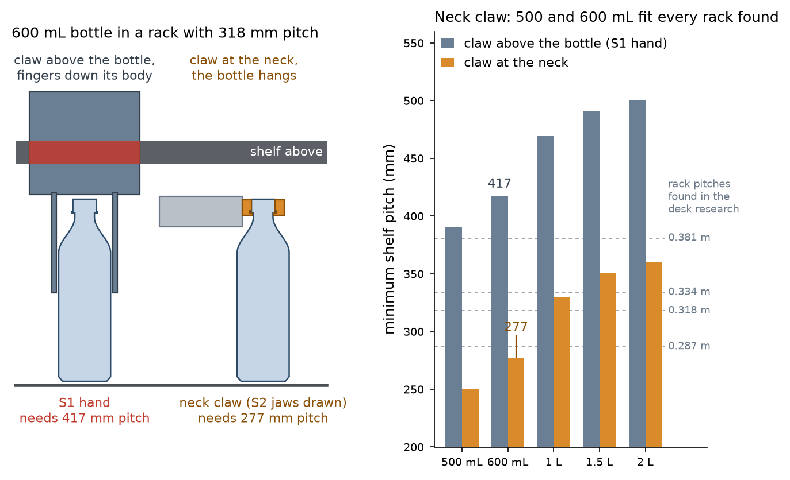

# Telexistence beverage-restocking claw: public evidence, what the photographs show, and what it means for ElRobot2-S2

Date: 2026-10-03. Status: desk research plus inspection of four published photographs. Nothing here was measured on hardware. Photographs are linked, not reproduced.

## 1. The company and what is deployed

- Telexistence Inc. (TX), Tokyo. Product line: TX SCARA (announced 2 Nov 2021 at the FamilyMart store inside the Ministry of Economy, Trade and Industry, Tokyo), mass deployment to 300 FamilyMart stores from August 2022, now marketed as TX Ghost; pilots in Tokyo 7-Eleven stores announced September 2025. A third-party registry also lists two Lawson stores (not confirmed by TX).
- System (public descriptions): a SCARA arm on a vertical column on a linear rail inside the refrigerated back room, cameras that scan the shelves, an AI system (Gordon) that chooses the product, the grip point and the path, and remote operators who take over when a bottle tips or rolls. Vendor-stated autonomy above 98 %; up to about 1,000 bottles and cans per day; a METI journal report gives 30 to 50 s per bottle; one store's back aisle is 70 to 80 cm wide (trade press).
- Hand, as TX describes it: one hand for all PET bottles (to 2 L) and all can sizes, with a grip point that differs per beverage and is found by a neural network.

## 2. Photographs examined

| # | Source (open it yourself) | Date | What is visible | Confidence in my reading |
|---|---|---|---|---|
| 1 | tx-inc.com, TX SCARA press render (file 2022/02/TX-SCARA_Press_1-1-1) | 2022 | Electric parallel-jaw hand on a forearm tilted about 20 to 25 degrees down. Two long, flat, blade-like fingers on parallelogram linkages. Rendering, not a field photograph. | medium |
| 2 | Diamond Chain Store Online article on the Sagamihara store (photo MG_6955) | Dec 2021 | First-generation hand seen from behind the shelves: black parallel-jaw body with a flat black blade finger and a white finger with a scooped profile; arm entering a shelf tier from the rear. | medium |
| 3 | NVIDIA blog, 10 Aug 2022 (photo of the METI store robot) | 2022 | A 600 mL PET bottle hangs below the hand. Two flat vertical plates sit directly around the cap and neck; the cap top shows just above the near plate. Horizontal arm. | high that the bottle is held at the top; medium on plate size |
| 4 | AP photograph, 26 Aug 2022 (TechXplore story) | 2022 | A 650 mL PET bottle hangs from a black block about as wide as the bottle body and about a third of a cap-to-shoulder length tall, directly on the bottle shoulder. Horizontal arm, camera and light behind the plates. | high that the bottle is held at the top |

Scale: plate width and height were scaled from the bottle body width (assumed 65 mm). Estimated plates: about 50 to 65 mm wide and 20 to 25 mm tall, uncertainty about 25 %.

## 3. Reading of the claw shape (my interpretation)

1. A parallel-jaw hand whose two jaws are flat plates closing horizontally across the bottle's neck zone. The plates are about as wide as the bottle body, thin in the closing direction and 20 to 25 mm tall.
2. The plates cover the cap and the neck down to the start of the shoulder. The bottle hangs from them with its body free. Nothing of the hand is above the cap top apart from the plate edge.
3. The arm is horizontal when it carries the bottle; the hand's bulk (camera, light, motor) is behind the plates.
4. Not visible in any photograph I found: whether the plates also hook under the support ring, the clamp force, the pad material, how cans are held, and how a bottle is released.

## 4. Why a claw at the neck beats a claw around the body, for a rack gap

*Figure 1. Minimum shelf pitch p = H + 5 mm insertion lift + 30 mm shelf structure (assumed) + 5 mm margin + R, with R the height of claw structure above the bottle top: 140 mm for the S1 hand, about 0 for a claw at the neck. Data: claw_families_pmin.csv.*

- Vertical stack. The S1 claw puts its body 6 mm above the bottle and its fingers down the sides, so 140 mm of hand sits above the cap. That needs 417 mm of pitch for a 600 mL bottle; none of the four rack pitches found in the desk research (0.287 to 0.381 m) reaches it, not even for 500 mL. A claw at the neck adds nothing above the cap: 277 mm for 600 mL, which fits all four racks, and 1 L, 1.5 L and 2 L fit from 0.334 m, 0.381 m and 0.381 m.
- Side clearance. Fingers beside the bottle need free space in the lane; a lane 73 mm wide holding a 65 mm bottle has about 4 mm per side. At the neck the jaws sit above the neighbours' caps, which are 60 mm away from the lane axis.
- Load path. The weight goes through the injection-moulded neck finish, a standardised rigid part (28 mm PCO 1881 in the sources used here), not through the thin, variable wall of the body. One hand then fits every brand, which is what TX claims.
- Costs. The bottle hangs and can swing; a neck grip needs side access to the neck at pick-up (bottles in a single spaced row, not a dense crate); cans have no neck, so they need a second mode; the neck dimensions must be measured on local bottles.

## 5. What changes in the S2 design (lead decision, 2026-10-03)

My S2-RC1 hand already grips at the neck, with two 2 mm tongues under the support ring. The TX photographs show a stiffer and more tolerant form, and a beam calculation shows that my tongues were too flexible:

| Finger form (PETG, E = 1800 MPa, 8.8 N per finger = 1.2 kg x 1.5) | Tip deflection |
|---|---|
| flat tongue 14 x 4 mm, 126 mm long (the long finger of the thin fork) | 43.7 mm |
| same, 72 mm long (with a guide beam) | 8.2 mm |
| vertical plate 5 x 22 mm, 126 mm long | 0.73 mm |
| vertical plate 5 x 22 mm, 72 mm long | 0.14 mm |

New baseline: collar jaws. Each jaw is a vertical plate whose inner edge is a stepped half-bore: a cap wall (about 15 mm tall, bore 30 to 31 mm, light torque-limited clamp, TPU pad), a ring groove (3 to 4 mm tall, bore 35 mm) and a lip under the ring (3 mm tall, bore 27 mm) that carries the weight when friction on the cap slips. The thin fork (lip only) stays as a variant. The plates end flush with the cap top, so the claw adds nothing above the bottle. The Gate-0 print kit tests both forms by hand on real bottles.

## 6. Sources

- TX SCARA press release, 2 Nov 2021: https://tx-inc.com/en/blog/2021/11/02/11451/
- TX 300-store press release, 10 Aug 2022 (same hand for all beverages, grip point per beverage): https://tx-inc.com/en/blog/2022/08/10/11712/
- NVIDIA blog with the METI-store photograph: https://blogs.nvidia.com/blog/telexistence-convenience-store-robotics/
- AP story and photographs: https://techxplore.com/news/2022-09-robot-stocks-corner.html
- Diamond Chain Store Online (Sagamihara store): https://diamond-rm.net/technology/100237/2/
- METI journal (30 to 50 s per bottle): https://journal.meti.go.jp/p/18742/
- TX and Physical Intelligence partnership (rolled-over bottles as the hard error case): https://tx-inc.com/en/blog/2025/06/25/12307/
- TX home page (TX Ghost, 7-Eleven pilot): https://tx-inc.com/en/
- Model-T hand (2020: vacuum suction plus two-finger gripper): https://tx-inc.com/en/blog/2020/07/21/10624/
- Product listing (PET up to 2 L): https://www.robotatta.com/products/344
- Bottling-line background (PET bottles are carried by the neck below the support collar): https://patents.google.com/patent/US8662553
