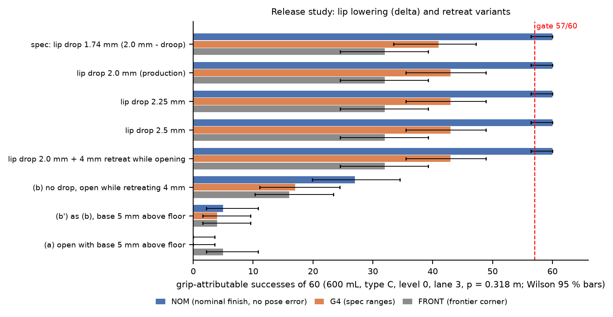
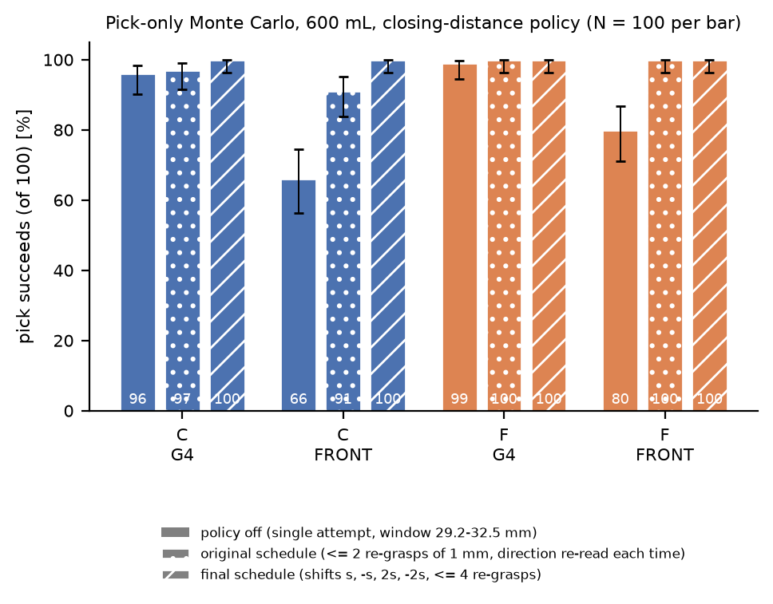
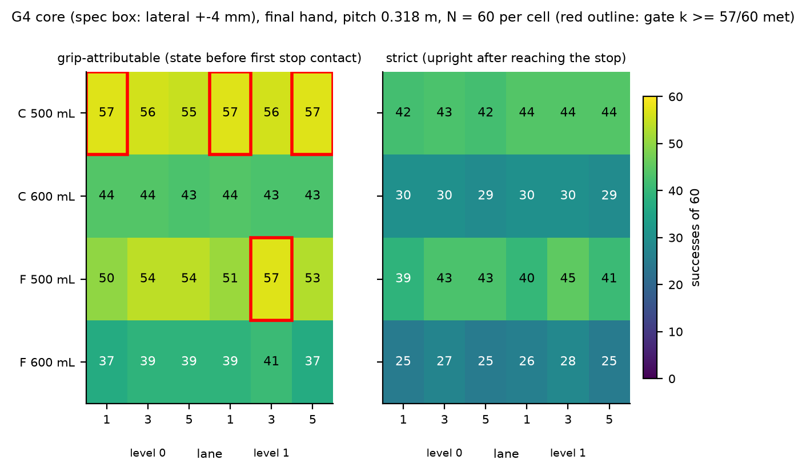
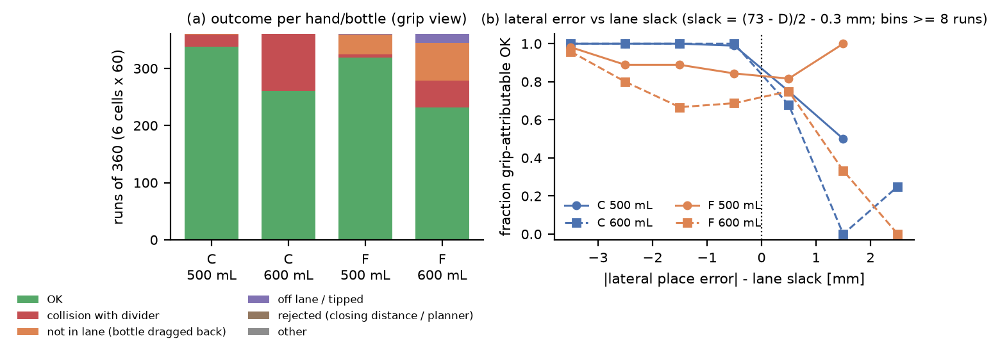
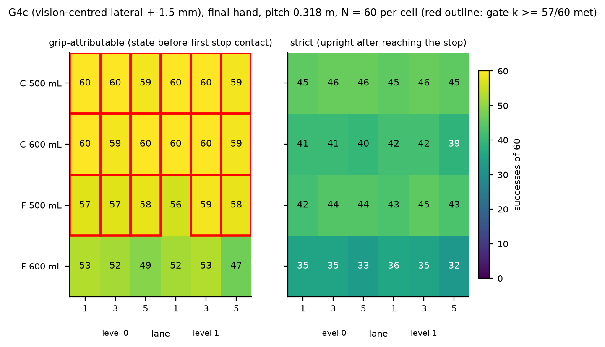
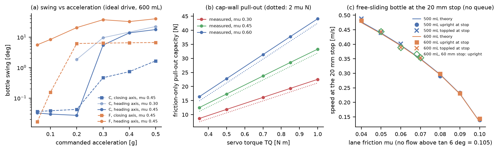
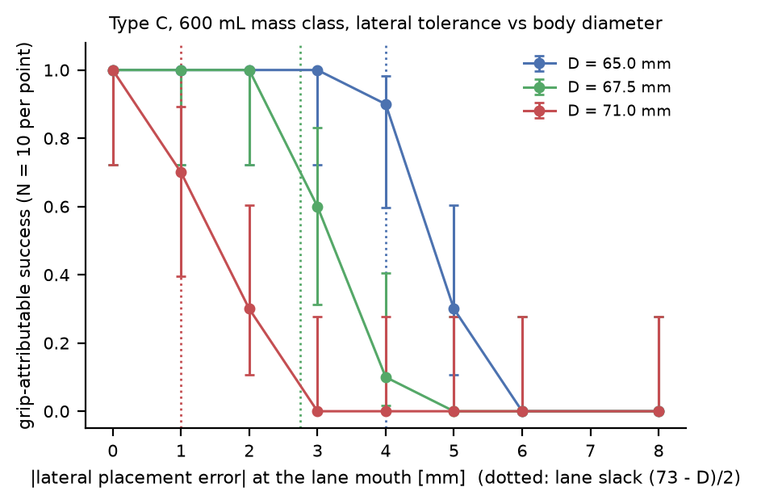
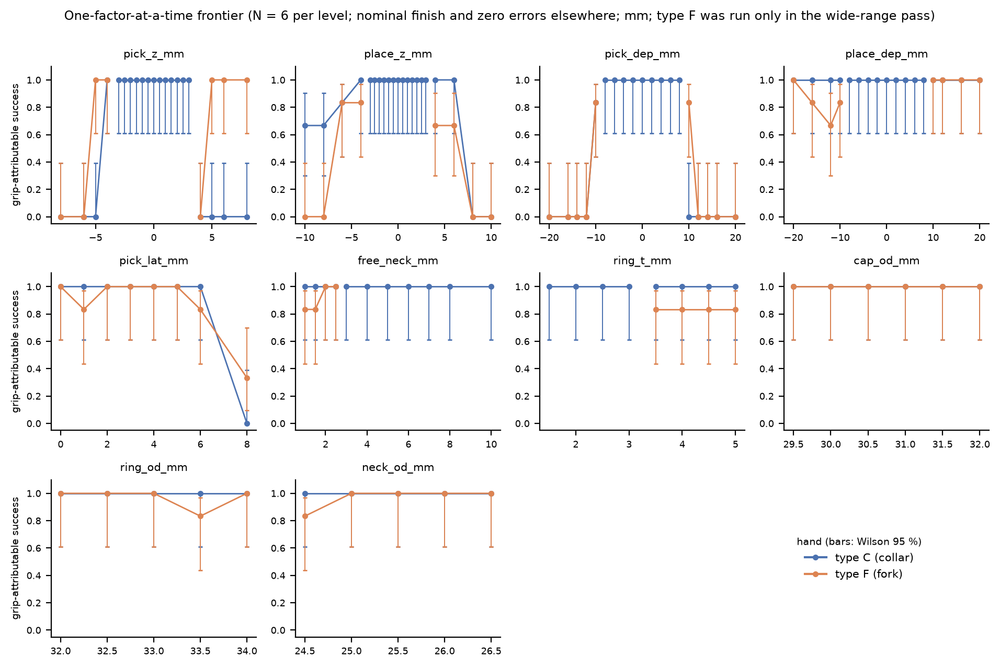

# ElRobot2 S2-RC2 PET collar-jaw mode - MuJoCo S2 validation (SIM track, Phase 2 on the final Hand geometry): README and summary

Every table is generated by `s2sim_make_summary.py` from the CSV files named in the caption (column names are CSV column names).  Rerun instructions: section 11, files: section 12.

## 0. Deviations, interpretation choices and what was NOT assessed (read first)

1. **G4 acceptance (>= 57/60 in every cell) is NOT met.**  Grip-attributable count: 4 of 24 cells reach 57/60 (C 500 mL L0 lane 1: 57; C 500 mL L1 lane 1: 57; C 500 mL L1 lane 5: 57; F 500 mL L1 lane 3: 57); strict count: 0 of 24.  Totals over the 6 cells of each hand/bottle (grip-attributable / strict, of 360): C 500 mL 338 / 259; C 600 mL 261 / 178; F 500 mL 319 / 251; F 600 mL 232 / 156.  Failures over all 1440 draws: collision 173, not_in_lane 101, tipped 10, off_lane_x 6.  The dominant mechanism is the lateral placement error at the lane mouth (bottle body strikes a divider nose when the error exceeds the lane slack (73 mm - D)/2; 600 mL bodies of D 64-71 mm leave 1-4.5 mm), plus, for type F only, the lip dragging the bottle back out during the retreat (`not_in_lane`).  Nothing was relaxed.  **With the lateral error of the spec box reduced to +-1.5 mm (vision-centred, G4c; along-heading +-4 mm, vertical +-1.5 mm unchanged)** the cells reaching 57/60 grip-attributable are C 500 mL 6/6 cells (358/360 draws, strict 273); C 600 mL 6/6 cells (358/360 draws, strict 245); F 500 mL 5/6 cells (345/360 draws, strict 261); F 600 mL 0/6 cells (306/360 draws, strict 206) (section 6.2).
2. **Regeneration after a workspace loss.**  The workspace was cleaned while the session was idle (about 24 h, so the report is later than the 08:45 UTC Oct 3 deadline; the lead extended it to 10:30 UTC Oct 4).  Result files saved before were restored from the artifact store; files created after the 07:39 UTC Oct 3 snapshot (policy fix, lateral sweep, big bottles, frontier, stop-60, convergence, figures) were recomputed with the restored scripts.  The restored pool reproduces the earlier draws: the job keys of 1416 of the 1440 G4 core jobs (hash of seed, error draws, finish and controller overrides) matched the saved CSV rows one to one (the other 24 were the rejected draws, re-run on purpose); after re-applying the same controller patch, the two formerly rejected draws 13 and 57 reproduced the pre-loss closing readings exactly (32.71 -> 29.97 mm and 34.12 -> 32.28 mm; the final schedule then reaches 32.2 mm for draw 57), and the regenerated lateral-sweep, big-bottle, stop-60, convergence and narrow-range frontier tables are numerically identical to the pre-loss ones (counts and means).  In the G4 core and p = 0.287 tables the rows of draws that never trigger the closing-distance policy are the ORIGINAL rows (restored by job key); every draw that used or needed a re-grasp was re-run with the final policy (`s2sim_preload.py`).  The 7 replay CSVs were NOT regenerated (intact since 07:55 UTC Oct 3); the two failure replays are draws without any re-grasp (G4 core column `regrasp_n` = 0), so they do not depend on the schedule.  The release study had been run before any re-grasp existed: its 120 draws rejected on the closing window were re-run with the final schedule.
3. **All J3-wrench numbers I sent before 2026-10-03 03:00 UTC, and every result obtained before the controller fix below, are void.**  A controller error reset the carry-leg grip command to the measured gap, so the 24.8 N clamp collapsed to ~0 at the start of the first carry leg (cap slid 1.5 mm onto the lip, 4 ms J3 spike of 3.88 N*m / 35.1 N).  Fixed; all numbers below were produced after the fix on the FINAL hand.
4. **Success is reported twice.** `success_grip` = all G4 criteria (planner acceptance, placed in its lane, tilt <= 8 deg, carry swing <= 10 deg, slip <= 3.5 mm, neighbour displacement <= 5 mm, no collision with ceiling/dividers) evaluated on the state before the bottle first touches the lane-end stop (what the gripper and the placement are responsible for).  `success` (strict) additionally requires the bottle to be still upright in its lane after it has glided down the 6 deg lane to the 20 x 5 mm stop.  With lane friction 0.05-0.075 the bottle reaches the stop above ~0.3 m/s and topples (sections 7.3 and 9.5); that is a bench property, not a gripper property.  Neither number relaxes a criterion; the G4 acceptance table gives both.
5. **Closing-distance policy** (lead request; final version 'v3'): acceptance window 29.2-32.5 mm on the gauge-calibrated closing reading (cap OD 29.5-32.0 mm minus 0.3 / plus 0.5 mm measurement error; calibration offset +0.2 mm = soft-contact penetration at 24.8 N).  On a reading above the window the jaws re-open and the carriage is shifted, then the clamp closes again.  The first shift is 1 mm in the direction given by the reading (up if 32.5-34.2 mm = ring inside the cap-wall zone, down otherwise); if the window is still missed the carriage tries the other side (-1 mm from the first height), then +/-2 mm, i.e. the total shifts from the first height are s, -s, 2s, -2s with s = +/-1 mm, at most four re-grasps.  The reading alone cannot tell 'ring in the cap-wall zone' from 'lip bar on the ring edge' when the hand is about 1.5 mm too high (reading 32.7-34.1 mm, one jaw on the ring and the other on the cap), which is why the first policy version (one direction only, two shifts) left 24 of 1440 G4 draws rejected; the criterion window was NOT widened.  A rejection that survives the policy is a failure (0 in G4 core with the final schedule).  **The schedule was changed after the first full G4 run** (original schedule: at most two re-grasps of 1 mm, direction re-read each time; 24 of 1440 G4 draws and 6 of 288 at p = 0.287 were rejected); all headline numbers use the final schedule, the original-schedule CSVs are kept (`*_policy_v1.csv`) and compared in section 5.1.  Section 5 shows the pick-stage effect.
6. **Hand model.** Final Hand meshes (`s2hand_frame_*.stl`) -> exact convex decomposition of the slot region (y >= 60 mm: back wall y = 83, planar lip/groove/cap-wall faces, lead-ins, lip ramp are faces of the pieces, hull excess 0.065 mm^3, max deviation 0.003 mm); the rear block / straps / rack tabs (y < 60 mm, never in contact with a bottle) are coarse hulls (excess 9-23 % of the jaw volume, up to 10 mm outward deviation, conservative for the collision accounting).  Base, carrier, top plate, servo and guide rail are convex hulls (conservative).  Racks ride on the jaw bodies, pinion and camera plate are not modelled.  The hand is rigid: the droop is emulated only in the 'spec' release variant as a reduction of the commanded lip drop (0.26 mm for 600 mL).  The wrist body keeps the S1 J3 flange stand-in (+10 g), so the hand subtree mass in the model is 408.4 g (type C) against the manifest 398.4 g.
7. **Neighbours.** Only the mouth-slot bottle of each neighbouring lane is dynamic; the deeper slots (0.15-0.25 m behind the jaw tips) and the tote neighbours are fixed bodies (a touch of a tote neighbour is counted as a collision anyway).  Same outcomes as fully dynamic stacks in the tested cases, 4x faster.
8. **Carry accelerations are limited by the S1 arm** (joint accel 4 rad/s^2, J3 8 rad/s^2): the requested 0.2 g bore acceleration is not reachable; the cycles run at the joint-limited value.  The swing/slip versus acceleration tests (section 7.2) use an ideal drive (torque limits lifted) to cover 0.05-0.5 g.
9. **Not assessed:** the old-datum suite (y_E = 270 mm, angled-entry planner) - not run; CAN mode (P2) - not built; p = 0.381 and divider height 80 mm - not run; the pick-window study (`s2sim_results_pick_window.csv`) was made with the stand-in hand and is NOT used.  Indicative only (small N, Wilson intervals in the tables): p = 0.287 (N = 24 per cell), 1 L / 1.5 L / 2 L (N = 10 per lane), lateral-tolerance sweep (N = 10), frontier (N = 6 per level), lane-stop 60 mm check (N = 20), dt / solref convergence (N = 10).
10. Studies with N < 60 are labelled 'indicative' (Wilson 95 % intervals are in the tables); only the G4 core matrix uses N = 60 per condition.
11. **Type F needs a larger lip drop than type C.**  All headline numbers use the lead's release sequence with 2.0 mm effective lip drop; with it type F loses 13.9 % of the G4 draws and 8.6 % of the G4c draws to the bottle being dragged back out of the lane (`not_in_lane`).  In a 60-draw diagnostic (section 6.4) a 2.5 mm effective drop removes all of these failures; the full G4c matrix with 2.5 mm (section 6.5, diagnostic, not the headline) places 500 mL 359/360 draws, 6/6 cells at 57/60 or better; 600 mL 358/360 draws, 6/6 cells at 57/60 or better.
12. **Corrections of earlier statements.**  (a) My message of 2026-10-03 06:37 UTC quoted 'with delta = 2.5 mm: 24/24' with both `s2sim_results_nominal.csv` and `s2sim_results_nominal_d25.csv` as sources; only the second file passes all cycles (24 of 24); the first (spec release) shows 21/24.  Both files belong to the superseded stand-in hand; the final-hand nominal matrix is section 3.  (b) My status message of 2026-10-03 07:57 UTC said the G4 gate is not met 'for F'; precisely, of the 12 type F cells one reaches 57/60 (F 500 mL, level 1, lane 3), the other 11 do not (section 6.1).  (c) `evaluate()` in `s2sim_run_tests.py` had an unused `crit=` argument that silently discarded overrides; it now raises, the thresholds (swing 10 deg, slip 3.5 mm, neighbour displacement 5 mm) are the spec values in every result.  (d) The docstring of `s2sim_routes.py` quoted a 3 mm hand-to-neighbour clearance while the code uses 20 mm; the docstring is corrected, results were always produced with 20 mm.

## 1. Model (what was built)

- World: x lateral, y toward the shelf, z up, J1 axis through the origin; S1 arm hulls, servo gains and joint limits imported unmodified; carriage 0.37-1.06 m; L1 = L2 = 200 mm; J3 reach annulus 170-385 mm.
- Hand: final geometry (section 2), closing axis perpendicular to the heading, bore axis 104 mm ahead of the J3 axis, seat plane zeta -12.3 mm (z_c = z_ring + 162.3 mm), jaw travel 0-45.75 mm per jaw, clamp 24.8 N per jaw at TQ 0.70 N*m (eta 0.85, r 12 mm), drop-over opening 10 mm per jaw (cap-wall faces 49.0 mm).
- Bench: lane mouth y_E = 330 mm, ceiling underside front edge the vertical plane y = 313 mm, lane 250 mm long, 6 deg slope, 5 lanes pitch 76 mm (clear 73 mm), 3 mm dividers with knife-edge noses 0.6 -> 3 mm over 40 mm, height 35 mm, lane friction 0.05-0.15, stop 5 x 20 mm; tote: single row x = -300 mm, pockets y = 0/100/200 mm, D75, 8 mm deep, open on +x.
- Bottles: revolved convex pieces (cap, ring, neck, shoulder, body, base chamfer) with liquid-fill inertia (COM at 0.42 H), finish and masses per spec section 3.
- Controller: scripted FSM, analytic IK for the bore point and heading (q3 = 0 when the hand heading points along the forearm), jerk-limited Cartesian legs with joint-rate limits, vertical drop-over for every tote pick, straight insertion along the heading parallel to the lane floor (base 5 mm above the floor), lower to floor contact, loose clamp (+1 mm), lip drop, full opening, retreat along the lane axis.  Holds are by contact only (no welds, no pose writes after the initial reset).
- Solver: dt 1 ms, implicitfast, elliptic cones, impratio 10, noslip 10, multiccd; default contact solref 0.004, jaw solref 0.008.

## 2. Final hand integration (Phase 2): decomposition and hull error

Caption: `s2sim_hand_pieces.json` (field `check`), produced by `s2sim_hand_prep.py`.  Slot region = y >= 60 mm in the hand frame (contains every face that touches a bottle).

| part | pieces | mesh_vol_mm3 | hull_excess_slot_mm3 | max_dev_slot_mm | hull_excess_rear_pct | max_dev_rear_mm |
|---|---|---|---|---|---|---|
| jaw_A_C | 6 slot + 4 rear | 47277.503 | 0.065 | 0.003 | 8.800 | 7.118 |
| jaw_B_C | 6 slot + 6 rear | 51331.993 | 0.065 | 0.003 | 22.369 | 10.218 |
| jaw_A_F | 4 slot + 4 rear | 46012.503 | 0.000 | 0.000 | 9.042 | 7.159 |
| jaw_B_F | 4 slot + 6 rear | 50066.993 | 0.000 | 0.000 | 22.934 | 10.173 |

Mass and centre of mass of the closed hand rebuilt from the part meshes (uniform density scaled to the manifest masses) against the manifest totals:

| type | mass_g | manifest_mass_g | com_x_y_zeta_mm | manifest_com_mm |
|---|---|---|---|---|
| C | 398.40 | 398.40 | 2.72, 10.78, 12.86 | 2.72, 10.78, 12.86 |
| F | 396.80 | 396.80 | 2.73, 10.34, 12.91 | 2.73, 10.34, 12.92 |

## 3. Nominal matrix on the final hand (24 cycles: C/F x 500/600 mL x level 0/1 x lanes 1/3/5, p = 0.318 m, nominal finish, no pose error)

Caption: `s2sim_results_nominal_final_Vd2.0.csv` (release: lip drop 2.0 mm effective).

| jaw | sku | cycles | passed | swing_max_deg | slip_max_mm | nb_disp_max_mm | t_cycle_L0_s | t_cycle_L1_s |
|---|---|---|---|---|---|---|---|---|
| C | pet_500 | 6 | 6 | 0.033 | 0.807 | 0.002 | 21.431 | 34.962 |
| C | pet_600 | 6 | 6 | 0.034 | 0.806 | 0.001 | 21.481 | 35.013 |
| F | pet_500 | 6 | 6 | 0.114 | 1.100 | 0.002 | 22.208 | 35.337 |
| F | pet_600 | 6 | 6 | 0.114 | 1.219 | 0.001 | 22.263 | 35.393 |

With the spec release (delta 2.0 mm minus droop emulation = 1.74 mm effective, `s2sim_results_nominal_final.csv`): 21/24 pass (failures: F pet_500 L0 lane3 not_in_lane; F pet_600 L0 lane5 not_in_lane; F pet_600 L1 lane5 not_in_lane).

## 4. Release study (600 mL, type C, level 0, lane 3, p = 0.318 m, N = 60 per cell, same 60 draws for every variant)

Caption: `s2sim_table_release_final.csv`.  Cell = placed in lane by the gripper (strict count incl. lane-end stop in brackets) out of 60.  Boxes: NOM = nominal finish + zero pose error (friction, mass, body D, tote pocket random); G4 = G4 ranges (spec); FRONT = frontier corner (cap 31.5-32, ring 32-32.6 mm, ring t 2.5-3, free neck 3-5, errors 6/4/3 mm).

| variant | NOM: grip ok / strict ok | G4: grip ok / strict ok | FRONT: grip ok / strict ok |
|---|---|---|---|
| spec: drop 2.0 mm minus droop (1.74 mm effective) | 60/60  (41) | 41/60  (28) | 32/60  (23) |
| drop 2.0 mm effective | 60/60  (40) | 43/60  (30) | 32/60  (23) |
| drop 2.25 mm effective | 60/60  (39) | 43/60  (31) | 32/60  (23) |
| drop 2.5 mm effective | 60/60  (40) | 43/60  (31) | 32/60  (23) |
| drop 2.0 mm, 4 mm retreat while opening | 60/60  (40) | 43/60  (30) | 32/60  (23) |
| (b) no drop, open while retreating 4 mm | 27/60  (18) | 17/60  (13) | 16/60  (12) |
| (b') no drop, base 5 mm up, open while retreating 4 mm | 5/60  (17) | 4/60  (6) | 4/60  (6) |
| (a) open with base 5 mm above floor | 0/60  (0) | 0/60  (0) | 5/60  (4) |

Failure-mode histogram (counts of 60; `OK` = placed by the gripper; `collision` = bottle strikes a divider nose (lateral error beyond the lane slack); `rejected_closing_distance` = grasp refused by the planner; `not_in_lane` = bottle dragged back out of the lane; `tipped` = bottle left tilted > 8 deg):

| variant | box | OK | collision | not_in_lane | off_lane_x | tipped | rejected_closing_distance |
|---|---|---|---|---|---|---|---|
| Vd2.0 | NOM | 60 | 0 | 0 | 0 | 0 | 0 |
| Vd2.0 | G4 | 43 | 17 | 0 | 0 | 0 | 0 |
| Vd2.0 | FRONT | 32 | 28 | 0 | 0 | 0 | 0 |
| Vopen_at_height | NOM | 0 | 0 | 60 | 0 | 0 | 0 |
| Vopen_at_height | G4 | 0 | 0 | 59 | 0 | 1 | 0 |
| Vopen_at_height | FRONT | 5 | 0 | 52 | 0 | 3 | 0 |
| Vopen_retreat4 | NOM | 27 | 0 | 30 | 0 | 3 | 0 |
| Vopen_retreat4 | G4 | 17 | 7 | 35 | 0 | 1 | 0 |
| Vopen_retreat4 | FRONT | 16 | 11 | 30 | 0 | 3 | 0 |
| Vopen_retreat4_h | NOM | 5 | 0 | 32 | 0 | 23 | 0 |
| Vopen_retreat4_h | G4 | 4 | 0 | 48 | 1 | 7 | 0 |
| Vopen_retreat4_h | FRONT | 4 | 0 | 47 | 1 | 8 | 0 |



Reading: the lead's sequence (clamp loose, lower the lip, open fully, retreat) releases 60/60 in the nominal box for every effective lip drop from 1.74 to 2.5 mm on the final hand (the front ramp of the lip removed the 1.74 mm marginality seen with the stand-in hand).  Drag-back (`not_in_lane`) counts: spec 1.74 mm 2 (G4) / 1 (FRONT); 2.0 mm 0 / 0; 2.25 mm 0 / 1; 2.5 mm 0 / 1 (single draws at the frontier corner).  Opening at height fails in every nominal draw (0/60: the lip drags the bottle back out), opening while retreating without lowering the lip releases 27/60 nominal.  The remaining G4 / FRONT failures of the lip-drop variants are NOT release failures: they are lateral collisions with the divider noses (section 6).  The release works across the whole free-neck range of the G4 draws (3-10 mm) with 2.0 mm effective drop; the dedicated sweep is in section 9.  The first pass of this study (run before any re-grasp existed: single attempt with the closing window) counted 120 of its 1440 draws as `rejected_closing_distance`; those 120 draws were re-run with the final schedule, so every number here uses it (the nominal box is unaffected).

## 5. Closing-distance policy: pick stage only (600 mL, G4 and FRONT draws, N = 100 per cell)

Caption: `s2sim_table_pick_mc.csv`, `s2sim_results_pick_mc.csv`.  Success = grasp accepted and bottle follows a 3 mm lift.  `off` = single attempt with the 29.2-32.5 mm window, `on` = policy v3 (re-grasp shifts s, -s, 2s, -2s, at most four).

| jaw | box | policy | success | rate | lo | hi |
|---|---|---|---|---|---|---|
| C | G4 | off | 96/100 | 0.96 | 0.90 | 0.98 |
| C | FRONT | off | 66/100 | 0.66 | 0.56 | 0.74 |
| F | G4 | off | 99/100 | 0.99 | 0.95 | 1.00 |
| F | FRONT | off | 80/100 | 0.80 | 0.71 | 0.87 |
| C | G4 | on | 100/100 | 1.00 | 0.96 | 1.00 |
| C | FRONT | on | 100/100 | 1.00 | 0.96 | 1.00 |
| F | G4 | on | 100/100 | 1.00 | 0.96 | 1.00 |
| F | FRONT | on | 100/100 | 1.00 | 0.96 | 1.00 |



### 5.1 Policy sensitivity: original schedule versus final schedule (section 0, item on the schedule change)

Original schedule (first G4 run): at most two re-grasps of 1 mm, the direction re-read from the closing reading before each shift.  Final schedule (used for every headline number): total shifts from the first grasp height s, -s, 2s, -2s with s = +/-1 mm taken from the first reading, at most four re-grasps.  The window 29.2-32.5 mm and all pass criteria are identical.  The schedule changed after the first G4 run because 24 of 1440 G4 draws ended as `rejected_closing_distance`: for a hand about 1.5 mm too high the reading (32.7-34.1 mm) mimics 'ring inside the cap-wall zone', the original rule raised the hand and could not recover.  An intermediate version with one reversal and at most 2-3 re-grasps was tried first; with at most two tries of the final pattern (s, -s) the frontier-corner pick fails more often than the original (diagnostic column below), because it cannot continue in the same direction.

Pick-only Monte Carlo, 600 mL, N = 100 per cell (pick succeeds = grasp accepted and the bottle follows a 3 mm lift).  Captions: `s2sim_results_pick_mc.csv` (off and final), `s2sim_results_pick_mc_policy_v1.csv` (original), `s2sim_results_pick_mc_final_max2.csv` (diagnostic).

| hand | box | off (single attempt) | original schedule | final schedule, only 2 tries (diagnostic) | FINAL schedule (<= 4 tries) |
|---|---|---|---|---|---|
| C | G4 | 96/100 | 97/100 | 100/100 | 100/100 |
| C | FRONT | 66/100 | 91/100 | 86/100 | 100/100 |
| F | G4 | 99/100 | 100/100 | 100/100 | 100/100 |
| F | FRONT | 80/100 | 100/100 | 92/100 | 100/100 |

G4 core (spec box, N = 60 per cell, 6 cells per row), `s2sim_results_g4_core_Vd2.0_policy_v1.csv` versus `s2sim_results_g4_core_Vd2.0.csv`:

| hand | SKU | original: placed by gripper (of 360) | original: rejected_closing_distance | FINAL: placed by gripper | FINAL: rejected | original: strict | FINAL: strict | re-grasps used (max / draws with >= 1) |
|---|---|---|---|---|---|---|---|---|
| C | 500 mL | 326 | 12 | 338 | 0 | 253 | 259 | 2 / 30 |
| C | 600 mL | 261 | 12 | 261 | 0 | 178 | 178 | 2 / 30 |
| F | 500 mL | 319 | 0 | 319 | 0 | 251 | 251 | 1 / 18 |
| F | 600 mL | 232 | 0 | 232 | 0 | 156 | 156 | 1 / 18 |

Cycle-time cost of the re-grasps (column `t_cycle`, successful rows of the final G4 core, levels mixed):

| regrasp_n | mean t_cycle s (OK rows) | OK rows |
|---|---|---|
| 0 | 29.45 | 1066 |
| 1 | 33.91 | 72 |
| 2 | 36.15 | 12 |

p = 0.287 m (N = 24 per cell, 3 cells per row), `s2sim_results_g4_pitch_Vd2.0_policy_v1.csv` versus `s2sim_results_g4_pitch_Vd2.0.csv`:

| hand | SKU | original: placed (of 72) | original: rejected | FINAL: placed | FINAL: rejected |
|---|---|---|---|---|---|
| C | 500 mL | 64 | 3 | 67 | 0 |
| C | 600 mL | 53 | 3 | 53 | 0 |
| F | 500 mL | 58 | 0 | 58 | 0 |
| F | 600 mL | 46 | 0 | 46 | 0 |

## 6. G4 acceptance (p = 0.318 m; 500 and 600 mL; lanes 1/3/5; levels 0/1; types C and F; full neighbour lanes)

### 6.1 Spec G4 ranges (lateral +-4 mm, along heading +-4 mm, vertical +-1.5 mm)

Caption: `s2sim_results_g4_core_Vd2.0.csv`; N = 60 draws per cell (G4 ranges: cap OD 29.5-32.0, ring OD 32-34, ring t 1.5-3, neck OD 24.5-26.5, free neck 3-10 mm, mass +-5 %, lane friction 0.05-0.15, pad friction 0.3-0.6, lip friction 0.3-0.5, pose errors: lateral +-4 mm, along heading +-4 mm, vertical +-1.5 mm); release: lip drop 2.0 mm effective; full neighbour lanes (mouth slot dynamic); acceptance >= 57/60.

**placed by the gripper (before the lane-end stop)**  (`*` = meets 57/60)

| type | SKU | L0 lane 1 | L0 lane 3 | L0 lane 5 | L1 lane 1 | L1 lane 3 | L1 lane 5 | all 6 cells |
|---|---|---|---|---|---|---|---|---|
| C | 500 mL | 57/60 * | 56/60 | 55/60 | 57/60 * | 56/60 | 57/60 * | 338/360 |
| C | 600 mL | 44/60 | 44/60 | 43/60 | 44/60 | 43/60 | 43/60 | 261/360 |
| F | 500 mL | 50/60 | 54/60 | 54/60 | 51/60 | 57/60 * | 53/60 | 319/360 |
| F | 600 mL | 37/60 | 39/60 | 39/60 | 39/60 | 41/60 | 37/60 | 232/360 |

**strict (bottle still upright in its lane after gliding to the stop)**  (`*` = meets 57/60)

| type | SKU | L0 lane 1 | L0 lane 3 | L0 lane 5 | L1 lane 1 | L1 lane 3 | L1 lane 5 | all 6 cells |
|---|---|---|---|---|---|---|---|---|
| C | 500 mL | 42/60 | 43/60 | 42/60 | 44/60 | 44/60 | 44/60 | 259/360 |
| C | 600 mL | 30/60 | 30/60 | 29/60 | 30/60 | 30/60 | 29/60 | 178/360 |
| F | 500 mL | 39/60 | 43/60 | 43/60 | 40/60 | 45/60 | 41/60 | 251/360 |
| F | 600 mL | 25/60 | 27/60 | 25/60 | 26/60 | 28/60 | 25/60 | 156/360 |

Outcome of every draw (gripper-attributable view; `at_stop` = placed correctly, then fell over at the lane-end stop; `collision` = bottle strikes a divider nose):

| jaw | sku | OK | collision | not_in_lane | off_lane_x | tipped |
|---|---|---|---|---|---|---|
| C | pet_500 | 338 | 21 | 1 | 0 | 0 |
| C | pet_600 | 261 | 99 | 0 | 0 | 0 |
| F | pet_500 | 319 | 6 | 34 | 0 | 1 |
| F | pet_600 | 232 | 47 | 66 | 6 | 9 |

Lateral error is the dominant failure: the draws whose absolute lateral placement error is within the lane slack (73 mm - D)/2 - 0.3 mm give

| type | draws with abs(lateral place error) inside the lane slack | placed by gripper (inside) | placed by gripper (outside slack) | rejected_closing_distance (all) |
|---|---|---|---|---|
| C | 486/720 | 485/486 | 114/234 | 0 |
| F | 486/720 | 409/486 | 142/234 | 0 |





### 6.3 Type F: what drives the drag-back failures (`not_in_lane`, spec box, both SKUs)

Fraction of type F runs in which the bottle is dragged back out of the lane when the open hand retreats (outcome `not_in_lane`) by finish/friction bin, from `s2sim_results_g4_core_Vd2.0.csv`.  The same draws recur in the 6 cells, so `unique_draws` (SKU x draw index) is the independent sample size of each bin; the trends are indicative.  The drag-back does not depend on the free neck (3-10 mm) but rises with the lip friction and the ring diameter; a 2.5 mm effective lip drop removes it in the 60-draw check of section 6.4, so the 2.0 mm drop leaves type F too little lip-to-ring clearance when friction and ring diameter are at the upper end.

| factor | bin | rows | unique_draws | drag_back_fraction |
|---|---|---|---|---|
| mu_lip | [0.3, 0.35) | 132 | 22 | 0.053 |
| mu_lip | [0.35, 0.4) | 216 | 36 | 0.120 |
| mu_lip | [0.4, 0.45) | 216 | 36 | 0.139 |
| mu_lip | [0.45, 0.5) | 156 | 26 | 0.237 |
| ring_od_mm | [32.0, 32.5) | 264 | 44 | 0.072 |
| ring_od_mm | [32.5, 33.0) | 120 | 20 | 0.183 |
| ring_od_mm | [33.0, 33.5) | 204 | 34 | 0.152 |
| ring_od_mm | [33.5, 34.01) | 132 | 22 | 0.212 |
| free_neck_mm | [3.0, 4.0) | 132 | 22 | 0.121 |
| free_neck_mm | [4.0, 5.0) | 84 | 14 | 0.071 |
| free_neck_mm | [5.0, 6.0) | 96 | 16 | 0.167 |
| free_neck_mm | [6.0, 8.0) | 228 | 38 | 0.162 |
| free_neck_mm | [8.0, 10.01) | 180 | 30 | 0.139 |
| mu_cap | [0.3, 0.4) | 240 | 40 | 0.104 |
| mu_cap | [0.4, 0.5) | 240 | 40 | 0.129 |
| mu_cap | [0.5, 0.6) | 240 | 40 | 0.183 |

### 6.2 Same with vision-centred lateral error +-1.5 mm (G4c: all other G4 ranges unchanged)

Caption: `s2sim_results_g4_core_Vd2.0_G4c.csv`; N = 60 draws per cell (G4 ranges: cap OD 29.5-32.0, ring OD 32-34, ring t 1.5-3, neck OD 24.5-26.5, free neck 3-10 mm, mass +-5 %, lane friction 0.05-0.15, pad friction 0.3-0.6, lip friction 0.3-0.5, pose errors: lateral +-1.5 mm, along heading +-4 mm, vertical +-1.5 mm); release: lip drop 2.0 mm effective; full neighbour lanes (mouth slot dynamic); acceptance >= 57/60.

**placed by the gripper (before the lane-end stop)**  (`*` = meets 57/60)

| type | SKU | L0 lane 1 | L0 lane 3 | L0 lane 5 | L1 lane 1 | L1 lane 3 | L1 lane 5 | all 6 cells |
|---|---|---|---|---|---|---|---|---|
| C | 500 mL | 60/60 * | 60/60 * | 59/60 * | 60/60 * | 60/60 * | 59/60 * | 358/360 |
| F | 500 mL | 57/60 * | 57/60 * | 58/60 * | 56/60 | 59/60 * | 58/60 * | 345/360 |
| C | 600 mL | 60/60 * | 59/60 * | 60/60 * | 60/60 * | 60/60 * | 59/60 * | 358/360 |
| F | 600 mL | 53/60 | 52/60 | 49/60 | 52/60 | 53/60 | 47/60 | 306/360 |

**strict (bottle still upright in its lane after gliding to the stop)**  (`*` = meets 57/60)

| type | SKU | L0 lane 1 | L0 lane 3 | L0 lane 5 | L1 lane 1 | L1 lane 3 | L1 lane 5 | all 6 cells |
|---|---|---|---|---|---|---|---|---|
| C | 500 mL | 45/60 | 46/60 | 46/60 | 45/60 | 46/60 | 45/60 | 273/360 |
| F | 500 mL | 42/60 | 44/60 | 44/60 | 43/60 | 45/60 | 43/60 | 261/360 |
| C | 600 mL | 41/60 | 41/60 | 40/60 | 42/60 | 42/60 | 39/60 | 245/360 |
| F | 600 mL | 35/60 | 35/60 | 33/60 | 36/60 | 35/60 | 32/60 | 206/360 |

Outcome of every draw (gripper-attributable view; `at_stop` = placed correctly, then fell over at the lane-end stop; `collision` = bottle strikes a divider nose):

| jaw | sku | OK | collision | not_in_lane | off_lane_x | tipped |
|---|---|---|---|---|---|---|
| C | pet_500 | 358 | 0 | 2 | 0 | 0 |
| C | pet_600 | 358 | 2 | 0 | 0 | 0 |
| F | pet_500 | 345 | 0 | 15 | 0 | 0 |
| F | pet_600 | 306 | 2 | 47 | 3 | 2 |

Lateral error is the dominant failure: the draws whose absolute lateral placement error is within the lane slack (73 mm - D)/2 - 0.3 mm give

| type | draws with abs(lateral place error) inside the lane slack | placed by gripper (inside) | placed by gripper (outside slack) | rejected_closing_distance (all) |
|---|---|---|---|---|
| C | 702/720 | 700/702 | 16/18 | 0 |
| F | 702/720 | 635/702 | 16/18 | 0 |



### 6.4 Type F release diagnostic: lip drop, opening speed, retreat (600 mL, level 0, lane 3, G4c draws, N = 60 per variant; same draws as the corresponding G4c cell)

Caption: `s2sim_results_release_F.csv`, `s2sim_table_release_F.csv` (this study is outside the lead's list; it was run to find out whether the type F drag-back is a release-sequence problem).  `Vd2.0` is the production setting of all headline numbers (it reproduces the G4c cell: 52/60); `Vd2.5` / `Vd3.0` = lip lowered 2.5 / 3.0 mm effective before the jaws open; `slowopen` / `fastopen` = jaw opening speed 0.01 / 0.12 instead of 0.04; `retreat4` = jaws open while the hand backs off 4 mm.

| variant | placed by gripper (of 60) | strict | not_in_lane (drag-back) | collision | other failures |
|---|---|---|---|---|---|
| Vd2.0 | 52 | 35 | 8 | 0 | 0 |
| Vd2.5 | 60 | 41 | 0 | 0 | 0 |
| Vd3.0 | 60 | 41 | 0 | 0 | 0 |
| Vd2.0_slowopen | 54 | 36 | 6 | 0 | 0 |
| Vd2.0_fastopen | 51 | 34 | 9 | 0 | 0 |
| Vd2.0_retreat4 | 54 | 36 | 6 | 0 | 0 |

A lip drop of 2.5 mm effective (command 2.5 mm plus the droop of the real hand) removes every drag-back failure of the 60 draws; opening speed and retreat-while-opening do not.  Larger drops need free neck room (rule of the lead: free neck >= lip thickness + drop - 1.0 mm = 4.5 mm for 2.5 mm); the 60 draws include free necks of 3-10 mm and no collision appeared in the model.  The type C hand did not need this (section 4).

### 6.5 Type F with the 2.5 mm lip drop, G4c matrix (diagnostic; headline numbers elsewhere use 2.0 mm)

Caption: `s2sim_results_g4_core_Vd2.5_G4c.csv`; N = 60 draws per cell (G4 ranges: cap OD 29.5-32.0, ring OD 32-34, ring t 1.5-3, neck OD 24.5-26.5, free neck 3-10 mm, mass +-5 %, lane friction 0.05-0.15, pad friction 0.3-0.6, lip friction 0.3-0.5, pose errors: lateral +-1.5 mm, along heading +-4 mm, vertical +-1.5 mm; lip drop 2.5 mm effective); release: lip drop 2.0 mm effective; full neighbour lanes (mouth slot dynamic); acceptance >= 57/60.

**placed by the gripper (before the lane-end stop)**  (`*` = meets 57/60)

| type | SKU | L0 lane 1 | L0 lane 3 | L0 lane 5 | L1 lane 1 | L1 lane 3 | L1 lane 5 | all 6 cells |
|---|---|---|---|---|---|---|---|---|
| F | 500 mL | 60/60 * | 60/60 * | 60/60 * | 59/60 * | 60/60 * | 60/60 * | 359/360 |
| F | 600 mL | 60/60 * | 60/60 * | 59/60 * | 60/60 * | 60/60 * | 59/60 * | 358/360 |

**strict (bottle still upright in its lane after gliding to the stop)**  (`*` = meets 57/60)

| type | SKU | L0 lane 1 | L0 lane 3 | L0 lane 5 | L1 lane 1 | L1 lane 3 | L1 lane 5 | all 6 cells |
|---|---|---|---|---|---|---|---|---|
| F | 500 mL | 46/60 | 45/60 | 45/60 | 44/60 | 45/60 | 45/60 | 270/360 |
| F | 600 mL | 42/60 | 41/60 | 40/60 | 41/60 | 41/60 | 39/60 | 244/360 |

Outcome of every draw (gripper-attributable view; `at_stop` = placed correctly, then fell over at the lane-end stop; `collision` = bottle strikes a divider nose):

| jaw | sku | OK | collision | not_in_lane |
|---|---|---|---|---|
| F | pet_500 | 359 | 0 | 1 |
| F | pet_600 | 358 | 2 | 0 |

Lateral error is the dominant failure: the draws whose absolute lateral placement error is within the lane slack (73 mm - D)/2 - 0.3 mm give

| type | draws with abs(lateral place error) inside the lane slack | placed by gripper (inside) | placed by gripper (outside slack) | rejected_closing_distance (all) |
|---|---|---|---|---|
| F | 702/720 | 701/702 | 16/18 | 0 |

## 7. Isolated physics tests (final hand)



### 7.1 Pull-out capacity: friction only versus clamp torque and pad friction (type C, lip bars removed, 600 mL, downward force ramp 8 N/s at the bottle COM; capacity = force at 3 mm slip + weight 6.38 N)

Caption: `s2sim_results_phys_pullout.csv` (columns `tq`, `mu_cap`, `capacity_N`, `two_mu_N`).

| TQ_CLAMP N*m | clamp per jaw N | capacity mu=0.3 | 2*mu*N mu=0.3 | capacity mu=0.45 | 2*mu*N mu=0.45 | capacity mu=0.6 | 2*mu*N mu=0.6 |
|---|---|---|---|---|---|---|---|
| 0.3 | 12.4 | 8.6 | 7.4 | 12.5 | 11.2 | 16.4 | 14.9 |
| 0.5 | 17.7 | 11.9 | 10.6 | 17.3 | 15.9 | 22.8 | 21.2 |
| 0.7 | 24.8 | 16.1 | 14.9 | 23.7 | 22.3 | 31.3 | 29.8 |
| 0.8 | 30.1 | 19.3 | 18.1 | 28.6 | 27.1 | 37.7 | 36.1 |
| 1.0 | 35.4 | 22.5 | 21.3 | 33.3 | 31.9 | 44.1 | 42.5 |

Lip engagement after forced slip (TQ 0.35 N*m, pad friction 0.3 for C; TQ 0.70 for F; the ramp continues to 90 N):

| jaw | lip_below_mm | capacity_N | capacity_is_lower_bound | final_slip_mm | fail |
|---|---|---|---|---|---|
| C | 1.20 | 96.37 | True | 1.31 |  |
| F | 1.20 | 96.37 | True | 0.05 |  |
| C | 2.50 | 96.37 | True | 2.61 |  |
| F | 2.50 | 96.37 | True | 0.05 |  |
| C |  |  |  |  | rejected_closing_distance |
| F | 4.00 | 96.37 | True | 0.05 |  |

The held mass by friction alone is capacity/g: at TQ 0.70 N*m the capacity is 16 / 24 / 31 N for pad friction 0.3 / 0.45 / 0.6, i.e. 1.6 / 2.4 / 3.2 kg at 1 g and 1.1 / 1.6 / 2.1 kg at 1.5 g, so friction alone holds every SKU up to the 2 L (2.13 kg) only at pad friction >= 0.6 and 1 g; with the lip engaged the capacity exceeds 96 N (lower bound, ramp limit) for C and F, so the lip carries the bottles that friction cannot (cap slides by the lip clearance, 1.3 mm for the nominal 1.2 mm approach offset).

### 7.2 Swing and slip versus carry acceleration (ideal drive, rest-to-rest 0.16 m pulses, 600 mL, pad friction 0.45; swing = max tilt of the bottle axis from vertical; compare atan(16.5/119.5) = 7.9 deg for tipping about the ring edge)

Pulse along the HEADING (the open slot direction):

| acceleration g | slip_mm C | slip_mm F | swing_deg C | swing_deg F |
|---|---|---|---|---|
| 0.05 | 0.59 | 0.94 | 0.03 | 5.59 |
| 0.10 | 0.83 | 1.79 | 0.03 | 8.40 |
| 0.20 | 1.17 | 1.90 | 0.03 | 20.54 |
| 0.30 | 1.86 | 5.06 | 5.47 | 37.21 |
| 0.40 | 1.66 | 3.67 | 13.80 | 32.41 |
| 0.50 | 2.56 | 15.43 | 17.69 | 39.98 |

Pulse along the CLOSING AXIS:

| acceleration g | slip_mm C | slip_mm F | swing_deg C | swing_deg F |
|---|---|---|---|---|
| 0.05 | 0.97 | 0.99 | 0.04 | 0.02 |
| 0.10 | 1.38 | 1.40 | 0.04 | 0.15 |
| 0.20 | 1.96 | 2.63 | 0.04 | 6.17 |
| 0.30 | 2.44 | 3.01 | 0.47 | 6.35 |
| 0.40 | 2.98 | 3.31 | 0.74 | 6.52 |
| 0.50 | 3.34 | 3.60 | 1.66 | 6.66 |

Type C along the heading with pad friction 0.3:

| jaw | axis | a_g_cmd | swing_deg | slip_mm |
|---|---|---|---|---|
| C | heading | 0.20 | 1.85 | 1.13 |
| C | heading | 0.30 | 9.57 | 2.11 |
| C | heading | 0.50 | 22.24 | 16.90 |

Caption: `s2sim_results_phys_accel.csv`.  Type C holds the bottle without swing up to 0.2 g along the heading and starts to swing between 0.2 and 0.3 g (5.5 deg at 0.3 g, 13.8 deg at 0.4 g, exceeding the 10 deg limit); type F hangs on the ring and swings as a pendulum already at 0.05 g (5.6 deg) and exceeds 10 deg at 0.2 g.  Along the closing axis both types stay below 7 deg; slip reaches 3.3-3.6 mm at 0.5 g (limit 3.5 mm).

### 7.3 Lane flow at 6 deg and the lane-end stop

Caption: `s2sim_results_phys_lane_flow.csv`, 600 mL upright on the lane floor released from rest at the mouth (a_theory = g(sin 6deg - mu cos 6deg)); `v_stop` = speed just before the first contact with the 20 mm stop.

| mu | a_theory | a_eff | slid_mm | flows | t_stop_s | v_stop | v_stop_theory | tilt_final_deg |
|---|---|---|---|---|---|---|---|---|
| 0.040 | 0.635 | 0.634 | 1909.545 | True | 0.759 | 0.482 | 0.475 | 7.192 |
| 0.050 | 0.538 | 0.537 | 1844.004 | True | 0.824 | 0.444 | 0.437 | 157.602 |
| 0.060 | 0.440 | 0.440 | 1659.698 | True | 0.911 | 0.389 | 0.395 | 111.972 |
| 0.070 | 0.342 | 0.342 | 1747.093 | True | 1.032 | 0.354 | 0.349 | 74.356 |
| 0.080 | 0.245 | 0.247 | 181.337 | True | 1.218 | 0.298 | 0.295 | 0.003 |
| 0.090 | 0.147 | 0.153 | 181.337 | True | 1.561 | 0.231 | 0.229 | 0.003 |
| 0.100 | 0.050 | 0.061 | 181.337 | True | 2.627 | 0.144 | 0.133 | 0.005 |
| 0.105 | 0.001 | 0.025 | 81.719 | True | -1.000 | -1.000 | 0.019 | 0.003 |
| 0.110 | -0.048 | 0.000 | 0.087 | False | -1.000 | -1.000 | -1.000 | 0.005 |
| 0.120 | -0.145 | 0.000 | 0.025 | False | -1.000 | -1.000 | -1.000 | 0.005 |
| 0.150 | -0.438 | 0.000 | 0.012 | False | -1.000 | -1.000 | -1.000 | 0.005 |

Lane-end stop height versus tipping of the 600 mL at the stop (True = bottle ends tilted > 8 deg):

| stop | 0.05 | 0.06 | 0.07 |
|---|---|---|---|
| stop height 10 mm | True | True | True |
| stop height 20 mm | True | True | True |
| stop height 30 mm | True | True | False |
| stop height 40 mm | True | False | False |
| stop height 60 mm | False | False | False |
| stop height 90 mm | False | False | False |

## 8. J3-interface wrench (hand/J3 frame, cfrc_int of the hand subtree at the interface plane zeta 62.5 mm)

Caption: `s2sim_results_g4_core_Vd2.0.csv` columns `j3_carry_*`, `j3_place_*`, `j3_retreat_*`, `j3_static_*`; maxima over the successful G4 draws (carry = lift from the tote pocket to the pre-insertion pose; place = insertion, lowering, release; Mh = hypot(Mx, My); the Wrist design moments are 1.25 / 1.56 N*m).

| type | SKU | draws | static Mh N*m (m g L3 + hand COM) | carry Mh max N*m | carry Mx max N*m | carry My max N*m | static Fz N | carry Fz max N | place Mh p50 N*m | place Mh p95 N*m | place Mh max N*m | place F resultant p50 N | place F resultant max N | retreat Mh max N*m |
|---|---|---|---|---|---|---|---|---|---|---|---|---|---|---|
| C | 500 mL | 338 | 0.58 | 0.68 | 0.68 | 0.08 | 9.12 | 9.62 | 1.63 | 3.63 | 20.13 | 17.11 | 148.75 | 0.69 |
| C | 600 mL | 261 | 0.71 | 0.84 | 0.84 | 0.11 | 10.40 | 10.99 | 1.69 | 2.67 | 3.50 | 18.45 | 29.20 | 0.85 |
| F | 500 mL | 319 | 0.57 | 0.81 | 0.81 | 0.13 | 9.11 | 11.10 | 0.78 | 7.51 | 14.12 | 10.43 | 109.88 | 0.72 |
| F | 600 mL | 232 | 0.71 | 1.00 | 1.00 | 0.19 | 10.39 | 12.81 | 0.88 | 1.73 | 9.70 | 11.42 | 76.25 | 0.86 |

The carry peak is the static moment (m g L3 plus the hand COM offset) plus the swing/acceleration contribution at the joint-limited carry acceleration (sustained load: compare with the Wrist design moments 1.25 / 1.56 N*m).  The place-phase value is the maximum single 1 kHz sample over insertion, lowering and release: it is a contact-chatter spike of 1-2 ms at the clamp release and lip drop (sub-phases 7_loose / 7_delta, section 8.1), not a sustained load; its 50 ms moving average is below 0.9 N*m in the traced cycle.  The outliers above 10 N*m belong to single draws with a hard contact (e.g. draw 32 of the 500 mL type C set: place depth error -3.1 mm, vertical +1.35 mm) and recur in the six cells because the draws are shared.

### 8.1 Time-series check of the J3 wrench (600 mL, type C, nominal pose; 1 kHz trace of the interface wrench, peak and 50 ms moving average per phase)

Caption: `s2sim_table_j3_wrench_check.csv` from `s2sim_trace_j3_pet_600_C_base.csv` (`with_bug`: controller before the grip-clamp fix, VOID, kept only to show the 4 ms spike) and `s2sim_trace_j3_pet_600_C_fixed2.csv` (`corrected`).  Mh = hypot(Mx, My) in N*m, Fz in N; the 50 ms average (MA50) is the value to compare with a servo/bearing rating; the corrected carry peak 0.79 N*m equals the final-hand nominal carry peak of the 600 mL type C cycle (section 3).

| trace | group | Mh_peak | Mh_MA50 | Fz_peak | Fz_MA50 | Mx_peak | My_peak | steps_above_half_peak | t_at_peak | grip_force_min_N |
|---|---|---|---|---|---|---|---|---|---|---|
| with_bug | carry | 3.88 | 0.96 | 35.10 | 12.60 | 3.88 | 0.05 | 4 | 4.28 | -2.25 |
| with_bug | lift | 0.78 | 0.76 | 11.10 | 10.90 | 0.78 | 0.01 | 489 | 3.77 | -24.79 |
| with_bug | place | 0.87 | 0.86 | 10.70 | 10.50 | 0.85 | 0.20 | 4433 | 17.54 | -2.77 |
| with_bug | pre | 0.12 | 0.12 | 4.70 | 4.70 | 0.12 | 0.01 | 839 | 3.75 | -24.79 |
| with_bug | retreat | 0.86 | 0.85 | 10.70 | 10.60 | 0.83 | 0.20 | 114 | 18.18 | 0.00 |
| corrected | carry | 0.79 | 0.79 | 10.70 | 10.60 | 0.79 | 0.05 | 7763 | 8.37 | -24.79 |
| corrected | lift | 0.89 | 0.78 | 12.90 | 11.60 | 0.89 | 0.01 | 428 | 3.75 | -24.79 |
| corrected | place | 2.03 | 0.81 | 19.40 | 10.50 | 2.02 | 0.17 | 17 | 17.16 | -24.79 |
| corrected | pre | 0.12 | 0.12 | 4.70 | 4.70 | 0.12 | 0.01 | 839 | 3.75 | -24.79 |
| corrected | retreat | 0.06 | 0.06 | 4.10 | 4.10 | 0.06 | 0.01 | 3612 | 20.43 | 0.25 |

Sub-phase breakdown of the corrected trace (`s2sim_trace_j3_pet_600_C_fixed2.csv`, columns `phase`, `Mh`, `Fz`, `grip_force_N`; MA50 = 50 ms centred moving average of Mh):

| phase | t_start_s | t_end_s | Mh_peak | Mh_MA50_max | Fz_peak | grip_force_min_N |
|---|---|---|---|---|---|---|
| init | 0.00 | 0.80 | 0.05 | 0.05 | 4.15 | 0.00 |
| 1_dropover | 0.80 | 2.58 | 0.05 | 0.05 | 4.17 | 0.00 |
| 2_close | 2.58 | 3.75 | 0.12 | 0.44 | 4.70 | -24.79 |
| 3_lift | 3.75 | 4.18 | 0.89 | 0.76 | 12.87 | -24.79 |
| 4_carry_lift | 4.18 | 7.45 | 0.75 | 0.74 | 10.68 | -24.79 |
| 4_carry | 7.46 | 11.94 | 0.79 | 0.79 | 10.39 | -24.79 |
| 5_insert | 11.94 | 14.24 | 0.81 | 0.81 | 10.48 | -24.79 |
| 6_lower | 14.24 | 15.52 | 0.74 | 0.74 | 10.39 | -24.79 |
| 7_loose | 15.52 | 16.96 | 1.82 | 0.61 | 19.41 | -24.79 |
| 7_delta | 16.96 | 17.47 | 2.03 | 0.52 | 11.43 | 0.00 |
| 7_open | 17.48 | 18.64 | 0.04 | 0.04 | 4.01 | -2.68 |
| 8_retreat | 18.64 | 22.26 | 0.06 | 0.06 | 4.08 | 0.25 |

1 L / 1.5 L / 2 L (wide lane set, larger tote pockets), successful draws:

| type | SKU | draws | static Mh N*m (m g L3 + hand COM) | carry Mh max N*m | carry Mx max N*m | carry My max N*m | static Fz N | carry Fz max N | place Mh p50 N*m | place Mh p95 N*m | place Mh max N*m | place F resultant p50 N | place F resultant max N | retreat Mh max N*m |
|---|---|---|---|---|---|---|---|---|---|---|---|---|---|---|
| C | 1000 mL | 18 | 1.13 | 1.30 | 1.30 | 0.18 | 14.49 | 15.40 | 3.76 | 13.70 | 15.58 | 39.25 | 114.31 | 0.06 |
| C | 1500 mL | 14 | 1.66 | 1.93 | 1.93 | 0.18 | 19.71 | 20.93 | 4.18 | 6.95 | 7.65 | 38.90 | 55.32 | 6.98 |
| C | 2000 mL | 1 | 2.25 | 3.46 | 3.46 | 0.51 | 25.91 | 30.26 | 2.61 | 2.61 | 2.61 | 26.08 | 26.08 | 2.19 |

## 9. Pitch 0.287 m, large bottles, lateral tolerance, frontier

### 9.1 p = 0.287 m (level 0, lanes 1/3/5, indicative N per cell as stated)

Caption: `s2sim_results_g4_pitch_Vd2.0.csv`; ok = placed by the gripper, strict in the last column.

| jaw | sku | lane | ok | rate | lo | hi | strict ok |
|---|---|---|---|---|---|---|---|
| C | pet_500 | 1 | 23/24 | 0.96 | 0.80 | 0.99 | 19/24 |
| C | pet_500 | 3 | 22/24 | 0.92 | 0.74 | 0.98 | 19/24 |
| C | pet_500 | 5 | 22/24 | 0.92 | 0.74 | 0.98 | 19/24 |
| C | pet_600 | 1 | 18/24 | 0.75 | 0.55 | 0.88 | 14/24 |
| C | pet_600 | 3 | 18/24 | 0.75 | 0.55 | 0.88 | 14/24 |
| C | pet_600 | 5 | 17/24 | 0.71 | 0.51 | 0.85 | 14/24 |
| F | pet_500 | 1 | 17/24 | 0.71 | 0.51 | 0.85 | 15/24 |
| F | pet_500 | 3 | 20/24 | 0.83 | 0.64 | 0.93 | 18/24 |
| F | pet_500 | 5 | 21/24 | 0.88 | 0.69 | 0.96 | 19/24 |
| F | pet_600 | 1 | 15/24 | 0.62 | 0.43 | 0.79 | 11/24 |
| F | pet_600 | 3 | 16/24 | 0.67 | 0.47 | 0.82 | 13/24 |
| F | pet_600 | 5 | 15/24 | 0.62 | 0.43 | 0.79 | 12/24 |

### 9.2 1 L (p = 0.334 m), 1.5 L and 2 L (p = 0.381 m) in the WIDE lane set (3 lanes, pitch 125 mm, clear 122 mm) from tote pockets D90 / D90 / D115, type C, lanes 1-3 of the wide set

Caption: `s2sim_results_big_bottles_Vd2.0.csv` (G4c ranges: lateral +-1.5 mm).

| jaw | sku | lane | ok | rate | lo | hi | strict ok |
|---|---|---|---|---|---|---|---|
| C | pet_1000 | 2 | 6/10 | 0.60 | 0.31 | 0.83 | 3/10 |
| C | pet_1000 | 1 | 6/10 | 0.60 | 0.31 | 0.83 | 3/10 |
| C | pet_1000 | 3 | 6/10 | 0.60 | 0.31 | 0.83 | 3/10 |
| C | pet_1500 | 2 | 5/10 | 0.50 | 0.24 | 0.76 | 3/10 |
| C | pet_1500 | 1 | 5/10 | 0.50 | 0.24 | 0.76 | 3/10 |
| C | pet_1500 | 3 | 4/10 | 0.40 | 0.17 | 0.69 | 3/10 |
| C | pet_2000 | 2 | 0/10 | 0.00 | -0.00 | 0.28 | 0/10 |
| C | pet_2000 | 1 | 1/10 | 0.10 | 0.02 | 0.40 | 1/10 |
| C | pet_2000 | 3 | 0/10 | 0.00 | -0.00 | 0.28 | 0/10 |

| sku | OK | collision | no_floor_contact | not_in_lane | rejected_planner:no feasible carry route |
|---|---|---|---|---|---|
| pet_1000 | 18 | 0 | 0 | 3 | 9 |
| pet_1500 | 14 | 2 | 0 | 5 | 9 |
| pet_2000 | 1 | 1 | 3 | 9 | 16 |

Planner rejections (counted as G4 failures) by tote pocket: the carry planner needs a bore clearance of D + 15 mm to the neighbouring pocket axes (pitch 100 mm) and the J3 reach; from the far pocket (y = 200 mm) it finds no route for 1 L and 1.5 L, and for 2 L from every pocket in some draws.

| SKU | tote pocket (0/1/2 = y 0/100/200 mm) | planner rejections | draws |
|---|---|---|---|
| pet_1000 | 0 | 0 | 9 |
| pet_1000 | 1 | 0 | 12 |
| pet_1000 | 2 | 9 | 9 |
| pet_1500 | 0 | 0 | 9 |
| pet_1500 | 1 | 0 | 12 |
| pet_1500 | 2 | 9 | 9 |
| pet_2000 | 0 | 3 | 9 |
| pet_2000 | 1 | 4 | 12 |
| pet_2000 | 2 | 9 | 9 |

The 73 mm lane clear width does not admit the 1 L body (D 76-82 mm): any D above 73 mm cannot enter; the passing diameter of the standard lane is the lane clear width less the lateral capture slack, i.e. D <= 71 mm with +-1 mm of lateral error (section 9.3).

### 9.3 Lateral placement error versus body diameter (nominal finish, other errors zero; 600 mL, type C, lane 3; sign of the error random; N per cell as shown)



Caption: `s2sim_results_lat_D_Vd2.0.csv`; lane slack (73 - D)/2 = 4.0 / 2.75 / 1.0 mm for D = 65 / 67.5 / 71.

| abs lateral error mm (columns: body D mm) | 65.0 | 67.5 | 71.0 |
|---|---|---|---|
| 0 | 10/10 | 10/10 | 10/10 |
| 1 | 10/10 | 10/10 | 7/10 |
| 2 | 10/10 | 10/10 | 3/10 |
| 3 | 10/10 | 6/10 | 0/10 |
| 4 | 9/10 | 1/10 | 0/10 |
| 5 | 3/10 | 0/10 | 0/10 |
| 6 | 0/10 | 0/10 | 0/10 |
| 8 | 0/10 | 0/10 | 0/10 |

Success fraction versus the absolute lateral placement error of the G4 draws (abs(e_pl_lat) in mm, spec box +-4 mm, all other G4 errors random; pooled over the 6 cells level x lane of each hand/bottle; `s2sim_table_g4_lateral_bins.csv`).  The same 60 draws are reused in every cell (common random numbers), so `unique_draws` is the independent sample size and the interval is computed on it; the pooled row count overstates the information.

| hand | SKU | abs_e_pl_lat_mm | rows | unique_draws | k_grip | frac_grip | CI95_on_unique_draws | frac_strict | mean_D_mm | mean_lane_slack_mm |
|---|---|---|---|---|---|---|---|---|---|---|
| C | 500 mL | 0-1 | 84 | 14 | 84 | 1.000 | 0.78-1.00 | 0.702 | 64.800 | 4.100 |
| C | 500 mL | 1-2 | 108 | 18 | 107 | 0.991 | 0.81-1.00 | 0.731 | 65.820 | 3.590 |
| C | 500 mL | 2-3 | 78 | 13 | 78 | 1.000 | 0.77-1.00 | 0.769 | 66.370 | 3.310 |
| C | 500 mL | 3-4 | 90 | 15 | 69 | 0.767 | 0.51-0.91 | 0.678 | 66.140 | 3.430 |
| C | 600 mL | 0-1 | 84 | 14 | 84 | 1.000 | 0.78-1.00 | 0.619 | 66.020 | 3.490 |
| C | 600 mL | 1-2 | 108 | 18 | 105 | 0.972 | 0.78-1.00 | 0.667 | 67.620 | 2.690 |
| C | 600 mL | 2-3 | 78 | 13 | 36 | 0.462 | 0.23-0.71 | 0.385 | 68.470 | 2.260 |
| C | 600 mL | 3-4 | 90 | 15 | 36 | 0.400 | 0.20-0.64 | 0.267 | 68.110 | 2.450 |
| F | 500 mL | 0-1 | 84 | 14 | 81 | 0.964 | 0.73-1.00 | 0.643 | 64.800 | 4.100 |
| F | 500 mL | 1-2 | 108 | 18 | 99 | 0.917 | 0.71-0.98 | 0.694 | 65.820 | 3.590 |
| F | 500 mL | 2-3 | 78 | 13 | 59 | 0.756 | 0.48-0.91 | 0.615 | 66.370 | 3.310 |
| F | 500 mL | 3-4 | 90 | 15 | 80 | 0.889 | 0.65-0.97 | 0.822 | 66.140 | 3.430 |
| F | 600 mL | 0-1 | 84 | 14 | 70 | 0.833 | 0.57-0.95 | 0.548 | 66.020 | 3.490 |
| F | 600 mL | 1-2 | 108 | 18 | 87 | 0.806 | 0.58-0.93 | 0.528 | 67.620 | 2.690 |
| F | 600 mL | 2-3 | 78 | 13 | 39 | 0.500 | 0.26-0.74 | 0.372 | 68.470 | 2.260 |
| F | 600 mL | 3-4 | 90 | 15 | 36 | 0.400 | 0.20-0.64 | 0.267 | 68.110 | 2.450 |

Success fraction by body-diameter class of the G4 draws (lane slack (73 - D)/2; same pooling as above):

| hand | SKU | D_class_mm | rows | unique_draws | frac_grip | frac_strict | mean_abs_lat_mm | mean_lane_slack_mm |
|---|---|---|---|---|---|---|---|---|
| C | 500 mL | [60.0, 64.5) | 84 | 14 | 1.000 | 0.810 | 1.330 | 4.540 |
| C | 500 mL | [64.5, 66.0) | 120 | 20 | 1.000 | 0.775 | 2.040 | 3.770 |
| C | 500 mL | [66.0, 68.0) | 156 | 26 | 0.859 | 0.628 | 2.170 | 2.980 |
| C | 600 mL | [60.0, 64.5) | 36 | 6 | 1.000 | 0.778 | 0.820 | 4.380 |
| C | 600 mL | [64.5, 66.0) | 48 | 8 | 1.000 | 0.500 | 1.710 | 4.030 |
| C | 600 mL | [66.0, 68.0) | 126 | 21 | 0.857 | 0.571 | 1.990 | 2.960 |
| C | 600 mL | [68.0, 70.0) | 96 | 16 | 0.490 | 0.375 | 2.150 | 1.970 |
| C | 600 mL | [70.0, 72.0) | 54 | 9 | 0.407 | 0.333 | 2.340 | 1.260 |
| F | 500 mL | [60.0, 64.5) | 84 | 14 | 0.940 | 0.714 | 1.330 | 4.540 |
| F | 500 mL | [64.5, 66.0) | 120 | 20 | 0.883 | 0.733 | 2.040 | 3.770 |
| F | 500 mL | [66.0, 68.0) | 156 | 26 | 0.859 | 0.660 | 2.170 | 2.980 |
| F | 600 mL | [60.0, 64.5) | 36 | 6 | 0.944 | 0.778 | 0.820 | 4.380 |
| F | 600 mL | [64.5, 66.0) | 48 | 8 | 0.771 | 0.333 | 1.710 | 4.030 |
| F | 600 mL | [66.0, 68.0) | 126 | 21 | 0.706 | 0.437 | 1.990 | 2.960 |
| F | 600 mL | [68.0, 70.0) | 96 | 16 | 0.521 | 0.448 | 2.150 | 1.970 |
| F | 600 mL | [70.0, 72.0) | 54 | 9 | 0.407 | 0.259 | 2.340 | 1.260 |

### 9.4 Frontier (one factor at a time; nominal finish and zero pose error in the background; lip drop 2.0 mm; N = 6 per level and hand as shown; ok = placed by the gripper; wide ranges beyond the spec box where run)



Compact reading of the frontier (a level counts as passed with at least 5 of 6 draws placed; the sweep levels are as plotted; `levels_below_5of6` lists the failing levels with their counts; type F was run only in the wide-range pass, so its narrow-range cells are missing):

| hand | factor | tested_levels | tested_range | levels_with_5of6_or_better | levels_below_5of6 |
|---|---|---|---|---|---|
| C | free_neck_mm | 11 | 1 ... 10 | 1 ... 10 | none |
| C | ring_t_mm | 8 | 1.5 ... 5 | 1.5 ... 5 | none |
| C | pick_z_mm | 21 | -8 ... 8 | -4 ... 3 | -8 (0/6), -6 (0/6), -5 (0/6), 4 (0/6), 5 (0/6), 6 (0/6), 8 (0/6) |
| C | place_z_mm | 21 | -10 ... 10 | -6 ... 6 | -10 (4/6), -8 (4/6), 8 (0/6), 10 (0/6) |
| C | pick_dep_mm | 19 | -20 ... 20 | -10 ... 8 | -20 (0/6), -16 (0/6), -14 (0/6), -12 (0/6), 10 (0/6), 12 (0/6), 14 (0/6), 16 (0/6), 20 (0/6) |
| C | place_dep_mm | 17 | -20 ... 20 | -20 ... 20 | none |
| C | cap_od_mm | 6 | 29.5 ... 32 | 29.5 ... 32 | none |
| C | ring_od_mm | 5 | 32 ... 34 | 32 ... 34 | none |
| C | neck_od_mm | 5 | 24.5 ... 26.5 | 24.5 ... 26.5 | none |
| C | pick_lat_mm | 8 | 0 ... 8 | 0 ... 6 | 8 (0/6) |
| F | cap_od_mm | 6 | 29.5 ... 32 | 29.5 ... 32 | none |
| F | ring_od_mm | 5 | 32 ... 34 | 32 ... 34 | none |
| F | neck_od_mm | 5 | 24.5 ... 26.5 | 24.5 ... 26.5 | none |
| F | pick_lat_mm | 8 | 0 ... 8 | 0 ... 6 | 8 (2/6) |
| F | pick_z_mm | 8 | -8 ... 8 | -5 ... 8 | -8 (0/6), -6 (0/6), 4 (0/6) |
| F | place_z_mm | 8 | -10 ... 10 | -6 ... -4 | -10 (0/6), -8 (0/6), 4 (4/6), 6 (4/6), 8 (0/6), 10 (0/6) |
| F | pick_dep_mm | 10 | -20 ... 20 | -10 ... 10 | -20 (0/6), -16 (0/6), -14 (0/6), -12 (0/6), 12 (0/6), 14 (0/6), 16 (0/6), 20 (0/6) |
| F | place_dep_mm | 8 | -20 ... 20 | -20 ... 20 | -12 (4/6) |
| F | free_neck_mm | 4 | 1 ... 2.5 | 1 ... 2.5 | none |
| F | ring_t_mm | 4 | 3.5 ... 5 | 3.5 ... 5 | none |

**free_neck_mm, type C**

3.0: 6/6 4.0: 6/6 5.0: 6/6 6.0: 6/6 7.0: 6/6 8.0: 6/6 10.0: 6/6

**ring_t_mm, type C**

1.5: 6/6 2.0: 6/6 2.5: 6/6 3.0: 6/6

**pick_z_mm, type C**

-3.0: 6/6 -2.5: 6/6 -2.0: 6/6 -1.5: 6/6 -1.0: 6/6 -0.5: 6/6 0.0: 6/6 0.5: 6/6 1.0: 6/6 1.5: 6/6 2.0: 6/6 2.5: 6/6 3.0: 6/6

**place_z_mm, type C**

-3.0: 6/6 -2.5: 6/6 -2.0: 6/6 -1.5: 6/6 -1.0: 6/6 -0.5: 6/6 0.0: 6/6 0.5: 6/6 1.0: 6/6 1.5: 6/6 2.0: 6/6 2.5: 6/6 3.0: 6/6

**pick_dep_mm, type C**

-8.0: 6/6 -6.0: 6/6 -4.0: 6/6 -2.0: 6/6 0.0: 6/6 2.0: 6/6 4.0: 6/6 6.0: 6/6 8.0: 6/6

**place_dep_mm, type C**

-8.0: 6/6 -6.0: 6/6 -4.0: 6/6 -2.0: 6/6 0.0: 6/6 2.0: 6/6 4.0: 6/6 6.0: 6/6 8.0: 6/6

**cap_od_mm, type C**

29.5: 6/6 30.0: 6/6 30.5: 6/6 31.0: 6/6 31.5: 6/6 32.0: 6/6

**ring_od_mm, type C**

32.0: 6/6 32.5: 6/6 33.0: 6/6 33.5: 6/6 34.0: 6/6

**neck_od_mm, type C**

24.5: 6/6 25.0: 6/6 25.5: 6/6 26.0: 6/6 26.5: 6/6

**pick_lat_mm, type C**

0.0: 6/6 1.0: 6/6 2.0: 6/6 3.0: 6/6 4.0: 6/6 5.0: 6/6 6.0: 6/6 8.0: 0/6

**pick_z_wide_mm, type C**

-8.0: 0/6 -6.0: 0/6 -5.0: 0/6 -4.0: 6/6 4.0: 0/6 5.0: 0/6 6.0: 0/6 8.0: 0/6

**place_z_wide_mm, type C**

-10.0: 4/6 -8.0: 4/6 -6.0: 5/6 -4.0: 6/6 4.0: 6/6 6.0: 6/6 8.0: 0/6 10.0: 0/6

**pick_dep_wide_mm, type C**

-20.0: 0/6 -16.0: 0/6 -14.0: 0/6 -12.0: 0/6 -10.0: 5/6 10.0: 0/6 12.0: 0/6 14.0: 0/6 16.0: 0/6 20.0: 0/6

**place_dep_wide_mm, type C**

-20.0: 6/6 -16.0: 6/6 -12.0: 6/6 -10.0: 6/6 10.0: 6/6 12.0: 6/6 16.0: 6/6 20.0: 6/6

**free_neck_low_mm, type C**

1.0: 6/6 1.5: 6/6 2.0: 6/6 2.5: 6/6

**ring_t_high_mm, type C**

3.5: 6/6 4.0: 6/6 4.5: 6/6 5.0: 6/6

**cap_od_mm, type F**

29.5: 6/6 30.0: 6/6 30.5: 6/6 31.0: 6/6 31.5: 6/6 32.0: 6/6

**ring_od_mm, type F**

32.0: 6/6 32.5: 6/6 33.0: 6/6 33.5: 5/6 34.0: 6/6

**neck_od_mm, type F**

24.5: 5/6 25.0: 6/6 25.5: 6/6 26.0: 6/6 26.5: 6/6

**pick_lat_mm, type F**

0.0: 6/6 1.0: 5/6 2.0: 6/6 3.0: 6/6 4.0: 6/6 5.0: 6/6 6.0: 5/6 8.0: 2/6

**pick_z_wide_mm, type F**

-8.0: 0/6 -6.0: 0/6 -5.0: 6/6 -4.0: 6/6 4.0: 0/6 5.0: 6/6 6.0: 6/6 8.0: 6/6

**place_z_wide_mm, type F**

-10.0: 0/6 -8.0: 0/6 -6.0: 5/6 -4.0: 5/6 4.0: 4/6 6.0: 4/6 8.0: 0/6 10.0: 0/6

**pick_dep_wide_mm, type F**

-20.0: 0/6 -16.0: 0/6 -14.0: 0/6 -12.0: 0/6 -10.0: 5/6 10.0: 5/6 12.0: 0/6 14.0: 0/6 16.0: 0/6 20.0: 0/6

**place_dep_wide_mm, type F**

-20.0: 6/6 -16.0: 5/6 -12.0: 4/6 -10.0: 5/6 10.0: 6/6 12.0: 6/6 16.0: 6/6 20.0: 6/6

**free_neck_low_mm, type F**

1.0: 5/6 1.5: 5/6 2.0: 6/6 2.5: 6/6

**ring_t_high_mm, type F**

3.5: 5/6 4.0: 5/6 4.5: 5/6 5.0: 5/6

### 9.5 Lane-end stop 60 mm instead of 20 mm (600 mL, G4c draws)

| jaw | stop_h_mm | k_strict | n | k_grip | slip_mm | swing_max_deg | j3_carry_Mh | bx | by |
|---|---|---|---|---|---|---|---|---|---|
| C | 20.00 | 15 | 20 | 20 | 0.81 | 0.09 | 0.77 | -0.02 | 1.03 |
| F | 20.00 | 12 | 20 | 16 | 1.06 | 0.14 | 0.82 | 0.02 | 0.66 |
| C | 60.00 | 20 | 20 | 20 | 0.81 | 0.09 | 0.77 | 0.00 | 0.49 |
| F | 60.00 | 16 | 20 | 16 | 1.06 | 0.14 | 0.82 | 0.01 | 0.39 |

### 9.6 Convergence: same draws with dt 1 ms (ref), dt 0.5 ms, contact solref halved

| jaw | cfgname | k_strict | n | k_grip | slip_mm | swing_max_deg | j3_carry_Mh | bx | by |
|---|---|---|---|---|---|---|---|---|---|
| C | ref | 7 | 10 | 10 | 0.816 | 0.072 | 0.773 | -0.023 | 1.157 |
| F | ref | 6 | 10 | 8 | 1.105 | 0.133 | 0.831 | 0.022 | 0.646 |
| C | dt0.5ms | 7 | 10 | 10 | 0.788 | 0.065 | 0.772 | -0.044 | 1.119 |
| F | dt0.5ms | 6 | 10 | 8 | 1.070 | 0.189 | 0.795 | -0.008 | 0.926 |
| C | solref_half | 7 | 10 | 10 | 0.349 | 0.041 | 0.773 | 0.013 | 1.145 |
| F | solref_half | 5 | 10 | 7 | 0.683 | 0.110 | 1.006 | -0.009 | 0.998 |

## 10. Replays (25 Hz, S1 CSV format; see `s2sim_replay_README.md`)

| case | rows | duration_s | success | reason |
|---|---|---|---|---|
| 500ml_L0_lane5_p0.318_C | 576 | 23.04 | True |  |
| 600ml_L0_lane3_p0.318_C | 557 | 22.28 | True |  |
| 600ml_L0_lane3_p0.318_F | 576 | 23.04 | True |  |
| 600ml_L1_lane1_p0.318_C | 885 | 35.40 | True |  |
| 600ml_tote_pocket1_pick_C | 104 | 4.16 | None | pick only (stop after the verified 3 mm lift) |
| fail_600ml_L0_lane3_F_draw34_not_in_lane | 626 | 25.04 | False | not_in_lane |
| fail_600ml_L0_lane3_C_draw44_collision | 590 | 23.60 | False | collision:bottle_body/div3_nose |

## 11. Rerun instructions

```
cd <workspace>; export PYTHONPATH=$PWD
# needs the S1 harness files sim_build_model.py, sim_controller.py, sim_cad_data.json, sim_design_params_v3.json (project artifacts) and s2sim_hand_pieces.json
python s2sim_hand_prep.py hand            # final STL (hand/s2hand_frame_*.stl) -> s2sim_hand_pieces.json
python s2sim_run_tests.py nominal          # nominal matrix (S2CTL / S2TAG / S2OUT env)
export S2VAR=Vd2.0 S2W=15
python s2sim_suites.py g4_core 60          # G4 spec box (S2BOX=G4c S2SKUS=pet_500|pet_600 for lateral +-1.5 mm)
S2PITCHES=0.287 python s2sim_suites.py g4_pitch 24
S2JAWS=C python s2sim_suites.py lat_D 10
python s2sim_suites.py big_bottles 10 | stop60 20 | convergence 10 | pick_mc 100 | release_final 60
S2JAWS=C S2FACT=free_neck_mm,pick_z_mm,place_z_mm,pick_dep_mm,place_dep_mm,ring_t_mm python s2sim_suites.py frontier 6
S2JAWS=C,F S2FACT=pick_lat_mm,cap_od_mm,ring_od_mm,neck_od_mm,pick_z_wide_mm,place_z_wide_mm,pick_dep_wide_mm,place_dep_wide_mm,free_neck_low_mm,ring_t_high_mm python s2sim_suites.py frontier 6
# reuse finished rows of an earlier CSV and re-run only the drop-query rows:
S2PRELOAD=<old.csv> S2PRELOAD_DROP="regrasp_n >= 1" python s2sim_preload.py g4_core 60
python s2sim_physics.py lane_flow | pullout | accel
python s2sim_replay.py ; python s2sim_replay_fail.py <store prefix> Vd2.0 F auto     # replays (not regenerated after the workspace loss)
python s2sim_make_figs.py ; python s2sim_make_summary.py
```

Workers are subprocesses with one BLAS thread each; results are appended to `s2sim_store_<suite>.w*.jsonl` so an interrupted run resumes.  Random draws: `numpy.random.default_rng([seed, i])`, seeds 20261201 (release study), 20261203 (G4 / pitch / frontier / lateral sweep / G4c), 20261205 (large bottles), 20261209 (pick-only).  The same draw index i is used in every cell (common random numbers).

## 12. Files

**Reports and replays**

| file | content |
|---|---|
| [s2sim_README.md](s2sim_README.md.html) | this document (README / summary, deviations first) |
| s2sim_replay.py | script |
| s2sim_replay_500ml_L0_lane5_p0.318_C.csv | replay, 25 Hz, S1 format (intact since 07:55 UTC Oct 3; not regenerated) |
| s2sim_replay_600ml_L0_lane3_p0.318_C.csv | replay, 25 Hz, S1 format (intact since 07:55 UTC Oct 3; not regenerated) |
| s2sim_replay_600ml_L0_lane3_p0.318_F.csv | replay, 25 Hz, S1 format (intact since 07:55 UTC Oct 3; not regenerated) |
| s2sim_replay_600ml_L1_lane1_p0.318_C.csv | replay, 25 Hz, S1 format (intact since 07:55 UTC Oct 3; not regenerated) |
| s2sim_replay_600ml_tote_pocket1_pick_C.csv | replay, 25 Hz, S1 format (intact since 07:55 UTC Oct 3; not regenerated) |
| [s2sim_replay_README.md](s2sim_replay_README.md.html) | README of the replay CSVs (columns, q3 and gap conventions) |
| s2sim_replay_fail.py | script |
| s2sim_replay_fail_600ml_L0_lane3_C_draw44_collision.csv | failure-case replay, 25 Hz |
| s2sim_replay_fail_600ml_L0_lane3_F_draw34_not_in_lane.csv | failure-case replay, 25 Hz |
| [s2sim_replay_scene.json](s2sim_replay_scene.json) | static scene geometry (level 0 and level 1) and case metadata of the replays |

**Headline results (CSV)**

| file | content |
|---|---|
| [s2sim_results_big_bottles_Vd2.0.csv](s2sim_results_big_bottles_Vd2.0.csv) | 1 L / 1.5 L / 2 L (90 runs) |
| s2sim_results_convergence.csv | dt / contact solref convergence check |
| s2sim_results_frontier_all.csv | one-factor frontier (narrow / wide / combined) |
| s2sim_results_frontier_main.csv | one-factor frontier (narrow / wide / combined) |
| s2sim_results_frontier_wide.csv | one-factor frontier (narrow / wide / combined) |
| s2sim_results_g4_core_Vd2.0.csv | G4 spec box, N = 60 per cell, final schedule (1440 runs) - HEADLINE |
| s2sim_results_g4_core_Vd2.0_G4c.csv | G4c vision-centred lateral +-1.5 mm, 500 + 600 mL, N = 60 per cell (1440 runs) |
| s2sim_results_g4_core_Vd2.0_G4c_500.csv | G4c (lateral +-1.5 mm), one SKU |
| s2sim_results_g4_core_Vd2.0_G4c_600.csv | G4c (lateral +-1.5 mm), one SKU |
| s2sim_results_g4_core_Vd2.5_G4c.csv | type F with 2.5 mm lip drop, G4c matrix (diagnostic) |
| s2sim_results_g4_pitch_Vd2.0.csv | p = 0.287 m, N = 24 per cell (288 runs), final schedule |
| s2sim_results_lat_D_Vd2.0.csv | lateral error x body diameter sweep (240 runs) |
| s2sim_results_nominal_final.csv | nominal matrix, final hand, spec release 1.74 mm (24 cycles) |
| [s2sim_results_nominal_final_Vd2.0.csv](s2sim_results_nominal_final_Vd2.0.csv) | nominal matrix, final hand, lip drop 2.0 mm (24 cycles) - HEADLINE |
| [s2sim_results_phys_accel.csv](s2sim_results_phys_accel.csv) | isolated physics test (final hand) |
| [s2sim_results_phys_lane_flow.csv](s2sim_results_phys_lane_flow.csv) | isolated physics test (final hand) |
| [s2sim_results_phys_pullout.csv](s2sim_results_phys_pullout.csv) | isolated physics test (final hand) |
| s2sim_results_pick_mc.csv | pick-only MC, policy off and FINAL schedule (800 runs) |
| s2sim_results_release_F.csv | type F release diagnostic (360 runs) |
| s2sim_results_release_final.csv | release study on the final hand, 8 variants x 3 boxes x 60 (1440 runs) |
| s2sim_results_stop60.csv | lane stop 60 mm vs 20 mm |

**Sensitivity, diagnostic and legacy results (CSV)**

| file | content |
|---|---|
| s2sim_results_g4_core_Vd2.0_policy_v1.csv | G4 core, ORIGINAL re-grasp schedule (24 rejected rows), kept for the sensitivity table |
| s2sim_results_g4_pitch_Vd2.0_policy_v1.csv | p = 0.287 m, original schedule |
| s2sim_results_nominal.csv | LEGACY stand-in hand, spec release: 21/24 pass (superseded by the final-hand files) |
| s2sim_results_nominal_d25.csv | LEGACY stand-in hand, lip drop 2.5 mm: 24/24 pass (superseded by the final-hand files) |
| s2sim_results_pick_mc_final_max2.csv | pick-only MC, final pattern limited to 2 tries (diagnostic) |
| s2sim_results_pick_mc_policy_v1.csv | pick-only MC, ORIGINAL schedule |
| s2sim_results_pick_window.csv | OBSOLETE: stand-in hand pick window |
| s2sim_results_release_probe.csv | VOID: pre-fix release probe (clamp bug) |
| s2sim_results_release_study.csv | LEGACY name of the release-study artifact (latest version holds the final-hand data, same as s2sim_results_release_final.csv) |

**Tables**

| file | content |
|---|---|
| s2sim_table_big_bottles_Vd2.0.csv | table derived from the CSV of the same name (generated by the suite or by s2sim_make_summary.py) |
| s2sim_table_convergence.csv | table derived from the CSV of the same name (generated by the suite or by s2sim_make_summary.py) |
| [s2sim_table_free_neck_contacts.csv](s2sim_table_free_neck_contacts.csv) | table derived from the CSV of the same name (generated by the suite or by s2sim_make_summary.py) |
| [s2sim_table_frontier_main.csv](s2sim_table_frontier_main.csv) | table derived from the CSV of the same name (generated by the suite or by s2sim_make_summary.py) |
| s2sim_table_frontier_wide.csv | table derived from the CSV of the same name (generated by the suite or by s2sim_make_summary.py) |
| s2sim_table_g4_core_Vd2.0.csv | table derived from the CSV of the same name (generated by the suite or by s2sim_make_summary.py) |
| s2sim_table_g4_core_Vd2.0_G4c.csv | table derived from the CSV of the same name (generated by the suite or by s2sim_make_summary.py) |
| s2sim_table_g4_core_Vd2.0_G4c_500.csv | table derived from the CSV of the same name (generated by the suite or by s2sim_make_summary.py) |
| s2sim_table_g4_core_Vd2.0_G4c_600.csv | table derived from the CSV of the same name (generated by the suite or by s2sim_make_summary.py) |
| s2sim_table_g4_core_Vd2.5_G4c.csv | table derived from the CSV of the same name (generated by the suite or by s2sim_make_summary.py) |
| [s2sim_table_g4_lateral_bins.csv](s2sim_table_g4_lateral_bins.csv) | table derived from the CSV of the same name (generated by the suite or by s2sim_make_summary.py) |
| s2sim_table_g4_pitch_Vd2.0.csv | table derived from the CSV of the same name (generated by the suite or by s2sim_make_summary.py) |
| [s2sim_table_j3_wrench_check.csv](s2sim_table_j3_wrench_check.csv) | table derived from the CSV of the same name (generated by the suite or by s2sim_make_summary.py) |
| [s2sim_table_lat_D_Vd2.0.csv](s2sim_table_lat_D_Vd2.0.csv) | table derived from the CSV of the same name (generated by the suite or by s2sim_make_summary.py) |
| [s2sim_table_pick_mc.csv](s2sim_table_pick_mc.csv) | table derived from the CSV of the same name (generated by the suite or by s2sim_make_summary.py) |
| s2sim_table_pick_mc_final_max2.csv | table derived from the CSV of the same name (generated by the suite or by s2sim_make_summary.py) |
| s2sim_table_release_F.csv | table derived from the CSV of the same name (generated by the suite or by s2sim_make_summary.py) |
| [s2sim_table_release_final.csv](s2sim_table_release_final.csv) | table derived from the CSV of the same name (generated by the suite or by s2sim_make_summary.py) |
| s2sim_table_release_variants.csv | table derived from the CSV of the same name (generated by the suite or by s2sim_make_summary.py) |
| s2sim_table_stop60.csv | table derived from the CSV of the same name (generated by the suite or by s2sim_make_summary.py) |

**Traces**

| file | content |
|---|---|
| s2sim_trace_j3.py | script |
| s2sim_trace_j3_pet_600_C_base.csv | VOID: 1 kHz J3 trace with the clamp bug (shows the 4 ms spike) |
| s2sim_trace_j3_pet_600_C_fixed2.csv | 1 kHz J3 wrench trace, corrected controller |

**Figures**

| file | content |
|---|---|
| s2sim_fig_frontier.png | figure |
| s2sim_fig_g4_heatmap.png | figure |
| s2sim_fig_g4_heatmap_g4c.png | figure |
| s2sim_fig_g4_outcomes.png | figure |
| s2sim_fig_g4_outcomes_g4c.png | figure |
| s2sim_fig_lateral_tolerance.png | figure |
| s2sim_fig_physics.png | figure |
| s2sim_fig_pick_policy.png | figure |
| s2sim_fig_release_variants.png | figure |

**Scripts and inputs**

| file | content |
|---|---|
| s2sim_analyze.py | script |
| s2sim_build_model.py | script |
| s2sim_controller.py | script |
| s2sim_free_neck_check.py | script |
| s2sim_hand_pieces.json | convex decomposition + mass properties of the final hand (input of the model) |
| s2sim_hand_prep.py | script |
| s2sim_make_figs.py | script |
| s2sim_make_summary.py | script |
| s2sim_physics.py | script |
| s2sim_preload.py | script |
| s2sim_release_table.py | script |
| s2sim_routes.json | route cache (older snapshot; regenerated on demand) |
| s2sim_routes.py | script |
| s2sim_run_tests.py | script |
| s2sim_suites.py | script |
| s2status.py | script |

## 13. Interface notes and open risks

**Rack / bench:** (1) The 73 mm lane clear width against body diameters of 64-71 mm (600 mL) leaves 1.0-4.5 mm of lateral slack.  With the spec lateral error of +-4 mm at the lane mouth neither hand reaches 57/60 for 600 mL (section 6.1); success of type C, 600 mL against the absolute lateral placement error: 0-1 mm: 100 %, 1-2 mm: 97 %, 2-3 mm: 46 %, 3-4 mm: 40 % (section 9.3).  With the lateral error reduced to +-1.5 mm (vision-centred lane-mouth pose, G4c) the cells at 57/60 or better are: C 500 mL 6/6 cells at 57/60; C 600 mL 6/6 cells at 57/60; F 500 mL 5/6 cells at 57/60; F 600 mL 0/6 cells at 57/60.  The knife-edge nose (0.6 -> 3 mm over 40 mm) does not centre a bottle that arrives off-centre, so either centre to about +-1.5 mm or add a lead-in funnel.  (2) A 20 mm lane-end stop topples the 600 mL bottle at lane friction mu = 0.05, 0.06, 0.07 (impact speed 0.35-0.44 m/s); a 60 mm stop prevents it at these frictions, and with two queued bottles it did not topple (sections 7.3, 9.5): this is the whole difference between the grip-attributable and strict columns.  (3) The planner needs a bore clearance of D + 15 mm to the neighbouring tote pockets (pitch 100 mm): for 1 L and 1.5 L no carry route exists from the far pocket (y = 200 mm) (section 9.2).

**Hand:** (1) Type F hangs the bottle on the ring and swings as a pendulum along the heading (0.05 g: 5.6 deg; 0.1 g: 8.4 deg; 0.2 g: 20.5 deg), against type C (0.2 g: 0.03 deg; 0.3 g: 5.47 deg; 0.4 g: 13.80 deg); grip the cap wall or limit the carry acceleration to about 0.05 g for type F.  (2) Lip drop: the production setting for type C is 2.0 mm effective (command = 2.0 mm plus the droop of the real hand, 0.26 mm for 600 mL in the model's droop law); the spec value 1.74 mm effective gave two drag-back failures in 60 G4 draws.  Type F needs 2.5 mm effective (section 6.4, 6.5).  (3) Frontier of type C with the other errors at zero (N = 6 per level, section 9.4): pick vertical -4 to 3 mm, pick along the heading -10 to 8 mm, pick lateral 0 to 6 mm, place vertical -6 to 6 mm, place along the heading -20 to 20 mm; the free neck (1-10 mm tested) and the finish tolerances never failed; below about 1.5 mm free neck the lip bars rest on the shoulder cone (`s2sim_table_free_neck_contacts.csv`: 6.4 / 6.2 N at 1.5 mm, 4.3 / 3.8 N at 1.0 mm) and the closing reading rises by 0.15-0.6 mm, the pick still works.  (4) Closing-distance policy: needs up to four re-grasps of 1-2 mm (section 5.1); at least one re-grasp was used by 96 of 1440 G4 draws, each costing about 4 s of cycle time.

**Wrist (J3):** the sustained carry moment is the static moment plus a small acceleration term: carry peaks and the static values per hand and bottle are in section 8 (Wrist design moments 1.25 / 1.56 N*m); the release (clamp-off, lip drop) produces 1-2 ms contact-chatter spikes of the interface wrench, whose 50 ms moving average stays below 0.9 N*m in the traced cycle (section 8.1); single-sample maxima in the G4 table (p50 / p95 / max) are those spikes, not loads.

**Open risks / unverified:** rigid liquid fill (no slosh) and rigid hand (droop only emulated in the spec release variant); neighbours reduced to the mouth-slot bottle; pad friction 0.3-0.6, lip friction 0.3-0.5 and lane friction 0.05-0.15 are the spec ranges, not measurements; contact-solver sensitivity (dt, solref) was tested at N = 10 only (section 9.6); the closing-distance window is the lead's value, but the re-grasp schedule was developed on the same pick draws it is scored on; the cycles run at the joint-limited S1 accelerations (swing 0.03-0.11 deg), so acceleration thresholds come from the ideal-drive tests only; the frontier is one factor at a time at N = 6 (indicative); old-datum suite, CAN mode, p = 0.381 and divider 80 mm were not assessed.
