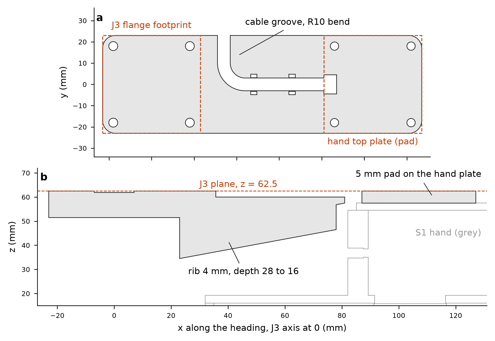

# S2-RC2 WRIST track - J3 verification, CAN-mode bar, J3 kits, mode switch, reach (file prefix s2wrist_)

Generated by `s2wrist_make_readme.py` from the CSV/JSON files named in brackets, 2026-10-03.  Environment `robodesign` (cadquery 2.8.0, trimesh 5.1.0, manifold3d, numpy/pandas).  Frames: arm zeta frame, J3 interface plane z = 62.5 (flange bottom), heading +x in the J3 frame.  All lengths mm, forces N, moments N*m unless a unit is given.  ASSUMED = a value I chose, not measured or published.

## 0. Deviations and open items (read first)

1. **CAN-mode lane placement is NOT validated with this hand: the retreat after release collides (gate G1 not met for CAN lane placement).** Source: the lead's exact-mesh audit of the `s2wrist_can_mode_*_j3frame.stl` meshes (script `s2chk_can.py`, results `s2chk_can_C_v2.csv`, saved by the lead; this track did not run or reproduce it): 36 configurations (lanes 1 / 3 / 5 x levels 0 / 1 x pitch 0.287 / 0.318 m x 3 cans), 16 poses each, neighbouring cans in the other lanes, positive controls pass. Insert 252 / 252, lower 36 / 36 and release 36 / 36 are clean (the 355 mL can can only be lowered to 0.5 mm above the floor margin because the finger tips end 2.0 mm below its bottom). On the straight retreat the first step (the release pose) is clean, but all 216 / 216 later poses collide: `hand_slider_plus` (the front finger, closing axis = heading) against the released can, 29-48 cm3. A lift-over needs >= 130 mm of lift to clear the can top, but the hand reaches the tunnel ceiling after 20 mm (p = 0.287 m) / 50 mm (p = 0.318 m) of lift with the 473 mL can and after 50 mm / 80 mm with the 355 mL can, so no lift-over exists; only p = 0.381 m with the 355 mL can has a window (130-140 mm). Consequence: this track's R_can / p_min / arm-clearance results (sections 6.2 and 9) stay valid but cover only insertion, lowering and release; the bar and the mode-switch guide (sections 6 and 7) are valid for **tote picks and geometry only**. What would remove it: section 11, item 12.

2. **Bar pad changed 3.0 -> 5.0 mm** (my earlier note to the lead said 3.0): the 3 mm far-end pad failed my own bar bending check B1 (SF 1.39 for the 473 mL can, with or without the rib) because the cable slot sits at the web/pad step where the moment peaks [s2wrist_bar_variants.csv]. With the 5 mm pad B1 = 3.52 (473 mL), 4.22 (355 mL), 4.13 (slim) [s2wrist_bar_checks.csv: B1]. Consequences: the hand drops 5.0 mm below the J3 plane (was 3.0); R_can 78.0 mm (was 76.0) and p_min(473 mL) 275.2 mm (was 273.2) [s2wrist_cad_rcan.csv]; bar screws M3 x 14 (was x 12); CAN-mode `z_c = z_g + 155 mm` (was 153). A 4 mm-thick, 28 -> 16 mm deep stiffening rib under the web cuts the static droop at the pad to 0.12 mm at 1 g [s2wrist_bar_checks.csv: B6].

3. **The S1 printed J3 chain fails SF >= 2 at every S2 payload** (tie thread SF 0.28, pin key pockets 0.45, horn plate 1.09 at 500 mL; key tabs 0.96 at the 1.0 N*m servo limit) [s2wrist_j3_summary.csv]. The minimal fix is a metal kit (section 5); no printed-only change reaches SF 2.

4. **UNASSESSED: horn-plate screws in the STS3215 POM horn** (checks A7 / K8 / N8): no published thread rating exists. Section 4.6 gives an INDICATIVE number from handbook POM values (ASSUMED). **No STS3215 output-shaft load rating was found** (searched); the kits remove the moment from the servo shaft by design (moment: pin -> two 6701 -> housing), the shaft still carries torque (<= 1.0 N*m) and, in the CNC kit, the weight through the tie.

5. **6701-2RS bearing material is unknown.** Chrome steel (C0r 530 N, AST Bearings) is the primary basis; stainless (W 61701-2RS1, C0r 260 N) is tabulated as a sensitivity. Payload at SF 2: chrome <= 1.46 kg, stainless <= 0.72 kg [s2wrist_j3_limits.json]. The 1.5 L / 2 L stretch payloads cannot be certified at J3 with these bearings.

6. **G1 is only partly assessed by this track**: done = hand + bar + can + J3 kit vs the arm / J3 stack / L2 (all q3), vs the J1 pedestal, clamp, J1 servo, Z carriage plate, column and rail at the used lane and tote poses and all headings, tunnel-ceiling boolean for R_can, all with positive controls [s2wrist_cad_interference.csv, s2wrist_cad_world_*.csv, s2wrist_cad_rcan.csv]. NOT done: the full rack mock-up (neighbouring lanes, dividers, shelf plate, tote) because no s2rack_ geometry exists yet; hand extents are in section 9 for that check.

7. Models are beam / closed-form (no FEA). ASSUMED values: stress concentration factors, insert knock-down 0.25, E(PETG) 1800 MPa, Al / steel repeated allowables (6061 60, 7075 100, steel 100 MPa), bond strength 2 MPa, thread factors 0.6, servo-register scaling, mode-switch bench times, all prices.

8. Hand data are the lead's first CAD numbers (0.399 kg + 11.7 g camera plate, COM 2.7 / 11.1 / 12.8): re-run `s2wrist_run_all.sh` when the Hand track publishes the final hand. The Sim track's logged J3 peaks (type C: Mh 3.16 / 3.89 N*m, Fz 29.7 / 35.2 N) are evaluated in 4.5 as given; I did not verify them.

9. Tote: a straight -x approach is limited to 26.0 mm at pocket y = 0 and 58.5 mm at y = 100 (>= 120 mm at y = 200 / 300); the lead accepted a vertical drop-over for tote picks [s2wrist_reach_tote_approach.csv].

10. P2 (stiffer servo retention) is an assessment only, no CAD (section 10).

## 1. Files

| file | content |
|---|---|
| s2wrist_common.py | parameters + load model (single source for every script) |
| s2wrist_j3_verify.py | J3 chain checks, 4 configurations -> s2wrist_j3_{loads,checks,summary,governing,bearing_table,torque_register}.csv, s2wrist_j3_limits.json |
| s2wrist_j3_sfcalc.py | SF of every check for ANY (M, Fz): `sf_at(M_Nm, Fz_N)`; -> s2wrist_j3_moment_at_SF2.csv, s2wrist_j3_sim_peak_check.csv |
| s2wrist_build.py | CadQuery: can bar, CNC shaft-flange, Al horn plate -> .step/.stl, s2wrist_bar_params.json, s2wrist_parts_table.csv |
| s2wrist_nckit.py / s2wrist_nc_dxf.py | NO-CNC kit parts (.step/.stl) and the two cutting profiles (.dxf) |
| s2wrist_cadlib.py / s2wrist_cadcheck.py / s2wrist_worldcheck.py / s2wrist_rcan.py | manifold3d interference battery with positive controls, world sweeps, R_can |
| s2wrist_barlib.py / s2wrist_bar_checks.py | bar section properties (CAD slices), strength, droop -> s2wrist_bar_checks.csv, s2wrist_bar_sections.csv |
| s2wrist_modeswitch.py | mode-switch step list and time budget -> s2wrist_modeswitch_steps.csv, s2wrist_modeswitch_parts.csv |
| s2wrist_order_list.py | paste-ready purchase / RFQ text -> s2wrist_j3_order_list.csv / .md |
| s2wrist_bar_variants.py | bar design history (3 mm pad / rib / 5 mm pad) -> s2wrist_bar_variants.csv |
| s2wrist_can_mode_export.py | CAN-mode hand (static + 2 finger sliders) and bar meshes in the J3 frame + placement / mass JSON -> s2wrist_can_mode_{hand_static,hand_slider_plus,hand_slider_minus,bar}_j3frame.stl, s2wrist_can_mode_interface.json (section 14) |
| s2wrist_make_readme.py | this README, generated from the CSV / JSON files |
| s2wrist_reach.py | analytic IK, lanes and tote -> s2wrist_reach_{path,summary,outside_limits,tote_approach}.csv |
| s2wrist_com.py | v1 hand COM from the 13-solid gripper STEP -> s2wrist_v1_hand_com.json |
| s2wrist_run_all.sh | regenerates everything in dependency order (~8 min) |

## 2. Load model (P1.1 input) [s2wrist_common.py, s2wrist_j3_loads.csv]

Design combination at the J3 interface plane: vertical force W = 1.5 g (m_hand + m_payload) (0.5 g carry factor of the task), horizontal V = 0.3 g m along the heading together with it, plus a lateral 0.3 g and the lateral COM offset; M_res = sqrt(M^2 + M_lat^2) with M = sum m g (1.5 x + 0.3 z_below).  PET hand 0.4107 kg (0.399 base + 0.0117 camera plate; COM 10.78 mm ahead, 4.07 mm lateral, 49.41 mm below the J3 plane); CAN hand 0.44 kg as designed (printed 0.3355 kg), COM 6.79 mm ahead of the pad datum; bar 0.0696 kg.

| mode | case | payload kg | total kg | M_res N*m | W N | lower 6701 radial N |
|---|---|---|---|---|---|---|
| PET | 500 mL | 0.519 | 0.930 | 1.245 | 13.7 | 94.6 |
| PET | 600 mL | 0.650 | 1.061 | 1.561 | 15.6 | 118.0 |
| PET | 1 L | 1.072 | 1.483 | 2.602 | 21.8 | 194.9 |
| PET | 1.5 L | 1.605 | 2.016 | 3.896 | 29.7 | 290.6 |
| PET | 2 L (stretch) | 2.130 | 2.541 | 5.164 | 37.4 | 384.4 |
| CAN | 355 mL can | 0.382 | 0.892 | 1.610 | 13.1 | 120.5 |
| CAN | 355 slim can | 0.382 | 0.892 | 1.625 | 13.1 | 121.5 |
| CAN | 473 mL can | 0.507 | 1.017 | 1.880 | 15.0 | 140.5 |
| CAN | 473 mL can (hand 0.336 kg task value) | 0.507 | 0.913 | 1.690 | 13.4 | 126.3 |

Governing case: the heaviest bottle. For the product scope (<= 1 L) it is the 1 L bottle (M_res 2.602 N*m); the CAN 473 mL can (1.880 N*m) lies between the 600 mL and 1 L bottle cases. Governing check up to 1 L, by kit: the 6701 bearings (C8) for KIT_CNC_7075, the Al flange plate N2 / the dowels N6a for KIT_NC, the pin K3 / the tie thread K6 for KIT_CNC_6061 [s2wrist_j3_governing.csv: governing_check].

## 3. Frames and inputs

- **J3 frame** (all CAD checks): origin on the J3 axis, z = arm zeta (J3 interface plane = flange bottom = 62.5), +x = heading (toward the bore / pad datum), y lateral. Arm assembly STEP -> J3 frame: (x, y, z) -> (y - 400, -x, z) (J1 at the origin, J2 at (0, 200), J3 at (0, 400)).
- **Hand (S1 gripper STEP, body frame) -> J3 frame in CAN mode**: x + 104, y, z - 5.5 (the pad drops the body 5.0 mm below the J3 plane; the hand is mounted 0.5 mm lower than the arm frame). The CAN hand's closing axis is along the heading; the PET hand is rotated 90 deg (Hand track).  Interface note for Sim: in CAN mode `z_c = z_g + 155 mm`.
- **Z module -> arm frame**: z - 550 (the carriage-plate holes at z = 610 / 645 / 680 coincide with the pedestal holes at zeta 60 / 95 / 130; x, y identical).
- Inputs: master spec v4 (S2_RC2_master_spec.md), arm_assembly.step, zmod_assembly.step, gripper_assembly_gap70.step, s2hand_* (Hand track), S1 BOM, lead messages of 2026-10-03 (hand 0.399 kg + 11.7 g camera plate, COM 2.7 / 11.1 / 12.8, bore at 104 mm, seat plane zeta -12.3).

## 4. J3 chain verification (P1.1, gate G3)

### 4.1 Result

The S1 printed chain fails SF >= 2 at every S2 payload, starting with the central M3 tie in its printed pilot (SF 0.28 at 500 mL, 0.13 at 1 L), the pin key pockets (0.45 / 0.22) and the printed horn plate (1.09 / 0.53); the cruciform key tabs are over-stressed at the 1.0 N*m servo limit even with no payload (SF 0.96). Minimal fix = move the moment path into metal: a one-piece shaft-flange (pin + flange) running in the two 6701 bearings, so the moment goes pin -> bearings -> housing and the tie and horn plate carry only the weight and the servo torque. With that fix the 6701 bearings (chrome) govern up to 1.46 kg per bottle; the CNC 7075 kit itself is good to 1.7 kg (pin at the hub fillet, K3), the CNC 6061 kit to 1.02 kg (K3), and the NO-CNC kit to 1.38 kg (3 mm Al flange plate, N2) [s2wrist_j3_summary.csv: max_bottle_kg_at_SF2]. The 1 L bottle (1.07 kg) is therefore the largest S2 payload that passes SF 2 on the 7075 and NC kits with chrome 6701 bearings; with stainless 6701 the bearings reach only SF 1.33 at 1 L, and the 6061 kit SF 1.90 (K3).

### 4.2 Safety factors by option and payload [s2wrist_j3_summary.csv; per-case detail with demand / capacity / basis in s2wrist_j3_checks.csv]

| option | check | element | SF 500 mL | 600 mL | 1 L | 1.5 L | 2 L | max bottle kg at SF 2 |
|---|---|---|---|---|---|---|---|---|
| AS_BUILT | A2 | flange 46x46x3 PETG plate between the 36x36 screws and the D14 collar | 1.89 | 1.53 | 0.93 | 0.63 | 0.48 | < 0.52 |
| AS_BUILT | A3 | flange cruciform key tabs 3x10x2.5 (torque 1.0 N*m servo limit) | 0.96 | 0.96 | 0.96 | 0.96 | 0.96 | < 0.52 |
| AS_BUILT | A4a | printed pin D11.95/bore 3.4, ring section | 1.31 | 1.05 | 0.63 | 0.42 | 0.32 | < 0.52 |
| AS_BUILT | A4b | printed pin, key-pocket zone (cruciform 3.3x10.3x2.6): lobed net section | 0.45 | 0.36 | 0.22 | 0.14 | 0.11 | < 0.52 |
| AS_BUILT | A5 | central tie M3x20 (as built, 2.0 mm engaged) in the printed plate post pilot D | 0.28 | 0.22 | 0.13 | 0.09 | 0.07 | < 0.52 |
| AS_BUILT | A5b | central tie M3x25 (7.0 mm engaged) in the printed plate post pilot D2.6 | 0.96 | 0.77 | 0.47 | 0.31 | 0.24 | < 0.52 |
| AS_BUILT | A6 | horn plate D24x3.5 PETG under the tie force | 1.09 | 0.87 | 0.53 | 0.35 | 0.27 | < 0.52 |
| KIT_CNC_7075 | K2 | 7075-T6 shaft-flange 46x46x3 plate between the 36x36 screws and the D14 hub | 9.46 | 7.63 | 4.66 | 3.14 | 2.38 | >= 2.13 |
| KIT_CNC_7075 | K3 | 7075-T6 pin D11.95/bore 3.4 above the hub shoulder (z 67.1) | 6.59 | 5.26 | 3.16 | 2.11 | 1.6 | 1.7 |
| KIT_CNC_7075 | K4 | 2 integral pegs D3x2 (r 4 mm) on the pin top: torque 1.0 N*m | 8.16 | 8.16 | 8.16 | 8.16 | 8.16 | >= 2.13 |
| KIT_CNC_7075 | K6 | M3x25 tie into the M3 thread of the Al horn plate (2.0 mm engaged) | 6.22 | 6.15 | 5.92 | 5.67 | 5.43 | >= 2.13 |
| KIT_CNC_7075 | K7 | Al horn plate 3.5 mm under the tie (supported on the pin-top annulus) | 6.55 | 6.47 | 6.24 | 5.97 | 5.72 | >= 2.13 |
| KIT_CNC_6061 | K2 | 6061-T6 shaft-flange 46x46x3 plate between the 36x36 screws and the D14 hub | 5.68 | 4.58 | 2.8 | 1.89 | 1.43 | 1.51 |
| KIT_CNC_6061 | K3 | 6061-T6 pin D11.95/bore 3.4 above the hub shoulder (z 67.1) | 3.95 | 3.16 | 1.9 | 1.27 | 0.96 | 1.02 |
| KIT_CNC_6061 | K4 | 2 integral pegs D3x2 (r 4 mm) on the pin top: torque 1.0 N*m | 4.9 | 4.9 | 4.9 | 4.9 | 4.9 | >= 2.13 |
| KIT_CNC_6061 | K6 | M3x25 tie into the M3 thread of the Al horn plate (2.0 mm engaged) | 3.73 | 3.69 | 3.55 | 3.4 | 3.26 | >= 2.13 |
| KIT_CNC_6061 | K7 | Al horn plate 3.5 mm under the tie (supported on the pin-top annulus) | 3.93 | 3.88 | 3.74 | 3.58 | 3.43 | >= 2.13 |
| KIT_NC | N2 | Al 3 mm flange plate (6061-T6 / 5052-H32 or better) between the 36x36 screws a | 5.22 | 4.21 | 2.57 | 1.73 | 1.31 | 1.38 |
| KIT_NC | N3 | D12 steel rod with 3 tapped M2.5 holes on r 3.5 (net section) at the lower bea | 8.2 | 6.55 | 3.94 | 2.64 | 1.99 | 2.12 |
| KIT_NC | N4a | flange-rod screw M2.5 8.8 (worst of 3): tension M/9.5 mm + W/3 | 8.7 | 6.96 | 4.2 | 2.81 | 2.12 | >= 2.13 |
| KIT_NC | N4b | thread strip of M2.5 in the mild-steel rod (4 mm engaged) | 7.09 | 5.68 | 3.42 | 2.29 | 1.73 | 1.84 |
| KIT_NC | N4c | csk head pull-through in the 3 mm Al plate (D5.0 cone, 1.5 mm rim) | 6.05 | 4.84 | 2.92 | 1.95 | 1.47 | 1.56 |
| KIT_NC | N4d | rod end face toe contact on the Al plate | 5.45 | 4.35 | 2.61 | 1.74 | 1.31 | 1.4 |
| KIT_NC | N6a | 2 x D3 steel dowels (ISO 2338 3x6) pressed in the rod top: torque 1.0 N*m | 4.92 | 4.92 | 4.92 | 4.92 | 4.92 | >= 2.13 |
| KIT_NC | N7 | top face bond rod / Al plate (retaining compound or epoxy): holds the weight | 16.53 | 14.49 | 10.37 | 7.63 | 6.05 | >= 2.13 |
| all options | C8 | 2 x 6701-2RS (lower bearing, centre spacing 14 mm), C0r 530 N | 5.6 | 4.49 | 2.72 | 1.82 | 1.38 | 1.46 |
| all options | C8s | 2 x 6701-2RS STAINLESS (W 61701-2RS1), C0r 260 N | 2.75 | 2.2 | 1.33 | 0.89 | 0.68 | 0.71 |
| all options | C1 | hand screws 4xM3x12 on 36x36 -> carrier / bar heat-set inserts | 9.18 | 7.41 | 4.53 | 3.05 | 2.31 | >= 2.13 |
| all options | C9a | housing 48x48 flange: 4 x M3 into heat-set inserts (38x38) | 9.63 | 7.77 | 4.75 | 3.2 | 2.43 | >= 2.13 |
| all options | C9b | housing D26 cylinder wall (OD26/ID18.1) between lower bearing and the 48x48 fl | 17.22 | 13.82 | 8.36 | 5.61 | 4.24 | >= 2.13 |
| all options | C9c | housing seat for the lower 6701 (D18.1 x 4 mm) | 11.95 | 9.59 | 5.8 | 3.89 | 2.94 | >= 2.13 |
| all options | C10a | L2 floor at J3 (7 mm, 3.8 mm under the D6 counterbore): housing-screw head pul | 15.55 | 12.55 | 7.68 | 5.18 | 3.92 | >= 2.13 |
| all options | C10b | L2 floor strip between servo-pocket wall and side wall (8.35 mm span, 3.8 mm u | 34.68 | 28.0 | 17.12 | 11.54 | 8.75 | >= 2.13 |

A7 / K8 / N8 (horn-plate screws in the POM horn) are UNASSESSED (no published thread rating). Torque-driven rows (A3, K4, N6a) do not depend on the payload: they use the 1.0 N*m servo limit.

### 4.3 Moment at SF = 2 per element and option (for comparison with a measured or simulated peak) [s2wrist_j3_moment_at_SF2.csv]

Values are the resultant interface moment M_res (N*m) at which SF = 2, as `design-coupled (pure)`: design-coupled keeps W = 8.39 N per N*m of moment (the 1 L bottle ratio) and V = 0.2 W, i.e. the vertical and horizontal forces that accompany the moment in the design combination; pure = W = V = 0. `s2wrist_j3_sfcalc.sf_at(M_Nm, Fz_N)` returns the SF of every check for any measured (M, Fz). Repeated-load allowables; for a one-off peak the single-event capacity is higher (PETG x1.75, Al x2.5, steel x1.5; bearings are already static).

| element (check) | AS_BUILT | KIT_CNC_7075 | KIT_CNC_6061 | KIT_NC |
|---|---|---|---|---|
| 6701-2RS chrome steel, C0r 530 N (C8) | 3.54 (3.71) | 3.54 (3.71) | 3.54 (3.71) | 3.54 (3.71) |
| 6701-2RS stainless, C0r 260 N (C8s) | 1.74 (1.82) | 1.74 (1.82) | 1.74 (1.82) | 1.74 (1.82) |
| flange plate (A2 / K2 / K2 / N2) | 1.21 (1.34) | 6.07 (6.71) | 3.64 (4.03) | 3.35 (3.7) |
| pin, nominal section (A4a); pin / rod with fillet or tapped holes (K3 / K3 / N3) | 0.82 (0.83) | 4.12 (4.16) | 2.47 (2.5) | 5.13 (5.21) |
| printed pin key-pocket zone (A4b) | 0.28 (0.28) | - | - | - |
| tie screw thread: M3x20 as built (A5), M3x25 (A5b / K6) | 0.17 (0.18) | 42.8 (> 60) | 18.53 (> 60) | - |
| M3x25 tie in the printed post (A5b) | 0.61 (0.64) | - | - | - |
| horn plate bending (A6 / K7 / K7) | 0.69 (0.72) | 46.01 (> 60) | 20.45 (> 60) | - |
| rod-plate screws: M2.5 bolt tension (N4a) | - | - | - | 5.46 (5.6) |
| rod-plate screws: thread strip in the rod (N4b) | - | - | - | 4.45 (4.57) |
| rod-plate screws: csk pull-through in the Al plate (N4c) | - | - | - | 3.79 (3.89) |
| rod end face toe contact on the Al plate (N4d) | - | - | - | 3.39 (3.39) |
| top bond rod / horn plate (N7) | - | - | - | 13.49 (> 60) |
| hand / bar screws -> inserts (C1) | 5.89 (6.52) | 5.89 (6.52) | 5.89 (6.52) | 5.89 (6.52) |
| housing screws -> inserts (C9a) | 6.18 (6.88) | 6.18 (6.88) | 6.18 (6.88) | 6.18 (6.88) |
| housing wall (C9b), 6701 seat (C9c) | 10.88 (11.41) | 10.88 (11.41) | 10.88 (11.41) | 10.88 (11.41) |
| L2 floor under the housing screw heads (C10a) | 9.99 (11.11) | 9.99 (11.11) | 9.99 (11.11) | 9.99 (11.11) |
| horn-plate screws in the POM horn (A7 / K8 / N8) | UNASSESSED | UNASSESSED | UNASSESSED | UNASSESSED |

Governing element per option (smallest moment at SF 2, stainless bearings excluded): AS_BUILT: 0.17 N*m (A5); KIT_CNC_7075: 3.54 N*m (C8); KIT_CNC_6061: 2.47 N*m (K3); KIT_NC: 3.35 N*m (N2).

Torque-limited elements at the 1.0 N*m servo limit (moment-independent):

| option | check | element | SF at 1.0 N*m | torque (N*m) at SF 2 |
|---|---|---|---|---|
| AS_BUILT | A3 | S1 key tabs, torque | 0.96 | 0.48 |
| KIT_CNC_7075 | K4 | CNC pegs D3, torque | 8.16 | 4.08 |
| KIT_CNC_6061 | K4 | CNC pegs 6061, torque | 4.9 | 2.45 |
| KIT_NC | N6a | NC dowels, torque | 4.92 | 2.46 |
| KIT_NC | N5a | NC flange-rod screws in shear, torque | 7.93 | 3.96 |

### 4.4 Bearings: both C0r values [s2wrist_j3_bearing_table.csv]

| mode | case | payload kg | M_res N*m | P0 lower 6701 N | SF chrome 530 N | SF stainless 260 N |
|---|---|---|---|---|---|---|
| PET | 500 mL | 0.519 | 1.245 | 94.6 | 5.6 | 2.75 |
| PET | 600 mL | 0.650 | 1.561 | 118.0 | 4.49 | 2.2 |
| PET | 1 L | 1.072 | 2.602 | 194.9 | 2.72 | 1.33 |
| PET | 1.5 L | 1.605 | 3.896 | 290.6 | 1.82 | 0.89 |
| PET | 2 L (stretch) | 2.130 | 5.164 | 384.4 | 1.38 | 0.68 |
| CAN | 355 mL can | 0.382 | 1.610 | 120.5 | 4.4 | 2.16 |
| CAN | 355 slim can | 0.382 | 1.625 | 121.5 | 4.36 | 2.14 |
| CAN | 473 mL can | 0.507 | 1.880 | 140.5 | 3.77 | 1.85 |
| CAN | 473 mL can (hand 0.336 kg task value) | 0.507 | 1.690 | 126.3 | 4.2 | 2.06 |

Payload at SF 2 (PET bottles, interpolated): chrome <= 1.46 kg, stainless <= 0.72 kg [s2wrist_j3_limits.json]. With stainless 6701 only the 500 mL and 600 mL bottles reach SF 2; the 473 mL can reaches 1.85 with the 0.44 kg hand and 2.06 with the task's 0.336 kg hand. Ask the bearing seller for the material (chrome steel, 'GCr15 / 52100') before relying on 1 L.

### 4.5 Cross-check against the Sim track's logged J3 peaks [s2wrist_j3_sim_peak_check.csv]

Lead message: type C Mh 3.16 / 3.89 N*m with Fz peaks 29.7 / 35.2 N (500 / 600 mL), type F Mh 0.67 / 0.82 N*m, versus my design M_res 1.25 / 1.56 N*m (static weight x 1.5 only 0.57 N*m at 500 mL). Treated here as (M_res = Mh, W = Fz, V = 0.2 Fz ASSUMED); type F uses Fz = design W. SF on the repeated-load basis:

| element | option | check | Sim C 500 mL | Sim C 600 mL | design 500 mL | design 600 mL |
|---|---|---|---|---|---|---|
| 6701 chrome (all kits) | KIT_CNC_7075 | C8 | 2.23 | 1.81 | 5.6 | 4.49 |
| 6701 stainless | KIT_CNC_7075 | C8s | 1.09 | 0.89 | 2.75 | 2.2 |
| 7075 flange plate | KIT_CNC_7075 | K2 | 3.8 | 3.1 | 9.46 | 7.63 |
| 7075 pin | KIT_CNC_7075 | K3 | 2.6 | 2.11 | 6.59 | 5.26 |
| 6061 pin | KIT_CNC_6061 | K3 | 1.56 | 1.27 | 3.95 | 3.16 |
| 6061 flange plate | KIT_CNC_6061 | K2 | 2.28 | 1.86 | 5.68 | 4.58 |
| NC flange plate | KIT_NC | N2 | 2.09 | 1.71 | 5.22 | 4.21 |
| NC rod toe contact | KIT_NC | N4d | 2.15 | 1.74 | 5.45 | 4.35 |
| NC rod | KIT_NC | N3 | 3.24 | 2.63 | 8.2 | 6.55 |
| S1 printed pin pockets | AS_BUILT | A4b | 0.18 | 0.14 | 0.45 | 0.36 |
| S1 tie thread | AS_BUILT | A5 | 0.11 | 0.09 | 0.28 | 0.22 |

Reading: if the type-C peaks are real and repeated, the 7075 kit stays at SF >= 2.11 and the chrome 6701 at 2.23 / 1.81; the 6061 pin (1.56 / 1.27) is below 2 at both peaks and the NC plate (2.09 / 1.71) at the 600 mL peak on the repeated basis, but both are above 2 on the single-event basis (x2.5 Al); stainless 6701 (1.09 / 0.89) and the printed chain (all < 1) do not survive. If the peaks are a sub-10 ms grasp / lift impulse, the static C0r rating of the bearings and the single-event allowables are the relevant ones.

### 4.6 J3 servo torque-limit register [s2wrist_j3_torque_register.csv; scaling ASSUMED linear: register = N*mm / 2943 x 1000, 2.94 N*m = 30 kg*cm stall at 12 V]

| mode | case | I_J3 kg m2 | T peak alpha 2 rad/s2 | alpha 5 | alpha 10 | hold vs lateral 0.3 g |
|---|---|---|---|---|---|---|
| PET | 500 mL | 0.00684 | 0.034 | 0.054 | 0.088 | 0.172 |
| PET | 600 mL | 0.00835 | 0.037 | 0.062 | 0.103 | 0.212 |
| PET | 1 L | 0.01338 | 0.047 | 0.087 | 0.154 | 0.341 |
| PET | 1.5 L | 0.0199 | 0.06 | 0.119 | 0.219 | 0.504 |
| PET | 2 L (stretch) | 0.02692 | 0.074 | 0.155 | 0.289 | 0.665 |
| CAN | 355 mL can | 0.01095 | 0.042 | 0.075 | 0.129 | 0.268 |
| CAN | 473 mL can | 0.01237 | 0.045 | 0.082 | 0.144 | 0.307 |

T = I_J3 x alpha + 20 N*mm bearing friction (ASSUMED) at alpha = 2 / 5 / 10 rad/s2; holding torque = torque about J3 needed to keep the hand orientation against a lateral 0.3 g acceleration of the offset COM.  **Recommended register, PET mode: 200 (about 0.59 N*m) with either metal kit** - 3.8x the 10 rad/s2 peak and 1.7x the hold torque of the 1 L bottle, and the pegs / dowels still see SF >= 8.2 / 4.9 at the 1.0 N*m spec limit (register 340 is acceptable but gives no benefit). **With the S1 printed key tabs still installed (interim): 130 (0.38 N*m)** - tab SF 2.5 on the single-event basis; the tabs need <= 0.48 N*m for SF 2 and the printed chain must not carry any bottle (section 5.3).  CAN mode: 200 (hold 0.31 N*m for the 473 mL can).  Calibrate the register with a spring-scale test before trusting the scaling.

INDICATIVE only (not a rating): handbook acetal shear 50 MPa (ASSUMED), thread factor 0.6, M3 with 2.2 mm engaged (M3 x 6 in the 3 mm POM horn) gives about 560 N per screw. Demand per screw: 43.0 N for the weight + tie preload path (K8, 1 L, CNC kit), 20.9 N at the 200 register and 35.4 N at the 1.0 N*m limit for the torque path (T / (4 x 7.07 mm)). The measure that removes the weight from the POM threads is process, not CAD: bond the two bearing inner races to the pin / rod with retaining compound (section 5.2) so the weight goes through the bearings.

### 4.7 Models, limits

Beam / closed-form checks only (cantilever analogy for the flange plates, numerical net sections for the pin and rod, bolt-group worst-bolt formula M / 50.9 mm on the 36 x 36 pattern, Roark plates for the horn plates). ASSUMED: Kt 2 (printed pin pockets and hub fillet), Kt 1.5 (rod holes), insert capacity = CNC Kitchen PETG M3 Ruthex pull-out 119 kg x 5/5.7 x 0.25 = 256 N, PETG 20 / 35 MPa in-plane repeated / single x 0.5 across layers (S1 rule), Al repeated 60 (6061-T6) / 100 (7075-T6) MPa, steel 100 MPa, bond 2 MPa, thread factor 0.6. No FEA, no fatigue test; a static proof hang-test at 104 mm is part of the build (section 5.2).

## 5. The fix: J3 kits, recommendation, order list

Both kits keep the S1 interface unchanged (46 x 46 x 3 flange, 4 x M3 on 36 x 36, J3 plane 62.5, pin through the two 6701, horn plate D24 at z 85.5, servo, housing, spacer, L2 untouched). **Do not print arm_j3_pin, arm_j3_flange, arm_j3_horn_plate (3 parts, 12 g).** Interference of every kit part with the housing, bearings, spacer, L2, servo, horn and shims is zero (1 mm3 criterion, positive control detected) [s2wrist_cad_interference.csv: F3].

### 5.1 Option A - CNC kit (7075-T6, recommended for the permanent build)

- `s2wrist_j3_shaft_flange` (23.2 g; 46.0 x 46.0 x 25.0): 46 x 46 x 3 flange + D14 x 1.6 hub + D11.95 pin to z 85.5 + 2 integral pegs D3 x 2 at r 4 + tie bore D3.4 with a bottom countersink, one piece (moment goes pin -> bearings). `s2wrist_j3_horn_plate_al` (3.8 g; D24 x 3.5, 4 csk on 10 x 10, 2 peg holes, M3 tapped centre). Tie **M3 x 25** (was x 20), horn screws **M3 x 6** (was x 5; 2.2 mm instead of 1.2 mm engaged in the POM horn).
- 7075-T6 limits (K3 pin at the hub fillet) 1.7 kg per bottle; 6061-T6 allowed as a fallback but then the 1 L bottle is at SF 1.90 (pin) - limit 1.02 kg. Moment at SF 2: 7075 4.12, 6061 2.47 N*m (pin, section 4.3).  Pegs SF 8.2 (7075) at the 1.0 N*m servo limit.

### 5.2 Option B - NO-CNC kit from commodity stock

| part | kind | mass g | bbox mm |
|---|---|---|---|
| nc_rod | purchased 12 mm drillable rod, cut 20.0 + tapped/reamed | 17.45 | 12.0 x 12.0 x 22.0 |
| nc_flange_plate | purchased 3 mm Al plate (6061-T6 / 5052-H32), drilled | 16.37 | 46.0 x 46.0 x 3.0 |
| nc_horn_plate | purchased 3 mm Al plate, drilled | 3.1 | 24.0 x 24.0 x 3.0 |
| nc_collar | printed PETG | 0.1 | 14.6 x 14.6 x 1.6 |
| nc_jig | printed PETG (socket opening down: print with the guide plate on the bed) | 8.68 | 22.0 x 22.0 x 18.0 |

**What each element is and how it is fixed**

1. **Rod**: D12 mm, unhardened steel (AISI 1018 / 1045, 12L14 or annealed silver steel; h9 or better, 11.957-12.000 mm; NOT a hardened chrome linear shaft - cannot be tapped - and not A2 stainless), length **23.0 - t_plate** (20.00 mm for a 3.00 mm plate, 19.83 mm for a 1/8 in plate), both ends faced square (<= 0.05 mm over D12): the end-face squareness sets the hand tilt (0.05 mm / 12 mm = 4 mrad = 0.6 mm at the finger tips).
2. **Rod in the bearings**: both 6701 inner races are bonded to the rod with Loctite 638 (slip-fit retaining compound; datasheet gap fill 0.15-0.25 mm, fixture 5 min, full cure 24 h). The weight then goes rod -> inner races -> balls -> housing lip, not through the POM horn. Keep compound off the seals.
3. **Rod to the horn plate**: 2 steel dowels ISO 2338 D3 x 6 pressed 4 mm into reamed D3.0 holes at (+-4, 0) in the rod top, 2 mm into D3.2 holes of the plate (0.2 mm diametral clearance, inside the 0.25 mm diameter clearance quoted for 638; the compound is not asked to fill more), plus the top face bonded with 638. Torque path at the 1.0 N*m servo limit: dowel shear SF 4.9 [N6a], hole bearing SF >= 10.8 [N6b, N6c]; the bond (N7, 2 MPa ASSUMED) holds the weight with SF >= 6.0.

4. **Rod to the flange plate**: 3 x M2.5 x 8 DIN 7991 flat head (steel 8.8, medium threadlocker) through the plate into 3 tapped M2.5 holes (5 mm of thread) in the rod bottom face on r = 3.5; the rod end face seats on the plate top (toe contact, N4d). No tie screw. The D3.0 holes with 90 deg countersinks let the cones self-centre the screws (+-0.25 mm) on the jig-drilled rod holes.
5. **Axial stack**: printed collar (ring ID 12.2 / OD 14.6 x (4.6 - t_plate): 1.60 mm for a 3.00 mm plate) between the plate top and the lower inner race (compression only); 0.4 mm clearance between the horn plate and the upper inner race, so a failed horn-screw thread lets the plate land on the race (benign).

**Making the holes without a mill**

- *36 x 36 pattern, the three M2.5 holes, the horn-plate holes, the outline*: have a laser / waterjet / CNC-router shop cut both plates from `s2wrist_nc_flange_plate.dxf` and `s2wrist_nc_horn_plate.dxf` (1:1 mm, +-0.1; the CUT layer holds the outline and the through holes). Hand route: print the DXF 1:1 on paper, glue it on the plate, centre-punch, drill; +-0.2 mm is enough because the hand screws have D3.4 clearance holes and the cones self-centre the M2.5 screws. **Exception: the two D3.2 dowel holes of the horn plate** must match the 8.0 mm dowel spacing within about +-0.1 mm: drill them last, after pressing the blank plate onto the dowel tips (marker ink or a transfer punch) to mark the centres, or use the laser-cut DXF. Then countersink with a 90 deg bit: D5.0 on the underside of the three r = 3.5 holes of the flange plate, D6.2 on the underside of the four 10 x 10 holes of the horn plate.
- *The 'D12 hole'*: there is none. The rod is solid and slides through the existing 6701 bores; nothing needs boring.
- *Rod*: cut and face on a lathe (a machinist needs minutes; 1 piece = 20.00 mm) or hacksaw + file against a square block. *Three M2.5 holes*: print `s2wrist_nc_jig` (socket D12.2 x 14 for the rod, guide holes D2.2 on r = 3.5 at 90 / 210 / 330 deg), clamp rod + jig in a drill-press vise, drill D2.05 x 6 deep with a stop collar, tap M2.5 x 0.45 (taper then plug tap, 5 mm of full thread). *Two dowel holes*: same jig, guide holes D3.2 at (+-4, 0), drill D2.9 x 4.5 deep, ream D3.0, press the dowels (3 x 6) in.
- *Assembly from below* (servo, horn and horn plate already in L2 as in the S1 order; the plate is fixed to the horn with 4 x M3 x 6): coat the rod OD in the two race zones and its top face with 638, push the rod up through both bearings until the dowels enter the plate and the top face touches, wipe, fit the collar, offer the flange plate and tighten the 3 x M2.5 with threadlocker (0.3-0.4 N*m), wait 24 h before loading.
- *Proof test (build gate)*: hang a dead weight at 104 mm from the J3 axis for 5 min with the J3 servo torque off, paint-mark the plate / rod / horn plate: no creep. With CHROME 6701: 3.3 kg (1.3 x the 1 L design moment, M = 3.4 N*m, below the 3.54 N*m of SF 2 for the chrome pair). With STAINLESS 6701 (or unknown bearings): 1.7 kg only (M = 1.74 N*m, the moment at SF 2 of the stainless pair; the 3.4 N*m test would load stainless bearings to their static rating). Then a 1.0 N*m torque (10 N at 100 mm) with the servo locked: no slip. Then, with the servo unpowered, twist the hand by hand about J3: free play at the finger tips <= 1 mm (0.007 rad at 143.5 mm); more means oversize dowel holes or an uncured bond. Required for both kits.

Limits: NC kit payload at SF 2 is 1.38 kg (3 mm Al flange plate, N2; 6061-T6 / 5052-H32 assumed - **an unknown 'aluminium sheet' (1100 / 3003) is weaker and invalidates this**), rod bending 2.12 kg (N3), rod-plate screws / toe contact 1.4 kg (N4d); it depends on workmanship (squareness, thread depth, bond), hence the proof test.

### 5.3 Recommendation for the first build

1. **First build (2-3 day print window): option B (NO-CNC)**, if the commodity items (12 mm unhardened rod, 3 mm 6061-T6 / 5052-H32 plate cut from the DXF, M2.5 x 8 + M3 x 6 flat-head screws, D3 x 6 dowels, Loctite 638) are in hand within about two days; every item is a common stock size and a local machinist can face the rod and cut the plates in an hour. It passes SF 2 up to 1.38 kg per bottle (1 L = 1.07 kg: SF 2.57 on the weakest check, N2).

2. **In parallel order 3 sets of option A (7075-T6 CNC)** for the permanent hand: the interfaces are identical, so the swap is the same screws. The CNC kit is not the limiter (pin 1.7 kg, bearings 1.46 kg) and removes the workmanship dependence. CNC lead time 1-2 weeks to Mexico per the lead; the online services list 3-day builds plus 3-7 days express (section 5.4).

3. **Printed S1 chain**: dry fits and no-payload motion only, register 130 (0.38 N*m). It cannot carry a bottle (SF 0.28 at 500 mL, section 4.2). **Do not use 1.5 L or 2 L bottles with either kit** (bearings 1.46 kg chrome / 0.72 kg stainless).

### 5.4 Order list (paste-ready) [s2wrist_j3_order_list.csv, s2wrist_j3_order_list.md; prices are ESTIMATE or WEB, not quotes]

Lot totals (computed): option A parts + screws USD 103-250 (+ express shipping USD 35-70 ESTIMATE), option B consumables + cutting + tools USD 85-266 (the high end includes a 50 mL bottle of Loctite 638 and tools you may already own), common hardware USD 12-30. Price anchors seen on 2026-10-03: Loctite 638 50 mL USD 54.81-92.53 across US industrial retailers (10 mL cheaper, ESTIMATE USD 25-35); 0.125 in 6061-T6 blanks USD 10.84 (3 x 3 in) / 13.38 (4 x 4 in) at tciprecision.com; JLCCNC lists CNC milling and turning 'from USD 5' with a 3 business-day build; a prototype-cost guide (lkprototype.com) lists aluminium CNC prototypes at USD 50-200 and 3qmachining.com 'as low as USD 50'.

| opt | id | item | per arm | order | USD lot | basis |
|---|---|---|---|---|---|---|
| A | A1 | J3 shaft-flange (CNC) | 1 | 3 | 75-180 | ESTIMATE (web anchors) |
| A | A2 | J3 horn plate (CNC) | 1 | 3 | 24-60 | ESTIMATE |
| A | A3 | tie screw M3 x 25 DIN 7991 (flat head, steel 8.8 or A2-70) | 1 | 6 | 2-5 | ESTIMATE |
| A | A4 | horn screws M3 x 6 DIN 7991 (flat head) | 4 | 12 | 2-5 | ESTIMATE |
| B | B1 | steel rod D12 (cold-drawn, drillable) | 1 | 5 | 4-12 | ESTIMATE |
| B | B2 | aluminium plate 3 mm (flat parts) | 2 | 6 | 25-75 | WEB + ESTIMATE |
| B | B3 | screws M2.5 x 8 DIN 7991 (flat head, steel 8.8) | 3 | 20 | 3-8 | ESTIMATE |
| B | B4 | dowel pins D3 x 6 ISO 2338 (m6, hardened steel) | 2 | 10 | 3-8 | ESTIMATE |
| B | B5 | retaining compound (Loctite 638 or 648) | 1 | 1 | 25-93 | WEB + ESTIMATE |
| B | B6 | printed parts (own printer) | 1 | 1 | 0-0 | own stock |
| B | B7 | workshop tools (if not owned) | 1 | 1 | 25-70 | ESTIMATE |
| common | C1 | socket cap screws M3 x 12 (ISO 4762, steel 8.8+) | 4 | 12 | 2-6 | ESTIMATE |
| common | C2 | bar pad screws M3 x 14 DIN 7991 (flat head) | 4 | 8 | 2-6 | ESTIMATE |
| common | C3 | heat-set inserts Ruthex M3 x 5 x 4 (bar J3 block) | 4 | 8 | 0-0 | own stock |
| common | C4 | servo extension cable, 3-pin, >= 300 mm | 1 | 2 | 6-14 | ESTIMATE |
| common | C5 | cable ties 2.5 x 100 mm | 2 | 10 | 2-4 | ESTIMATE |
| common | C6 | 6701-2RS bearings 12 x 18 x 4 (chrome steel) | 2 | 4 | 0-0 | own stock |

The full material / tolerance / finish text of every line is in the CSV column `spec_paste_ready`; `s2wrist_j3_order_list.md` holds two blocks to paste: a CNC quote request (A1, A2, with the critical dimensions: pin D11.95 +0/-0.02, flange underside flat 0.05, pin perpendicular 0.03, no anodising on pin / hub / pegs) and a metal-supplier / hardware list (B, common). Order 3 of each CNC part (2 + 1 spare).

## 6. CAN-mode offset bar (P1.2; gates G1, G5)

> **Scope**: CAN-mode lane placement is NOT validated with this hand (the lead's exact-mesh audit found collisions on every retreat pose after release, section 0 item 1). The bar, R_can and p_min below are valid for tote picks, for geometry and for insertion / lowering / release only.

*a: plan section of `s2wrist_can_bar` at z = 61.25 (inside the 2.5 mm cable groove); b: side section on the centre line through the stiffening rib; grey = S1 hand body.*

### 6.1 Geometry, mass, print [s2wrist_parts_table.csv, s2wrist_bar_params.json, s2wrist_can_bar.step / .stl]

- One part, printed PETG: J3 block 11 mm thick (z 51.5-62.5) with 4 heat-set insert holes D4.2 x 9.5 on 36 x 36 (M3 x 12 from the arm flange, same 4 screws as the PET hand), tapering over x 23-45 to a 7 mm web (x 45-72), stepping to the 5.0 mm far pad (x 81-127, 46 x 46) that sits on the S1 hand top plate with 4 x 90 deg countersinks for DIN 7991 M3 x 14 flat heads into the carrier inserts. Body origin (pad datum) 104.0 mm ahead of J3; the hand hangs **5.0 mm below the J3 plane** (`z_arm = zeta_body -5.5`). Stiffening rib 4 mm wide, 28 -> 16 mm deep (x 23-78) under the web (the hand envelope under the web, x 32-80, tops out at z = 22.0 mm in the J3 frame; the rib bottom is at z >= 34.5 mm, so there is room); tie / M2.5 head relief D14 x 0.6; cable slot 6 x 9 mm in the pad over the plate notch, groove 6 x 2.5 on the top face with a **R10.0 mm bend**, 2 zip-tie slots.

- Mass **69.6 g** (solid PETG, 54782 mm3), COM 39.0 mm ahead of J3 and 5.0 mm below the J3 plane, bbox 150.0 x 46.0 x 28.0, watertight = True, estimated print **2.0 h** (0.0287 h/g, ASSUMED rate); print pose: top face (flange mating face) on the bed, flipped 180 deg about x, **no supports** (bridges <= 6 mm: groove, insert holes), 6 walls, 100 % infill; fits 250 x 250 x 255.  Hardware: 4 Ruthex M3 x 5 x 4 inserts (bar), 4 x M3 x 12 socket cap (to the J3 flange), 4 x M3 x 14 DIN 7991 flat head (to the hand), 2 zip ties, 1 servo extension >= 300 mm.

### 6.2 R_can and p_min [s2wrist_cad_rcan.csv]

R = height of the highest structure that enters the shelf tunnel above the can top, measured on the CAD (hand + bar trimmed to x >= tunnel mouth); p_min = H + L_ins 5 + T + margin 5 + R, T = 30 mm (band 20-40, ASSUMED). The bar top (the J3 plane) is the highest point in the tunnel; the hand top plate is 5.0 mm lower. A tunnel-ceiling slab touching the top gives 0 mm3 overlap and 1 mm lower gives 3084 mm3 (positive control).

| can | H mm | D mm | can top below the datum mm | R_can mm | p_min T20 | p_min T30 | p_min T40 | margin at 0.287 m | margin at 0.318 m |
|---|---|---|---|---|---|---|---|---|---|
| 355 mL can | 122.7 | 66.0 | 15.3 | 83.3 | 236.0 | 246.0 | 256.0 | 41.0 | 72.0 |
| 355 slim can | 156.0 | 57.0 | 10.0 | 78.0 | 264.0 | 274.0 | 284.0 | 13.0 | 44.0 |
| 473 mL can | 157.2 | 66.0 | 10.0 | 78.0 | 265.2 | 275.2 | 285.2 | 11.8 | 42.8 |

All three cans fit the tightest pitch (0.287 m) with 11.8 mm (473 mL), 13.0 mm (slim) and 41.0 mm (355 mL) to spare at T = 30. The 355 mL can sits lower in the grip (fingertip / floor rule z_g >= floor + 143 puts its top 15.3 mm below the datum), hence the larger R. R = 78.0 mm for the 473 mL can is below the spec's expected R of about 81 mm. This covers the arm / tunnel insertion only: the retreat after release is NOT certified for these cans (section 0, item 1).

### 6.3 Bar strength and stiffness [s2wrist_bar_checks.csv, s2wrist_bar_sections.csv]

| check | element | SF over the 3 cans (min-max) |
|---|---|---|
| B1 | bar web / rib: bending between flange edge and pad (worst section 80 mm) | 3.5-4.2 |
| B2 | hand-side: 4 x M3x14 DIN 7991 flat head (pad 5 mm + top plate 3 mm) -> carrier heat-set in | 19.7-24.3 |
| B3 | pad (5 mm): csk head pull-through | 20.6-25.3 |
| B4 | J3-end: 4 x M3x12 -> 4 heat-set inserts in the bar block (worst screw) | 6.3-7.3 |
| B5 | J3 flange / bar interface: friction torque of 4 screws vs servo limit 1.0 N*m | 3.0-3.0 |
| B8 | bar torsion web 46 x 7 (+ rib) under F = T/104 mm acting 143.5 mm below the bar | 11.2-11.2 |

Bar design variants (same 473 mL load case; s2wrist_bar_variants.csv):

| bar variant | pad mm | rib mm | mass g | B1 stress MPa (worst x = 80.5) | B1 SF | droop 1 g mm | droop 1.5 g mm | finger-tip shift 1.5 g mm |
|---|---|---|---|---|---|---|---|---|
| first draft: 3 mm pad, no rib | 3.0 | 0.0 | 60.0 | 14.37 | 1.39 | 0.615 | 0.922 | 2.89 |
| 3 mm pad + rib | 3.0 | 4.0 | 64.0 | 14.37 | 1.39 | 0.159 | 0.238 | 0.95 |
| final: 5 mm pad + rib | 5.0 | 4.0 | 69.6 | 5.68 | 3.52 | 0.117 | 0.176 | 0.58 |

Design history [s2wrist_bar_variants.csv, same 473 mL load case for all three]: the rib cuts the static droop of the pad centre from 0.922 to 0.176 mm at 1.5 g but does not help the bending at the pad step (x = 80.5, 3 mm section, cable slot): only the thicker pad does (B1 SF 1.39 -> 3.52). Final bar: droop **0.117 mm at 1 g and 0.176 mm at 1.5 g** (E(PETG) 1800 MPa ASSUMED), pad tilt shifts the finger tips by 0.58 mm at 1.5 g. Twist under the 0.3 g lateral moment: 0.0073 rad (1.0 mm at the tips). Jam at the servo limit (1.0 N*m against an obstacle at the can): bar torsion SF 11.2.

### 6.4 Cable path

Hand servo lead (stock 150 mm) -> up through the pad slot (x 81-87) -> groove along -x (40 mm straight) -> R10.0 mm bend -> out through the bar side at y = +23 (x = 34): groove length from the slot centre to the side edge **69 mm**, centre-line bend radius **10.0 mm** (rule of thumb 5 x cable OD for a 2 mm hookup cable). Add the **>= 300 mm extension**: in CAN mode the cable has to travel back 82.0 mm to the J3 axis before it joins the arm loops, a detour the S1 direct mount does not have, so the stock 150 mm lead is expected to fall short (ESTIMATE; confirm on the bench). Cable routing at J1 / J2 / J3 windows is an open S1 item (no cable design in the arm CAD).

### 6.5 Assembly order (bar)

1. Heat-set the 4 inserts into the J3 block (iron 220-230 C, same as the S1 inserts). 2. Lay the hand servo cable through the pad slot and press the pad onto the hand top plate (cable notch under the slot); fit the 4 x M3 x 14 flat heads (flush). 3. Route the cable in the groove, zip-tie. 4. Offer the bar to the J3 flange and fit the 4 x M3 x 12. 5. Plug the extension. Full mode-switch procedure in section 7.

## 7. PET <-> CAN mode-switch guide (P1.3) [s2wrist_modeswitch_steps.csv, s2wrist_modeswitch_parts.csv]

> **Scope**: the CAN mode of this guide is usable for tote picks and geometry only; CAN lane placement is not validated with this hand (section 0, item 1).

Single hand body, swap the end-effector set: **PET -> CAN 11.1 min, CAN -> PET 9.8 min** (target < 15 min; bench times ASSUMED: M3 under the housing flange 15 s out / 25 s in, other M3 8 s / 15 s, 20 s per connector or part moved, 120 s controller set-up; with a 1.5x pessimism factor 16.7 / 14.7 min). Fastener operations: 20 each way. **Dual-hand variant** (two complete hands, PET and CAN, swapped at the J3 flange): **6.2 min**, costs a second body (335 g printed, about 11 h), a second STS3215 (S1 BOM: 3 on hand) and 30 inserts.

The 4 x M3 x 12 that hold the hand to the J3 flange are the same screws in both modes (S1 BOM: M3 x 12 x 4, buy 8). The jaw interface follows the Hand track (s2hand_build.py): PET jaws replace the S1 yokes on the rack tabs (one M3 screw per jaw, assumed M3 x 8 as the S1 yoke screw), the PET guide rail bolts to 4 inserts in the base end faces (screw length not stated by the Hand track: M3 x 8 ASSUMED) and must come off in CAN mode (it occupies the S1 yoke volume).

**PET -> CAN**

| step | action | count | s |
|---|---|---|---|
| P2C-1 | Power down: J3 to the service heading, Z carriage to bench height, 12 V off | 1 | 30.0 |
| P2C-2 | Unplug the hand servo cable at the arm harness | 1 | 20.0 |
| P2C-3 | Remove the 4 x M3x12 that hold the hand to the J3 flange; lift the hand off | 4 | 60.0 |
| P2C-4 | Remove the PET guide rail (2 end brackets) from the base end-face inserts | 4 | 32.0 |
| P2C-5 | Remove PET jaws A and B from the rack tabs | 2 | 16.0 |
| P2C-6 | Fit the S1 finger sets (yoke + finger + pad, kept assembled) on the rack tabs | 2 | 30.0 |
| P2C-7 | Place the body on the bar pad (closing axis along the bar), cable through the pad slot | 1 | 20.0 |
| P2C-8 | Fit 4 x M3x14 DIN 7991 flat head through the pad into the carrier inserts | 4 | 60.0 |
| P2C-9 | Offer the bar to the J3 flange and fit 4 x M3x12 into the bar inserts | 4 | 100.0 |
| P2C-10 | Lay the cable in the groove, 2 zip ties in the bar slots; plug the 300 mm extension into the arm harness | 1 | 60.0 |
| P2C-11 | Plug the cable, select CAN mode in the controller (hand mass, L3 = 104, J3 +-90 deg heading offset, J3 torque register), power up, open/close test | 1 | 120.0 |
| handling | pick / align / put down the 6 moved parts (2 jaws, rail, body, bar, 2 finger sets, minus those not moved in this direction) | 6 | 120.0 |

**CAN -> PET**: reverse the order: remove the bar screws and body, the S1 finger sets, fit PET jaws A / B, the guide rail, offer the body to the flange rotated 90 deg, plug the stock cable, select PET mode.

Controller settings that change with the mode: hand mass (PET 0.411 kg, CAN 0.44 kg + bar 0.070 kg), J3 heading offset (use column `q3_CAN_deg` or `q3_PET_p90_deg` of s2wrist_reach_path.csv; the two differ by 90 deg), J3 torque register (section 4.6: 200 with the metal kit), `z_c = z_g + 155 mm` in CAN mode, can grasp gap for D66 = 70.35 mm / D57 = 61.03 mm (V-pads, section 9). Parts per mode:

| mode | item | qty |
|---|---|---|
| both modes | J3 flange (CNC shaft-flange / NC flange plate) + 4 x M3x12 socket cap | 4 |
| both modes | S1 hand body (base, carrier, top plate, pinion, 2 racks, STS3215, camera plate) | 1 |
| PET only | PET jaws A + B (type C collar or type F fork), 2 x M3x8 | 2 |
| PET only | PET guide rail s2hand_guide_rail + 4 x M3 (end-face inserts of s2hand_base_v2 or the drilled S1 base) | 1 |
| CAN only | s2wrist_can_bar (printed PETG, 4 Ruthex M3x5x4 inserts in the J3 block) | 1 |
| CAN only | 4 x DIN 7991 M3x14 flat head (bar pad -> carrier inserts) | 4 |
| CAN only | S1 finger sets: 2 x yoke + finger + TPU pad, 2 x M3x8 | 2 |
| CAN only | Feetech 3-pin servo extension >= 300 mm, 2 zip ties | 1 |

## 8. Reach table with the new datums (P1.4) [s2wrist_reach_summary.csv, s2wrist_reach_path.csv, s2wrist_reach_tote_approach.csv, s2wrist_reach_outside_limits.csv]

y_E = 330 (lane-entrance datum), y_front = 313, lane length 250, L3 = 104 (bore / pad datum ahead of J3), place target y_bore = 330 + D/2 + 1.5, straight insertion along +y from outside the divider noses, analytic IK on both elbow branches, wrapped into the J1 window; limits J1 [-20, 160], J2 +-130, J3 +-180 deg, r [170, 385] mm. Rows for the used branch q2 > 0; D 65 / 71 bracket the CAN cans (D66 / D57 give y_bore 364.5 / 360, inside the tabulated range of y).

| lane x mm | D mm | whole path ok | r_min | r_max | place J3 y | q1 deg | q2 deg | q3 CAN deg | strap-to-y_front margin mm (PET) |
|---|---|---|---|---|---|---|---|---|---|
| x-152 | 65.0 | True | 242.2 | 301.2 | 260.0 | 79.2 | 82.3 | -71.5 | 22.9 |
| x-76 | 65.0 | True | 203.2 | 270.9 | 260.0 | 58.9 | 94.8 | -63.7 | 22.9 |
| x+0 | 65.0 | True | 188.5 | 260.0 | 260.0 | 40.5 | 98.9 | -49.5 | 22.9 |
| x+76 | 65.0 | True | 203.2 | 270.9 | 260.0 | 26.3 | 94.8 | -31.1 | 22.9 |
| x+152 | 65.0 | True | 242.2 | 301.2 | 260.0 | 18.5 | 82.3 | -10.8 | 22.9 |
| x-152 | 71.0 | True | 239.8 | 303.8 | 263.0 | 79.4 | 81.2 | -70.6 | 19.9 |
| x-76 | 71.0 | True | 200.5 | 273.8 | 263.0 | 59.3 | 93.6 | -62.9 | 19.9 |
| x+0 | 71.0 | True | 185.5 | 263.0 | 263.0 | 41.1 | 97.8 | -48.9 | 19.9 |
| x+76 | 71.0 | True | 200.5 | 273.8 | 263.0 | 27.1 | 93.6 | -30.7 | 19.9 |
| x+152 | 71.0 | True | 239.8 | 303.8 | 263.0 | 19.4 | 81.2 | -10.6 | 19.9 |

The q2 > 0 branch is feasible over the whole path for every lane and D. The q2 < 0 branch violates J1 <= 160 deg for lanes x = -152 and -76 (first violation q1 = -178.4 / 171.4 deg at s = 0); lanes x >= 0 are feasible on both branches. J3 radius along all lane paths: min 185.5 mm (x = 0, D71), max 303.8 mm. J3 y at the place pose 260.0-263.0 mm.

Tote (pockets y = 0 / 100 / 200 at x = -300, J3 at x = -196): final poses feasible on q2 > 0 only; the straight -x approach is limited to 26.0 / 58.5 / 120.0 mm for y = 0 / 100 / 200 (D75 bottle datum); the lead accepted a vertical drop-over (lift, then lower into the pocket). Pocket y = -100 is optional and J3 y < 0 is not covered by the S1 arm sweep; y = 300 is feasible with a 120 mm straight approach.

## 9. Geometry gate G1 for the wrist / bar part [s2wrist_cad_interference.csv, s2wrist_cad_world_headings.csv, s2wrist_cad_world_summary.csv, s2wrist_cad_world_controls.csv]

**Not covered here: the retreat after release.** The lead's exact-mesh audit of the CAN-mode meshes found collisions on all later retreat poses (section 0, item 1). The results below (every used heading free, zero overlaps) concern the arm / J3 stack / pedestal / column environment and the insertion, lowering and release poses, not the lane retreat.

manifold3d booleans, criterion 1 mm3, every family with a deliberate positive control. **44 tests, 0 failed; largest overlap among the real tests 0.000 mm3; smallest overlap among the 13 positive controls 44.2 mm3 (all detected).** Families: F1 hand-bar, F2 bar / hand vs J3 stack + L2 (S1 chain, CNC kit, NC kit), F3 kit parts vs housing / bearings / spacer / L2 / servo / horn / shims, F4 rotating group (hand at finger gaps 40 / 70 / 125 + bar + J3 rotor) vs the static stack at q3 = -180..165 step 15, F5 cans in the grip (contact gap bisection on the V pads: D66 -> 70.35 mm, D57 -> 61.03 mm; every other hand part clear). Minimum vertical clearance of hand + bar under the static stack 3.30 mm (bar top 62.5 to the housing bottom 65.8).

CAN-mode hand extents in the J3 frame (xmin, ymin, zmin, xmax, ymax, zmax): gap 70 [32.0, -30.1, -145.5, 176.0, 30.1, 57.5]; gap 125 (open) [30.0, -30.1, -145.5, 178.0, 30.1, 57.5]; bar [-23.0, -23.0, 34.5, 127.0, 23.0, 62.5]. In a 76 mm pitch lane with 3 mm dividers (73 mm clear width) the hand's widest part (yoke straps, |y| = 30.10 mm) clears the dividers by 6.40 mm per side; the fingers (|y| 22.2 mm) by 14.3 mm. The full rack mock-up (dividers, shelf plate, neighbouring cans, tote) is NOT run here.

World sweeps: hand + bar (gap 70 and 125) at 5 lane place poses and starts and 5 tote poses, all headings in 5 deg steps, against the J1 pedestal, clamp, J1 servo, Z carriage plate, column and rail. **Every used heading is free** (lane +90 deg, tote 180 deg, both finger gaps). Forbidden heading arcs (gap 125, deg from +x): lane x = 0 start pose 260..280; tote y = 0 285..305; tote y = -100 0..5;310..355; all other poses none. Controls: 3 of 3 deliberate collisions detected.

## 10. P2 - stiffer J3 servo retention (assessment, no CAD)

With either kit the servo no longer carries the moment: the pin / rod runs in the two 6701 inside the housing, which is bolted to the L2 floor (C9a SF >= 2.43 at 2 L), so the shaft sees torque and the weight only. Upward loads (a jammed bottle on the Z lift) go hub shoulder -> lower 6701 -> spacer -> upper 6701 -> L2 floor, not the servo. The worthwhile change is process: bond the two inner races to the pin / rod with retaining compound (also for the CNC kit) so the weight bypasses the POM horn threads; no part changes. A stiffer servo pocket would add TPU shims only (the pocket walls are too thin for inserts) and was not drawn. A COTS 25T steel / Al horn exists (a steel 25T horn at justcuzrobotics.com/products/ssp-servo-horn, 6.7 g, reported to fit a Feetech servo) but its hole pattern against the S1 10 x 10 pattern is UNVERIFIED, so it is not in the order list.

## 11. Open risks and assumptions

1. 6701 material unknown (chrome / stainless): decides whether 1 L is allowed (stainless: SF 1.33 at 1 L). 2. NC kit depends on rod squareness, thread depth and bond quality; proof test mandatory; unknown aluminium alloy invalidates N2. 3. POM horn threads UNASSESSED. 4. STS3215 shaft rating unknown. 5. Sim peaks (3.16 / 3.89 N*m) unverified: if they are real and repeated, 6061 and the NC plate are marginal (section 4.5). 6. Hand mass / COM are first-CAD values. 7. Droop and twist use E = 1800 MPa ASSUMED; the bar prints 100 % infill, 6 walls. 8. Bench times in section 7 are ASSUMED; the PET guide-rail screw length is ASSUMED. 9. Cable routing along the arm is not designed (S1 open item); CAN mode needs the >= 300 mm extension. 10. Prices are estimates / listings, not quotes. 11. Tolerance stack: the bar's 4 inserts and the pad holes are printed (D3.4 clearance, D4.2 insert holes): expect +-0.2 mm hand position; calibrate with the vision loop.

12. **CAN lane placement NOT validated (the retreat collides, section 0, item 1) - what would remove it** (not designed or checked by this track; no new CAD was made for it). (a) Jaws that hold a can at the rim or the seam collar instead of the body, mounted on the same S1 body and rail: the front jaw would then end above the can shoulder, so the lift needed after release is about the jaw depth instead of the can height and fits in the 20-80 mm available under the tunnel ceiling (my inference, unchecked). (b) Lane geometry that opens the front, so the front finger can leave without lifting over the can. (c) A taller tunnel: according to the lead's audit only p = 0.381 m with the 355 mL can has a lift window (130-140 mm), which is not the product pitch. A J3 rotation cannot help: the finger plates are 52 mm wide in a 73 mm lane (lead's audit; my extents: slider group y span 52.3 mm, yoke straps |y| = 30.15 mm, section 9). Tote picks and the offset bar itself are not affected.

## 12. Interface notes for the other tracks

- **Lead**: CAN lane placement is NOT validated with this hand (retreat collisions, section 0 item 1; remedies in section 11 item 12). Bar pad 5 mm (not 3): hand drops 5.0 mm below the J3 plane, R_can 78.0 / 83.3 mm, p_min(473 mL) 275.2 mm, `z_c = z_g + 155 mm` in CAN mode; moving mass in CAN mode 0.44 kg hand + 0.070 kg bar + can; torque register 200 with the metal kit (130 with the printed chain); moment-at-SF-2 table and the SF calculator for the Sim peaks (section 4.3 / 4.5).

- **Sim**: CAN-mode transform body -> J3 frame (x + 104, z -5.5); can grasp gap for D66 = 70.35 mm, D57 = 61.03 mm (V pads with 1 mm ribs); the J3 torque register / limit; the tilt of the bar under load (0.23 deg at 1.5 g) is not in the rigid-body model; use `sf_at()` on the logged (Mh, Fz) peaks. **Exact meshes for placement**: `s2wrist_can_mode_*_j3frame.stl` + `s2wrist_can_mode_interface.json` (J3 frame, transform to the arm frame, finger-slider rule, COM and mass per can; section 14).

- **Rack**: R_can and p_min per can (section 6.2; insertion only, the retreat is not certified, section 0 item 1); the hand in CAN mode closes along the heading, so the next can in the lane must leave the bay (S1 bay rule; recompute for 250 mm lanes); hand extents and used headings in section 9; place poses in s2wrist_reach_path.csv.

- **Hand**: CAN mode needs the PET guide rail and PET jaws removed (the rail occupies the S1 yoke volume); please confirm the jaw screw (M3 x 8?) and the rail screw length; the 4 x M3 x 12 flange screws are shared; the hand cable needs a >= 300 mm extension in CAN mode.

- **Check**: `s2wrist_cadlib.py` + `s2wrist_cadcheck.py` give the frames, loaders and boolean helpers (J3 frame, hand at any finger gap, the three J3 options); positive controls are part of every family.

## 13. How to re-run

`bash s2wrist_run_all.sh` (about 8 min, env `robodesign`) regenerates the bar / kit CAD, all CSVs and the CAD checks in dependency order; and finally runs the order list, the mode-switch guide, the DXF export, the CAN-mode mesh export and this README generator (`python s2wrist_make_readme.py` alone rebuilds only this file). Inputs expected in `./in` (arm / gripper / zmod STEP, spec_v4.txt, S1 BOM) and `./out`.

## 14. CAN-mode meshes and placement data for exact-mesh audits [s2wrist_can_mode_*_j3frame.stl, s2wrist_can_mode_interface.json]

**Status**: the lead's exact-mesh audit with these meshes found no collision on insert / lower / release but collisions on every later retreat pose (section 0, item 1): use them for retreat and lift-over studies, not as a certificate.

All meshes are in the **J3 frame**: origin on the J3 axis, z = arm zeta (J3 interface plane z = 62.5), +x = heading, +y lateral. To place them in the arm frame: `[x_w, y_w] = [px, py] + R(psi) [x', y']`, z unchanged, with the J3 position (px, py) and heading psi taken from s2wrist_reach_path.csv (lanes psi = +90 deg, tote picks psi = 180 deg; J3 heading = psi, the CAN-mode q3 is in column `q3_CAN_deg`). Carriage height: `z_world = z_c + z_arm - 149.5` (z_c = J1 horn plane; the hand datum sits at arm z = -0.5 - 5.0 mm, so z_c = z_g + 155 mm in CAN mode).

| part | STL | bounds min (x, y, z) mm | bounds max (x, y, z) mm | watertight (union of the solids) | volume mm3 |
|---|---|---|---|---|---|
| hand_static | s2wrist_can_mode_hand_static_j3frame.stl | 32.0, -29.1, -9.3 | 176.0, 29.1, 57.5 | True | 174227.8 |
| hand_slider_plus | s2wrist_can_mode_hand_slider_plus_j3frame.stl | 69.5, -22.1, -145.5 | 150.5, 30.1, 21.9 | True | 78134.0 |
| hand_slider_minus | s2wrist_can_mode_hand_slider_minus_j3frame.stl | 57.5, -30.1, -145.5 | 138.5, 22.1, 21.9 | True | 78134.1 |
| bar | s2wrist_can_mode_bar_j3frame.stl | -23.0, -23.0, 34.5 | 127.0, 23.0, 62.5 | True | 54782.1 (bar_params) |

Hand: S1 body frame -> J3 frame = translate (104.0, 0, -5.5) mm. The two finger sliders (rack + yoke + finger + pad) are separate meshes at pad gap 70 mm (apex to apex): for a pad gap g translate `slider_plus` by +(g - 70)/2 and `slider_minus` by -(g - 70)/2 along x' (in CAN mode the fingers close along the heading, x'; the y bounds of the two sliders only show which side of the pinion each rack sits on: rack A at +y, rack B at -y). Contact gap for a can of diameter D: g = D sqrt(1 + 0.27^2) + 2.0 mm.  Masses: hand 0.44 kg as designed (printed only 0.3355 kg), bar 0.0696 kg.  COM in the J3 frame (x, y, z) mm: hand (110.79, 0.00, -4.36), bar (39.05, 0.00, 57.47).

| can | D mm | H mm | can kg | top below datum mm | can top z (J3 frame) | can bottom z | pad gap at contact mm | hand + bar + can kg | COM of all three (x, y, z) mm |
|---|---|---|---|---|---|---|---|---|---|
| 355 mL can | 66.0 | 122.7 | 0.382 | 15.3 | -20.8 | -143.5 | 70.36 | 0.8916 | 102.28, 0.00, -32.86 |
| 355 slim can | 57.0 | 156.0 | 0.382 | 10.0 | -15.5 | -171.5 | 61.04 | 0.8916 | 102.28, 0.00, -37.72 |
| 473 mL can | 66.0 | 157.2 | 0.507 | 10.0 | -15.5 | -172.7 | 70.36 | 1.0166 | 102.49, 0.00, -44.88 |

The can axis is at (x', y') = (104, 0) in the J3 frame. The same JSON lists the tunnel heights R_can and the file names; the S1 / CNC / NC J3 kit parts are in the J3 frame in their STEP files and do not move with the mode.
